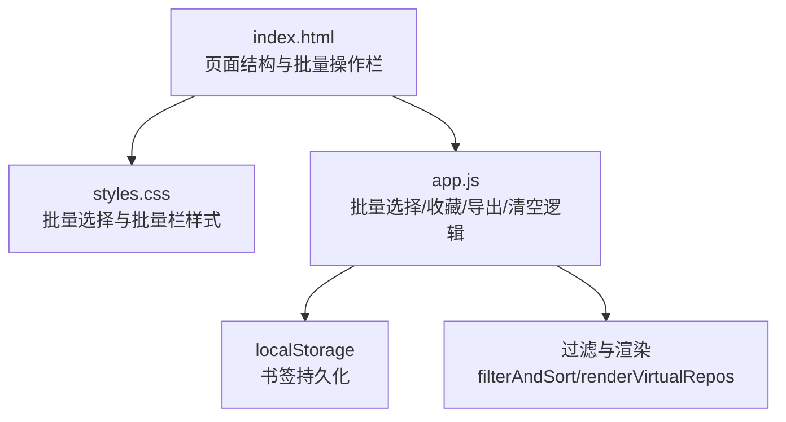
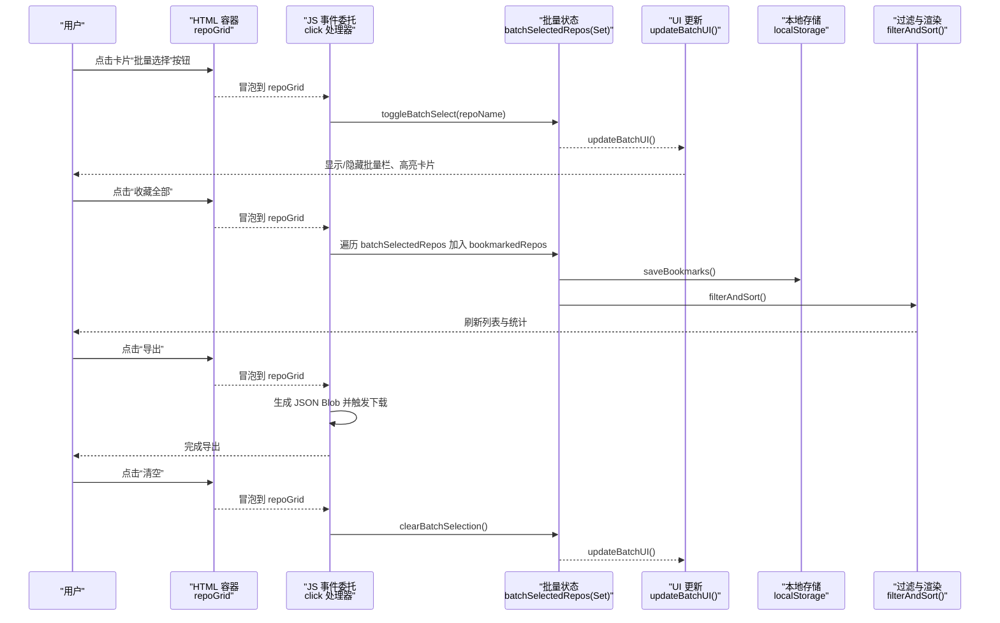
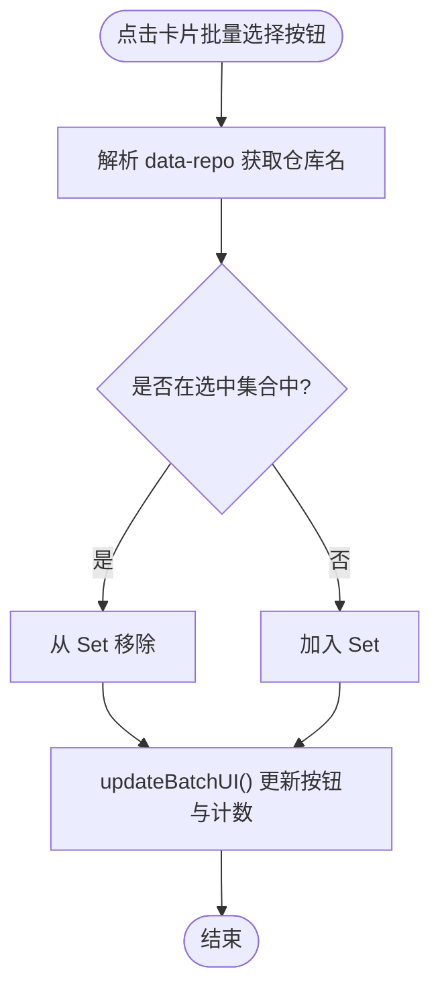
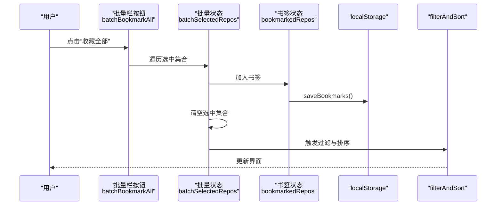
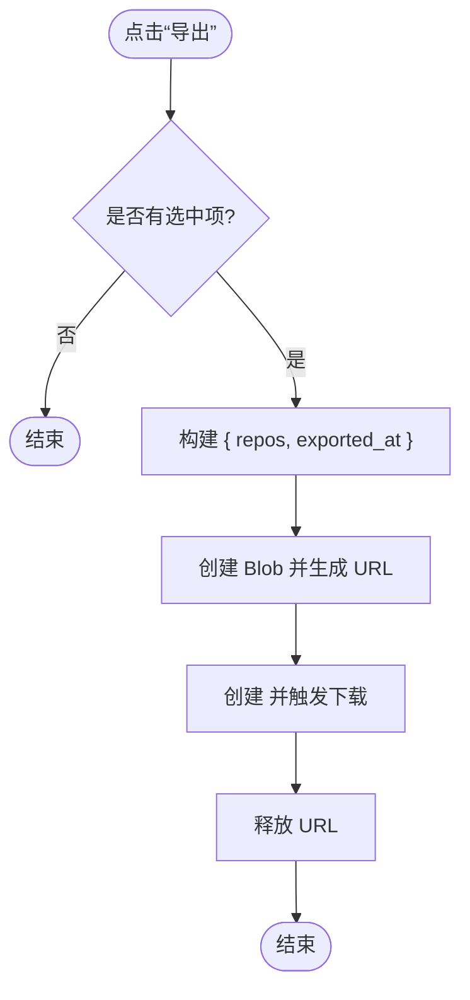
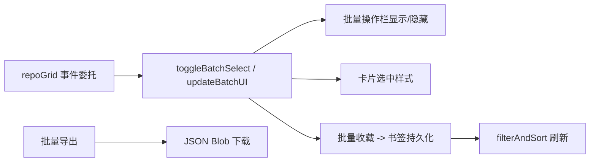

# 批量操作

<cite>
**本文引用的文件**   
- [web/app.js](file://web/app.js)
- [web/index.html](file://web/index.html)
- [web/styles.css](file://web/styles.css)
</cite>

## 目录
1. [简介](#简介)
2. [项目结构](#项目结构)
3. [核心组件](#核心组件)
4. [架构总览](#架构总览)
5. [详细组件分析](#详细组件分析)
6. [依赖关系分析](#依赖关系分析)
7. [性能考量](#性能考量)
8. [故障排查指南](#故障排查指南)
9. [结论](#结论)

## 简介
本文件聚焦于 GitHub Treasure Repo 的“批量操作”能力，围绕以下目标展开：
- 批量收藏的用户交互设计与实现（多选框、选中状态视觉反馈）
- 批量导出流程与数据清理策略
- 批量操作的交互确认机制与错误处理
- 性能优化策略（DOM 批处理、事件委托、虚拟滚动配合）
- 状态管理与撤销/恢复机制（在灵感模式内提供历史栈；批量操作当前未内置撤销）

说明：仓库中已实现“批量选择 + 批量收藏 + 批量导出 + 清空选择”，并未实现“批量删除”。因此文档对“批量删除”仅给出概念性建议。

## 项目结构
批量操作相关的前端代码集中在 web 目录下：
- HTML 入口：包含批量操作栏、卡片网格等 DOM 骨架
- CSS：定义批量选择按钮、批量操作栏、选中态样式
- JS：实现批量选择状态、批量收藏、批量导出、清空选择、事件委托与 UI 更新

图表来源
- [web/index.html:168-174](file://web/index.html#L168-L174)
- [web/styles.css:1650-1764](file://web/styles.css#L1650-L1764)
- [web/app.js:1539-1596](file://web/app.js#L1539-L1596)

章节来源
- [web/index.html:168-174](file://web/index.html#L168-L174)
- [web/styles.css:1650-1764](file://web/styles.css#L1650-L1764)
- [web/app.js:1539-1596](file://web/app.js#L1539-L1596)

## 核心组件
- 批量选择状态管理
  - 使用 Set 维护已选中的仓库名称集合
  - 点击卡片上的“批量选择”按钮切换选中状态
  - 根据选中集合同步更新批量操作栏显示与卡片选中样式
- 批量收藏
  - 将选中集合中的所有仓库加入书签集合并持久化
  - 执行后清空选择并刷新视图
- 批量导出
  - 将选中集合对应的仓库对象序列化为 JSON 并触发下载
- 清空选择
  - 清空选中集合并隐藏批量操作栏

章节来源
- [web/app.js:1539-1596](file://web/app.js#L1539-L1596)
- [web/app.js:1141-1185](file://web/app.js#L1141-L1185)
- [web/app.js:1242-1244](file://web/app.js#L1242-L1244)

## 架构总览
批量操作的整体交互流程如下：

图表来源
- [web/app.js:1141-1185](file://web/app.js#L1141-L1185)
- [web/app.js:1242-1244](file://web/app.js#L1242-L1244)
- [web/app.js:1539-1596](file://web/app.js#L1539-L1596)
- [web/app.js:1026-1059](file://web/app.js#L1026-L1059)

## 详细组件分析

### 批量选择与视觉反馈
- 多选框实现
  - 每个卡片渲染时附带一个“批量选择”按钮，通过 data-repo 标识仓库名
  - 点击该按钮调用 toggleBatchSelect，切换 Set 中的存在性
- 选中状态视觉反馈
  - 卡片增加 .batch-selected 类以高亮边框
  - 批量按钮增加 .active 类以改变背景与图标颜色
  - 底部出现“批量操作栏”，显示已选数量与操作按钮
- 事件委托
  - 所有卡片操作统一监听 repoGrid 的 click，按 target.closest(...) 判断命中区域，避免为每个卡片绑定事件

图表来源
- [web/app.js:1141-1185](file://web/app.js#L1141-L1185)
- [web/app.js:1539-1596](file://web/app.js#L1539-L1596)
- [web/styles.css:1650-1705](file://web/styles.css#L1650-L1705)

章节来源
- [web/app.js:1141-1185](file://web/app.js#L1141-L1185)
- [web/app.js:1539-1596](file://web/app.js#L1539-L1596)
- [web/styles.css:1650-1705](file://web/styles.css#L1650-L1705)

### 批量收藏
- 交互流程
  - 用户点击“收藏全部”
  - 遍历选中集合，逐个加入书签集合并持久化
  - 清空选中集合，刷新筛选与渲染
- 数据一致性
  - 书签数据保存在 localStorage，确保刷新后仍有效
  - 若处于“仅收藏”视图，会立即重新过滤并渲染

图表来源
- [web/app.js:1242-1244](file://web/app.js#L1242-L1244)
- [web/app.js:1571-1579](file://web/app.js#L1571-L1579)
- [web/app.js:1026-1059](file://web/app.js#L1026-L1059)

章节来源
- [web/app.js:1242-1244](file://web/app.js#L1242-L1244)
- [web/app.js:1571-1579](file://web/app.js#L1571-L1579)
- [web/app.js:1026-1059](file://web/app.js#L1026-L1059)

### 批量导出
- 交互流程
  - 用户点击“导出”
  - 根据选中集合筛选出对应仓库对象
  - 构造 JSON Blob 并触发浏览器下载
- 错误处理
  - 若无选中项则直接返回（无提示）
  - 若发生异常，建议捕获并提示用户重试

图表来源
- [web/app.js:1581-1591](file://web/app.js#L1581-L1591)

章节来源
- [web/app.js:1581-1591](file://web/app.js#L1581-L1591)

### 清空选择
- 交互流程
  - 用户点击“清空”
  - 清空选中集合并隐藏批量操作栏
- 视觉反馈
  - 批量栏隐藏，卡片取消高亮

章节来源
- [web/app.js:1593-1596](file://web/app.js#L1593-L1596)

### 批量删除（概念设计）
当前代码库未实现“批量删除”功能。若需扩展，可参考以下设计：
- 确认机制
  - 弹出二次确认对话框，展示待删除数量与风险提示
  - 支持键盘 Enter/Space 确认，Esc 取消
- 数据清理流程
  - 从书签集中移除对应仓库名并持久化
  - 若存在其他关联状态（如对比、灵感模式已见记录），按需清理
  - 刷新筛选与渲染
- 撤销/恢复
  - 维护一个“最近批量删除”的历史栈，支持撤销与重做
  - 限制历史长度，避免内存增长

[本节为概念性设计，不直接分析具体文件]

## 依赖关系分析
- 事件委托
  - 通过 repoGrid 的 click 事件统一处理批量选择、收藏、对比、分享等操作，降低事件监听器数量
- 状态联动
  - 批量选择状态影响 UI（批量栏、卡片高亮）
  - 批量收藏会影响书签状态与筛选结果
- 渲染与性能
  - 大数据量时使用虚拟滚动，减少 DOM 节点数量
  - 批量操作完成后统一触发 filterAndSort，避免多次重排

图表来源
- [web/app.js:1141-1185](file://web/app.js#L1141-L1185)
- [web/app.js:1539-1596](file://web/app.js#L1539-L1596)
- [web/app.js:1026-1059](file://web/app.js#L1026-L1059)

章节来源
- [web/app.js:1141-1185](file://web/app.js#L1141-L1185)
- [web/app.js:1539-1596](file://web/app.js#L1539-L1596)
- [web/app.js:1026-1059](file://web/app.js#L1026-L1059)

## 性能考量
- 事件委托
  - 通过单一事件监听器处理多个子元素点击，显著降低事件注册开销
- DOM 批处理
  - 批量收藏后统一调用 filterAndSort，避免多次渲染
  - 批量导出采用 Blob 一次性生成，减少中间 DOM 操作
- 虚拟滚动
  - 当结果集大于阈值时启用虚拟滚动，只渲染可视区附近卡片，提升长列表交互流畅度
- 防抖
  - 输入与滚动事件使用防抖，降低高频回调带来的重排压力

章节来源
- [web/app.js:1141-1185](file://web/app.js#L1141-L1185)
- [web/app.js:1078-1084](file://web/app.js#L1078-L1084)
- [web/app.js:874-925](file://web/app.js#L874-L925)

## 故障排查指南
- 批量操作栏不显示
  - 检查是否成功进入批量选择状态（至少选中一项）
  - 确认 updateBatchUI 被调用且批量栏可见性设置正确
- 批量收藏无效
  - 检查书签持久化是否成功（localStorage 可用性与大小限制）
  - 确认 filterAndSort 是否被触发并正确更新视图
- 批量导出失败
  - 检查浏览器是否允许下载与 Blob 创建
  - 若为空选择，应跳过导出逻辑
- 大量数据卡顿
  - 确认虚拟滚动是否启用
  - 检查是否存在频繁的重绘/重排（例如在循环中直接操作 DOM）

章节来源
- [web/app.js:1539-1596](file://web/app.js#L1539-L1596)
- [web/app.js:1026-1059](file://web/app.js#L1026-L1059)
- [web/app.js:874-925](file://web/app.js#L874-L925)

## 结论
本项目已实现完整的“批量选择 + 批量收藏 + 批量导出 + 清空选择”能力，具备清晰的状态管理、良好的视觉反馈与稳定的事件委托机制。针对“批量删除”，当前未实现，但可按本文提供的概念方案进行扩展。整体实现兼顾了用户体验与性能，适合在大规模数据集下稳定运行。