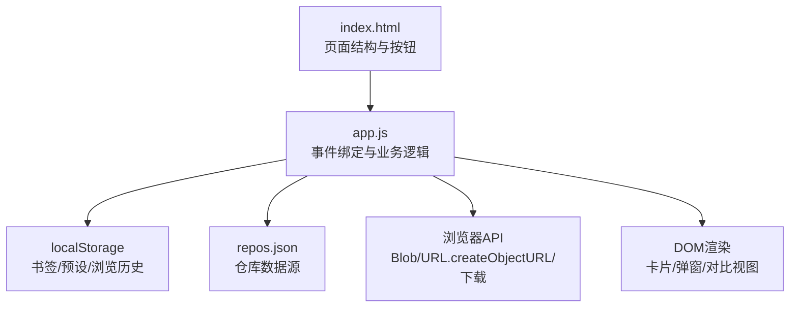
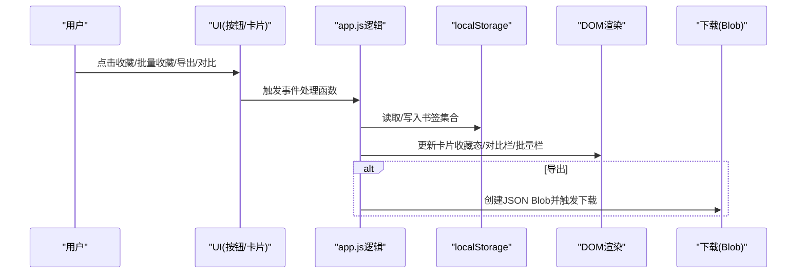
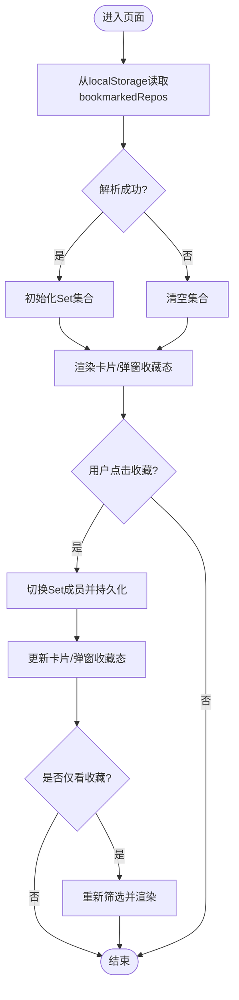
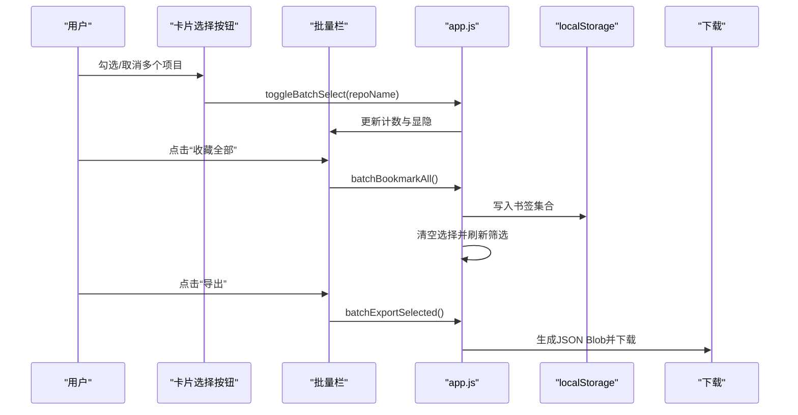
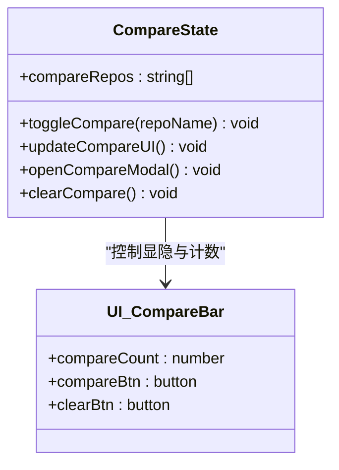
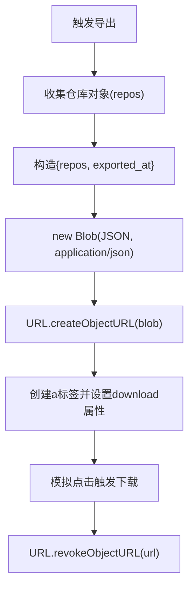
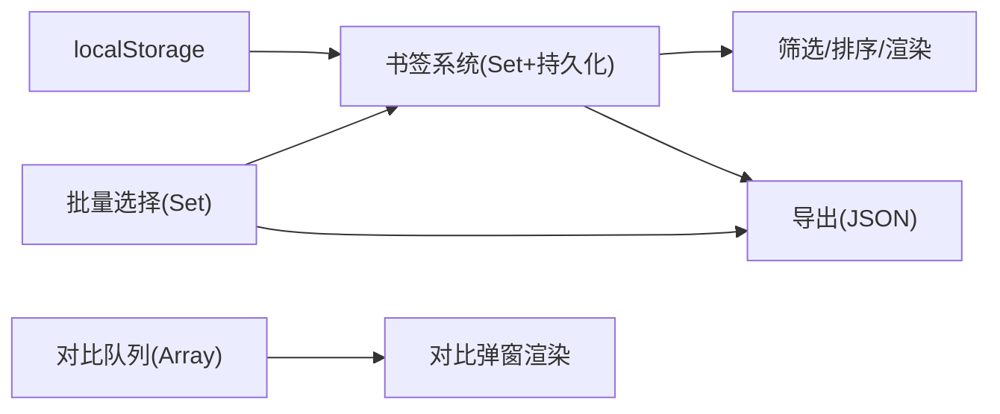

# 收藏管理

<cite>
**本文引用的文件**   
- [web/app.js](file://web/app.js)
- [web/index.html](file://web/index.html)
- [README.md](file://README.md)
- [README.zh-CN.md](file://README.zh-CN.md)
</cite>

## 目录
1. [简介](#简介)
2. [项目结构](#项目结构)
3. [核心组件](#核心组件)
4. [架构总览](#架构总览)
5. [详细组件分析](#详细组件分析)
6. [依赖关系分析](#依赖关系分析)
7. [性能考虑](#性能考虑)
8. [故障排查指南](#故障排查指南)
9. [结论](#结论)
10. [附录](#附录)

## 简介
本文件聚焦于 GitHub Treasure Repo 的“收藏管理”能力，围绕以下目标展开：
- localStorage 支持的书签系统实现（数据结构、状态同步）
- 批量操作（批量收藏、批量导出）的用户交互与数据流
- 项目对比功能的并排显示逻辑与差异高亮
- JSON 导出功能的数据格式定义与下载实现
- 数据模型、存储策略与用户体验优化建议

该功能在前端以纯 HTML/CSS/JS 实现，不依赖构建工具或第三方库，通过本地持久化与浏览器 API 完成全部交互。

## 项目结构
与收藏管理直接相关的代码位于 web 目录下：
- index.html：页面结构与交互入口（筛选区、对比栏、批量栏、详情弹窗等）
- app.js：业务逻辑（书签、批量、对比、导出、灵感模式等）
- styles.css：样式与动效（含对比、批量、灵感模式的视觉呈现）

图表来源
- [web/index.html:96-108](file://web/index.html#L96-L108)
- [web/app.js:1078-1092](file://web/app.js#L1078-L1092)
- [web/app.js:1527-1583](file://web/app.js#L1527-L1583)
- [web/app.js:1392-1524](file://web/app.js#L1392-L1524)

章节来源
- [web/index.html:96-108](file://web/index.html#L96-L108)
- [web/app.js:1078-1092](file://web/app.js#L1078-L1092)
- [web/app.js:1527-1583](file://web/app.js#L1527-L1583)
- [web/app.js:1392-1524](file://web/app.js#L1392-L1524)

## 核心组件
- 书签系统
  - 使用 Set 维护已收藏仓库名集合，并通过 localStorage 持久化
  - 提供单条收藏/取消收藏、按收藏过滤、导出收藏为 JSON
- 批量操作
  - 支持在列表中选择多个项目，进行批量收藏与批量导出
  - 提供清空选择与计数反馈
- 项目对比
  - 最多选择两个项目进行并排对比，展示 Stars/Forks/Score 的可视化对比条
- JSON 导出
  - 将当前收藏或选中项目序列化为 JSON Blob，触发浏览器下载
  - 文件名包含日期戳，便于归档

章节来源
- [web/app.js:293-347](file://web/app.js#L293-L347)
- [web/app.js:1078-1092](file://web/app.js#L1078-L1092)
- [web/app.js:1527-1583](file://web/app.js#L1527-L1583)
- [web/app.js:1392-1524](file://web/app.js#L1392-L1524)

## 架构总览
收藏管理的整体流程如下：用户通过界面触发收藏/批量/对比/导出等操作，前端更新内存中的状态集合并同步到 localStorage；同时根据状态重新渲染 UI（如卡片上的收藏态、对比栏可见性、批量栏计数）。导出时生成 JSON Blob 并触发下载。

图表来源
- [web/app.js:308-347](file://web/app.js#L308-L347)
- [web/app.js:1078-1092](file://web/app.js#L1078-L1092)
- [web/app.js:1527-1583](file://web/app.js#L1527-L1583)
- [web/app.js:1392-1524](file://web/app.js#L1392-L1524)

## 详细组件分析

### 书签系统（localStorage 支持）
- 数据结构
  - 内存：Set<string> 保存已收藏的仓库全名（如 owner/repo）
  - 持久化：localStorage 中键名为 bookmarkedRepos，值为仓库名数组的 JSON 字符串
- 初始化与加载
  - 应用启动时从 localStorage 读取并解析为 Set
  - 若解析失败则回退为空集合
- 状态变更与同步
  - 切换单个仓库收藏状态后，立即写回 localStorage
  - 同步更新所有同名卡片的收藏图标状态，以及弹窗内的收藏按钮状态
  - 当处于“仅看收藏”模式时，触发筛选重算与渲染
- 过滤与展示
  - 筛选逻辑支持“仅收藏”模式，结合搜索、语言、排序、阈值等条件
  - 卡片上显示收藏态，并在收藏成功时添加短暂动画反馈

图表来源
- [web/app.js:293-347](file://web/app.js#L293-L347)
- [web/app.js:1013-1046](file://web/app.js#L1013-L1046)

章节来源
- [web/app.js:293-347](file://web/app.js#L293-L347)
- [web/app.js:1013-1046](file://web/app.js#L1013-L1046)

### 批量操作（批量收藏、批量导出）
- 选择机制
  - 每个卡片左上角有选择按钮，点击后加入/移出 batchSelectedRepos（Set）
  - 顶部出现批量操作栏，显示已选数量并提供“收藏全部”、“导出”、“清空”
- 批量收藏
  - 遍历选中项，逐一加入书签集合，持久化后清空选择并刷新视图
- 批量导出
  - 基于选中仓库名匹配 allRepos，生成包含 repos 与 exported_at 的 JSON 对象
  - 使用 Blob + URL.createObjectURL 触发下载，文件名带日期戳
- 清空选择
  - 清空 batchSelectedRepos 并隐藏批量栏

图表来源
- [web/app.js:1527-1583](file://web/app.js#L1527-L1583)
- [web/app.js:1078-1092](file://web/app.js#L1078-L1092)

章节来源
- [web/app.js:1527-1583](file://web/app.js#L1527-L1583)
- [web/app.js:1078-1092](file://web/app.js#L1078-L1092)

### 项目对比（并排显示与差异高亮）
- 选择与限制
  - 每个卡片右上角有对比按钮，最多选择两个仓库
  - 选择后顶部显示对比栏，包含“对比”和“清空”
- 并排展示
  - 打开对比弹窗，左右两列分别展示仓库基本信息（名称、作者、描述）
  - 指标对比：Stars/Forks/Score 使用横向进度条，宽度按最大值归一化，直观体现差异
- 交互
  - 点击“对比”仅在已选两项时生效
  - 点击“清空”重置对比队列

图表来源
- [web/app.js:1392-1524](file://web/app.js#L1392-L1524)
- [web/index.html:135-139](file://web/index.html#L135-L139)

章节来源
- [web/app.js:1392-1524](file://web/app.js#L1392-L1524)
- [web/index.html:135-139](file://web/index.html#L135-L139)

### JSON 导出（数据格式与下载实现）
- 数据格式
  - 根对象包含：
    - repos：仓库完整对象数组（来自 allRepos）
    - exported_at：ISO 时间戳，表示导出时间
- 下载实现
  - 使用 new Blob([JSON.stringify(...)], { type: 'application/json' })
  - 通过 URL.createObjectURL 创建临时链接，模拟 a 标签点击触发下载
  - 下载完成后释放 URL 对象
- 适用场景
  - 导出全部收藏：exportBookmarks
  - 导出选中项目：batchExportSelected

图表来源
- [web/app.js:1078-1092](file://web/app.js#L1078-L1092)
- [web/app.js:1568-1578](file://web/app.js#L1568-L1578)

章节来源
- [web/app.js:1078-1092](file://web/app.js#L1078-L1092)
- [web/app.js:1568-1578](file://web/app.js#L1568-L1578)

### 用户体验优化要点
- 即时反馈
  - 收藏成功时卡片增加短暂动画提示
  - 复制链接/克隆命令后按钮文案临时变化，增强确认感
- 可访问性
  - 关键按钮提供 aria-label
  - 灵感模式内使用 aria-live 区域播报状态变化
- 键盘导航
  - 全局快捷键支持主题/语言/书签视图切换、列表导航、收藏与对比
- 分享与预设
  - 支持将当前筛选条件编码为 URL 参数，方便分享与恢复
  - 支持保存/加载筛选预设（同样使用 localStorage）

章节来源
- [web/app.js:308-347](file://web/app.js#L308-L347)
- [web/app.js:1188-1221](file://web/app.js#L1188-L1221)
- [web/app.js:1337-1390](file://web/app.js#L1337-L1390)
- [web/app.js:1714-1787](file://web/app.js#L1714-L1787)

## 依赖关系分析
- 模块耦合
  - 书签系统与筛选/渲染强耦合：收藏状态直接影响 filterAndSort 的结果与 UI 展示
  - 批量操作依赖书签系统（批量收藏）与导出逻辑（批量导出）
  - 对比功能独立于书签，但共享同一套仓库数据与弹窗渲染
- 外部依赖
  - localStorage：书签、预设、灵感模式浏览历史与位置
  - 浏览器下载 API：Blob + URL.createObjectURL
  - 剪贴板 API：复制链接/克隆命令
- 潜在循环依赖
  - 无直接循环导入；均为单文件脚本，通过全局变量与事件驱动组织

图表来源
- [web/app.js:293-347](file://web/app.js#L293-L347)
- [web/app.js:1527-1583](file://web/app.js#L1527-L1583)
- [web/app.js:1392-1524](file://web/app.js#L1392-L1524)

章节来源
- [web/app.js:293-347](file://web/app.js#L293-L347)
- [web/app.js:1527-1583](file://web/app.js#L1527-L1583)
- [web/app.js:1392-1524](file://web/app.js#L1392-L1524)

## 性能考虑
- 虚拟滚动
  - 当结果超过 100 条时启用虚拟滚动，仅渲染可视区域附近卡片，降低 DOM 压力
- 防抖
  - 输入框与范围滑块使用防抖减少频繁筛选计算
- 局部更新
  - 收藏/对比/批量选择采用最小化 DOM 更新（仅更新相关元素类名或文本）
- 资源释放
  - 导出后及时释放 URL 对象，避免内存泄漏

章节来源
- [web/app.js:861-912](file://web/app.js#L861-L912)
- [web/app.js:1065-1071](file://web/app.js#L1065-L1071)
- [web/app.js:1085-1092](file://web/app.js#L1085-L1092)

## 故障排查指南
- “无法加载数据”
  - 原因：通过 file:// 协议直接打开页面，浏览器阻止 fetch
  - 解决：使用本地 HTTP 服务器（例如 python3 -m http.server 8000）
- 收藏状态丢失
  - 检查浏览器是否禁用 localStorage 或存在隐私模式清理
  - 查看控制台是否有 JSON 解析异常（非法数据导致回退为空集合）
- 导出失败
  - 某些环境可能限制 Blob 下载，尝试在 HTTPS 环境下或使用现代浏览器
- 对比未生效
  - 确保已选择恰好两个项目；否则对比按钮不会触发

章节来源
- [web/app.js:401-440](file://web/app.js#L401-L440)
- [web/app.js:293-302](file://web/app.js#L293-L302)
- [web/app.js:1424-1429](file://web/app.js#L1424-L1429)

## 结论
收藏管理功能以简洁的前端架构实现了完整的书签、批量操作、对比与导出能力。通过 localStorage 持久化与浏览器原生 API，既保证了离线可用性与低延迟，又提供了良好的交互体验。建议在后续迭代中：
- 对大量收藏数据进行分页/增量导出，避免一次性序列化开销
- 为对比视图增加更多维度（如活跃度、许可证、最近更新时间）
- 引入更完善的错误边界与用户提示，提升健壮性

## 附录

### 数据模型与存储键
- 书签集合
  - 内存：Set<string>（仓库全名）
  - 持久化键：bookmarkedRepos（JSON 数组）
- 筛选预设
  - 内存：数组对象（name/search/lang/sort/stars/forks/score）
  - 持久化键：filterPresets（JSON 数组）
- 灵感模式
  - 已浏览记录：inspiration_seen_repos（JSON 数组）
  - 最后位置：inspiration_last_position（JSON 对象）

章节来源
- [web/app.js:293-302](file://web/app.js#L293-L302)
- [web/app.js:1714-1787](file://web/app.js#L1714-L1787)
- [web/app.js:1886-1923](file://web/app.js#L1886-L1923)

### 导出 JSON 字段说明
- repos：仓库对象数组（来源于 allRepos，包含 name/description/stars/forks/score/language/url 等）
- exported_at：ISO 时间戳字符串

章节来源
- [web/app.js:1078-1092](file://web/app.js#L1078-L1092)
- [web/app.js:1568-1578](file://web/app.js#L1568-L1578)