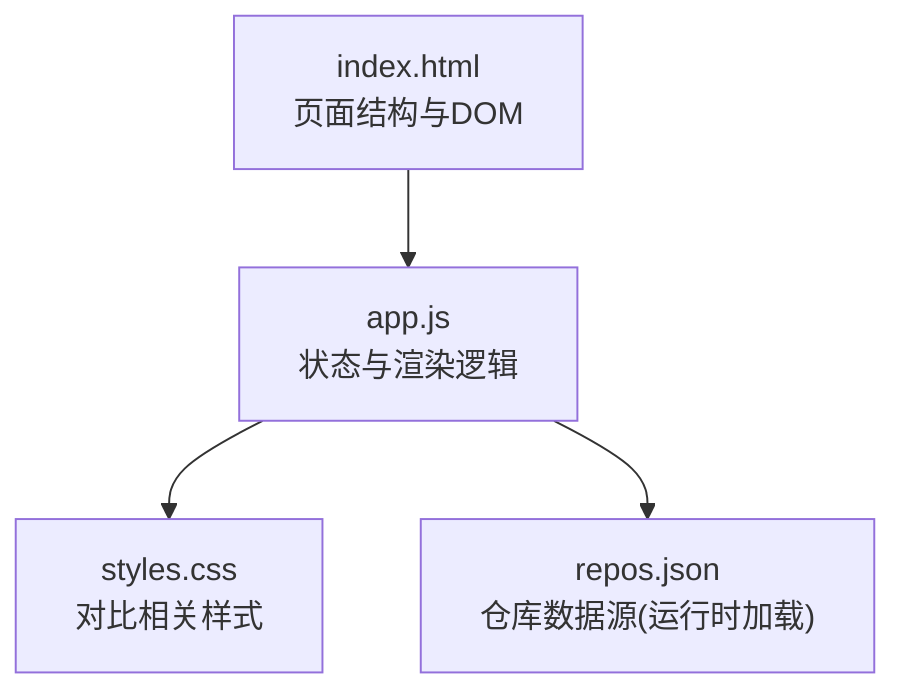
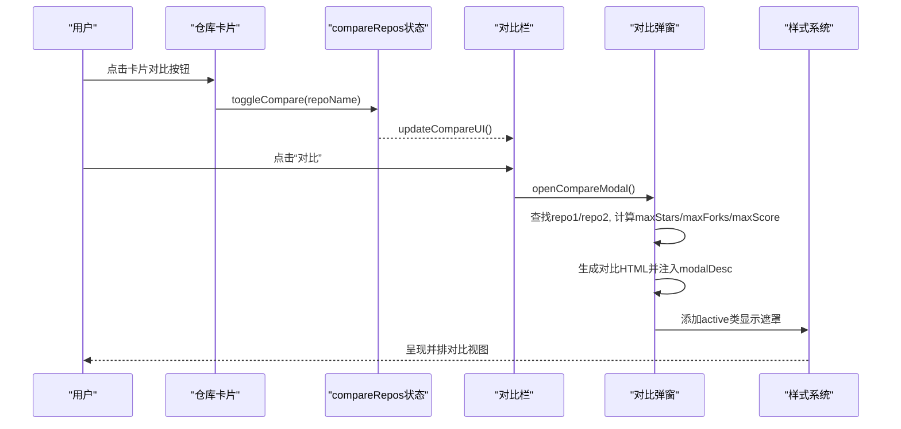
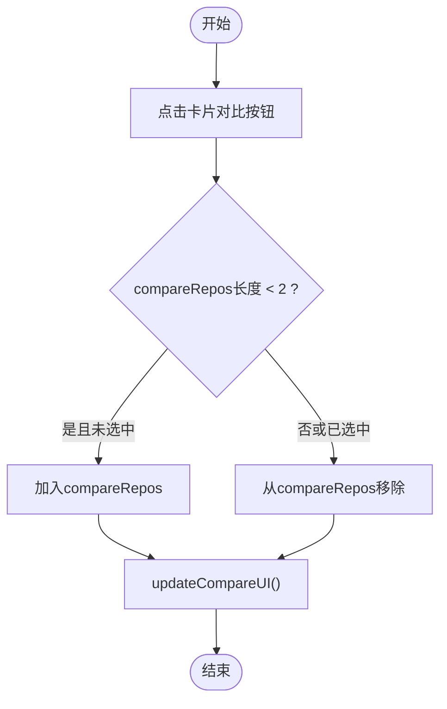
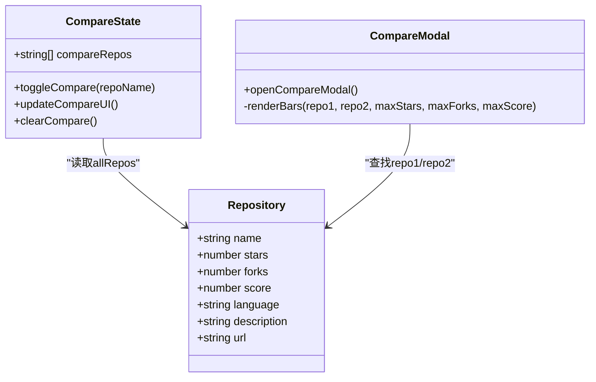
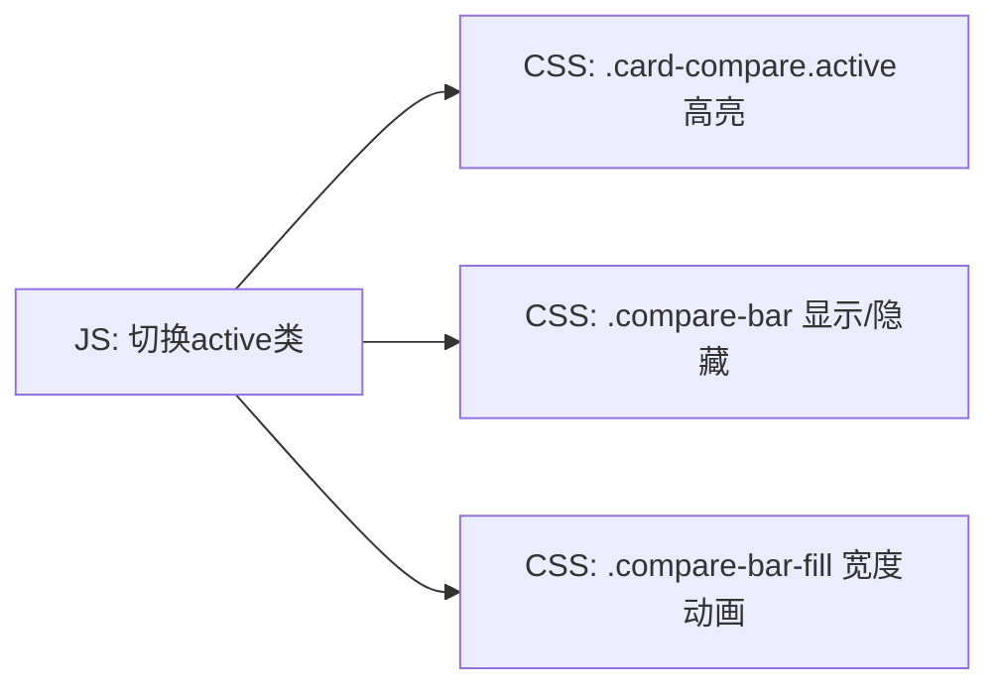
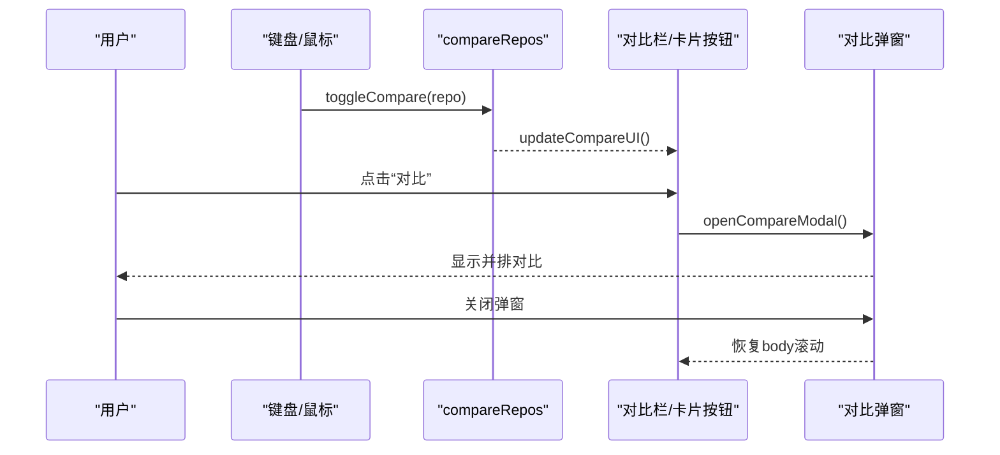
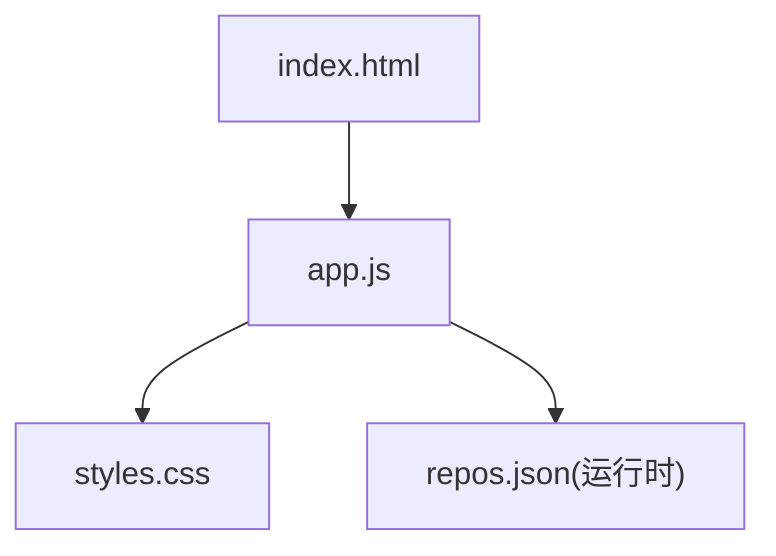

# 项目对比

<cite>
**本文引用的文件**   
- [web/app.js](file://web/app.js)
- [web/index.html](file://web/index.html)
- [web/styles.css](file://web/styles.css)
- [README.md](file://README.md)
</cite>

## 目录
1. [简介](#简介)
2. [项目结构](#项目结构)
3. [核心组件](#核心组件)
4. [架构总览](#架构总览)
5. [详细组件分析](#详细组件分析)
6. [依赖关系分析](#依赖关系分析)
7. [性能考量](#性能考量)
8. [故障排查指南](#故障排查指南)
9. [结论](#结论)
10. [附录](#附录)

## 简介
本文件聚焦于“GitHub Treasure Repo”的前端对比功能，系统性梳理并排显示逻辑、数据结构与渲染算法、差异高亮机制、对比数据计算与可视化展示，以及从选择到显示的完整交互状态管理。文档同时给出对比维度定义、UI 组件设计与性能优化策略，帮助读者快速理解与扩展该能力。

## 项目结构
前端采用纯 HTML/CSS/JS 单页应用，对比功能由以下文件协同实现：
- web/index.html：页面骨架，包含对比栏、详情弹窗容器等 DOM 节点
- web/app.js：业务逻辑与交互，包括对比状态管理、弹窗渲染、事件绑定
- web/styles.css：主题与对比 UI 样式（对比栏、卡片对比按钮、对比弹窗布局与进度条）

图表来源
- [web/index.html:134-139](file://web/index.html#L134-L139)
- [web/app.js:1405-1537](file://web/app.js#L1405-L1537)
- [web/styles.css:1215-1451](file://web/styles.css#L1215-L1451)

章节来源
- [web/index.html:134-139](file://web/index.html#L134-L139)
- [web/app.js:1405-1537](file://web/app.js#L1405-L1537)
- [web/styles.css:1215-1451](file://web/styles.css#L1215-L1451)

## 核心组件
- 对比状态
  - compareRepos：数组，保存当前选中的两个仓库名称（最多两个）
  - updateCompareUI：根据 compareRepos 更新卡片对比按钮与底部对比栏的显隐与计数
- 对比栏
  - 固定底部浮层，显示已选数量与操作按钮（对比、清空）
- 对比弹窗
  - 复用通用 modalOverlay/modal 容器，动态填充左右两列对比内容
  - 指标以水平进度条可视化，宽度按各自最大值归一化
- 卡片对比按钮
  - 每个仓库卡片右上角提供对比按钮，点击切换选中状态，限制最多两项

章节来源
- [web/app.js:1405-1537](file://web/app.js#L1405-L1537)
- [web/index.html:134-139](file://web/index.html#L134-L139)
- [web/styles.css:1215-1451](file://web/styles.css#L1215-L1451)

## 架构总览
对比功能的整体流程如下：用户通过卡片对比按钮或键盘快捷键将仓库加入 compareRepos；当数量为 2 时，点击对比栏“对比”按钮触发 openCompareModal；函数在内存中查找对应仓库对象，计算各指标的最大值用于归一化，然后生成对比面板 HTML 并注入到现有 modal 容器中，最后显示遮罩层。

图表来源
- [web/app.js:1408-1435](file://web/app.js#L1408-L1435)
- [web/app.js:1437-1532](file://web/app.js#L1437-L1532)
- [web/styles.css:721-756](file://web/styles.css#L721-L756)

## 详细组件分析

### 对比状态与交互
- 选择与取消
  - toggleCompare(repoName)：若已存在则移除；否则在长度小于 2 时追加
  - updateCompareUI：遍历所有卡片对比按钮，按是否包含 repoName 切换 active 类；控制对比栏显示与计数
- 清空
  - clearCompare：重置 compareRepos 并刷新 UI
- 键盘支持
  - 全局 keydown 监听中，C 键对当前焦点卡片执行 toggleCompare

图表来源
- [web/app.js:1408-1435](file://web/app.js#L1408-L1435)
- [web/app.js:1340-1346](file://web/app.js#L1340-L1346)

章节来源
- [web/app.js:1408-1435](file://web/app.js#L1408-L1435)
- [web/app.js:1340-1346](file://web/app.js#L1340-L1346)

### 对比弹窗渲染与数据结构
- 数据来源
  - 从 allRepos 中按 name 查找 repo1 与 repo2
- 对比维度
  - Stars、Forks、Score（综合评分）
- 归一化与可视化
  - maxStars = max(stars1, stars2)，同理 forks 与 score
  - 进度条宽度 = (value / max) * 100%
- 渲染目标
  - 复用 modalOverlay + detailModal，将对比内容写入 modalDesc
  - 隐藏无关区域（如普通详情页的链接、收藏按钮等）
- 关闭与清理
  - 关闭时恢复 body 滚动，保持与其他弹窗一致的体验

图表来源
- [web/app.js:1405-1537](file://web/app.js#L1405-L1537)

章节来源
- [web/app.js:1437-1532](file://web/app.js#L1437-L1532)

### 差异高亮机制（视觉区分）
- CSS 类驱动
  - .card-compare.active：表示卡片处于对比选中态，背景与边框高亮
  - .compare-bar：底部对比栏显隐与动画
  - .compare-container/.compare-repo/.compare-stats/.compare-bar-fill：对比面板布局与进度条
- 动态样式
  - JS 通过 className 切换 active 类，控制按钮与对比栏可见性
  - 进度条宽度通过内联 style.width 设置，随数值变化平滑过渡

图表来源
- [web/styles.css:1279-1325](file://web/styles.css#L1279-L1325)
- [web/styles.css:1215-1274](file://web/styles.css#L1215-L1274)
- [web/styles.css:1331-1451](file://web/styles.css#L1331-L1451)

章节来源
- [web/styles.css:1215-1451](file://web/styles.css#L1215-L1451)

### 对比数据计算与可视化
- 指标来源
  - Stars、Forks、Score 直接取自仓库对象
- 归一化规则
  - 针对每行指标取两者较大值为分母，计算百分比宽度
- 可视化呈现
  - 使用 .compare-bar-wrap 作为轨道，.compare-bar-fill 为填充条，宽度由 JS 计算后注入
- 文本格式化
  - 大数格式化使用 fmtNum，统一 k/M 单位

章节来源
- [web/app.js:1448-1523](file://web/app.js#L1448-L1523)
- [web/app.js:1014-1018](file://web/app.js#L1014-L1018)

### 用户选择项目的交互流程（状态管理）
- 入口
  - 卡片对比按钮点击、键盘 C 键
- 状态变更
  - compareRepos 增删元素，上限为 2
- UI 同步
  - updateCompareUI 同步卡片按钮与对比栏
- 触发对比
  - 对比栏“对比”按钮调用 openCompareModal
- 关闭与清理
  - 关闭弹窗时恢复滚动，必要时可清空 compareRepos

图表来源
- [web/app.js:1408-1435](file://web/app.js#L1408-L1435)
- [web/app.js:1437-1532](file://web/app.js#L1437-L1532)

章节来源
- [web/app.js:1408-1532](file://web/app.js#L1408-L1532)

### 对比维度定义
- Stars：仓库星标数
- Forks：仓库被 fork 次数
- Score：综合评分（详见 README 评分算法说明）
- 语言、描述、作者名、URL：辅助信息用于展示与跳转

章节来源
- [README.md:109-119](file://README.md#L109-L119)
- [web/app.js:1448-1523](file://web/app.js#L1448-L1523)

### UI 组件设计
- 对比栏（compare-bar）
  - 固定底部居中，显示已选数量与操作按钮
- 卡片对比按钮（card-compare）
  - 悬停可见，选中态高亮
- 对比弹窗（compare-container）
  - 左右两列对称布局，中间 VS 分隔
  - 指标行包含标签、进度条轨道、填充条与数值
- 响应式与动效
  - 进度条宽度带过渡动画，弹窗出现有缩放与透明度过渡

章节来源
- [web/index.html:134-139](file://web/index.html#L134-L139)
- [web/styles.css:1215-1451](file://web/styles.css#L1215-L1451)
- [web/styles.css:721-756](file://web/styles.css#L721-L756)

## 依赖关系分析
- 模块耦合
  - app.js 内部集中维护 compareRepos 状态，并通过 DOM 查询与事件委托进行 UI 同步
  - styles.css 仅负责样式表现，不持有状态
- 外部依赖
  - repos.json 数据在运行时通过 fetch 加载，对比逻辑依赖其字段完整性（name、stars、forks、score 等）
- 潜在循环依赖
  - 无循环引用，均为单向依赖：HTML -> JS -> CSS

图表来源
- [web/index.html:134-139](file://web/index.html#L134-L139)
- [web/app.js:1405-1537](file://web/app.js#L1405-L1537)
- [web/styles.css:1215-1451](file://web/styles.css#L1215-L1451)

章节来源
- [web/app.js:1405-1537](file://web/app.js#L1405-L1537)

## 性能考量
- 最小化 DOM 操作
  - 对比弹窗仅在需要时渲染一次，避免重复创建节点
- 样式驱动的高亮
  - 通过切换 CSS 类而非频繁修改内联样式，减少重排
- 数值计算开销低
  - 对比仅涉及两个对象，计算量极小
- 可扩展建议
  - 若未来增加更多维度或更多对比项，可引入虚拟列表或增量更新策略
  - 对大数格式化与日期格式化可缓存结果

[本节为通用指导，无需源码引用]

## 故障排查指南
- 无法加载数据
  - 现象：页面提示“无法加载数据”，需通过本地 HTTP 服务访问
  - 原因：浏览器禁止 file:// 协议下 fetch 请求
  - 解决：参考 README 启动本地服务器
- 对比按钮无效
  - 检查 compareRepos 是否超过 2 项；确认 toggleCompare 与 updateCompareUI 是否被正确调用
- 对比弹窗未显示
  - 检查 modalOverlay 是否存在 active 类；确认 openCompareModal 是否正确注入 HTML

章节来源
- [README.md:166-168](file://README.md#L166-L168)
- [web/app.js:1408-1532](file://web/app.js#L1408-L1532)

## 结论
对比功能以轻量状态（compareRepos）为核心，结合 CSS 类与内联宽度实现高效、直观的并排对比。通过复用通用弹窗容器与统一的样式体系，保证了交互一致性与可维护性。当前实现覆盖核心对比维度与基础可视化，具备进一步扩展多指标、多仓库对比的能力空间。

[本节为总结，无需源码引用]

## 附录
- 评分算法参考
  - 综合评分由 Stars、Forks、Fork率、今日增长与提交活跃度加权构成，具体公式见 README

章节来源
- [README.md:109-119](file://README.md#L109-L119)