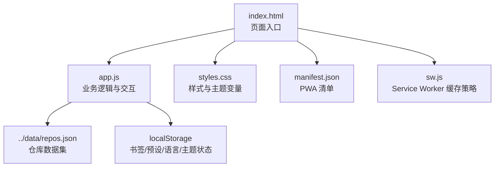
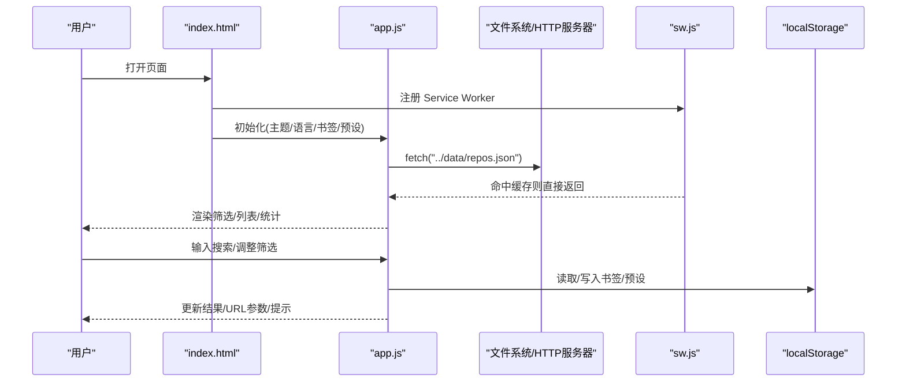
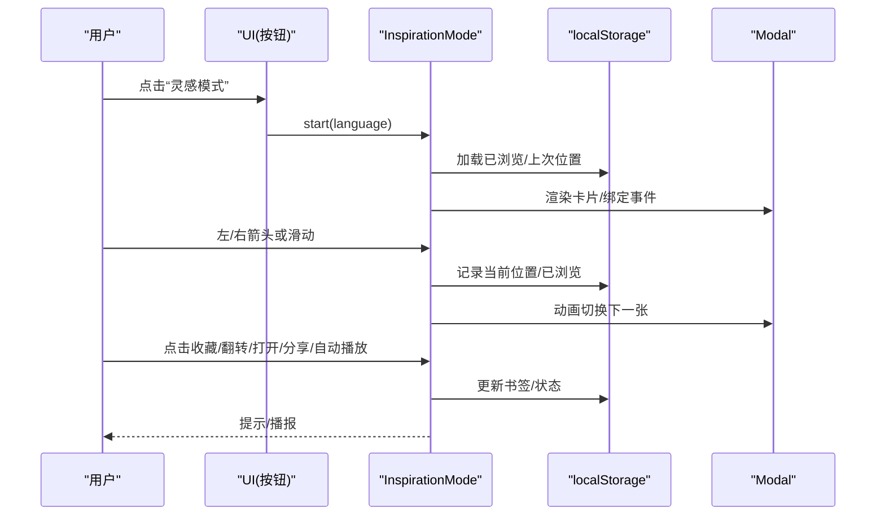
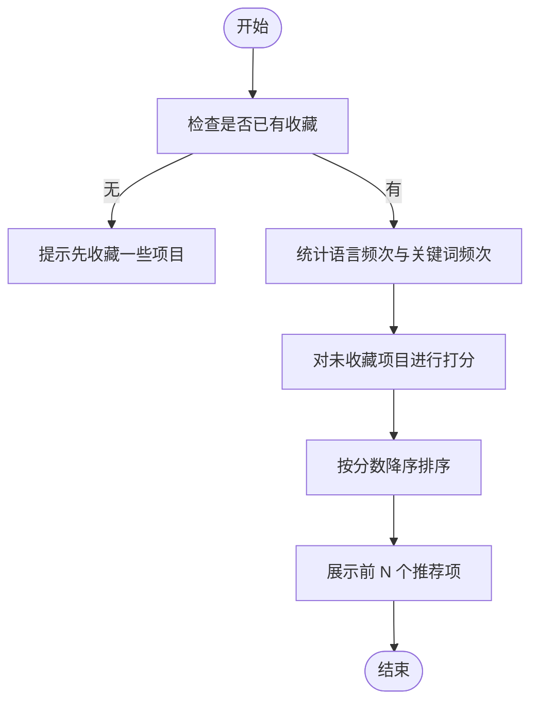
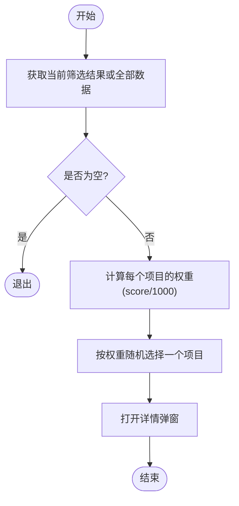
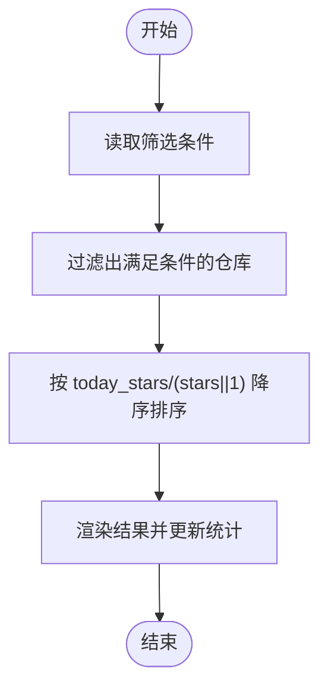
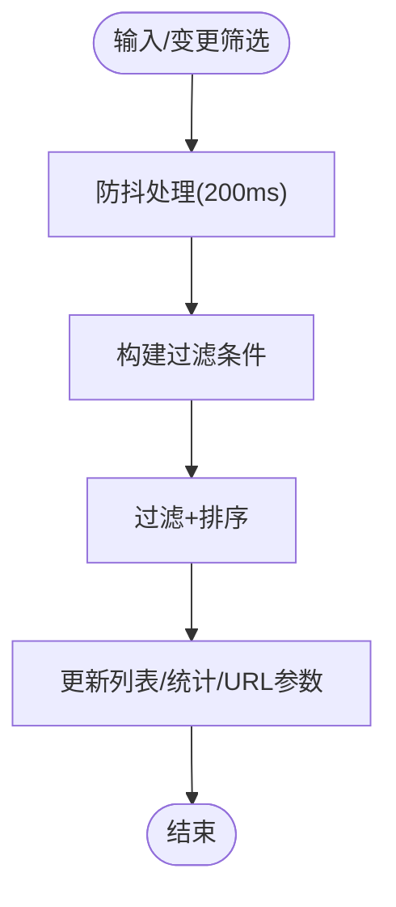
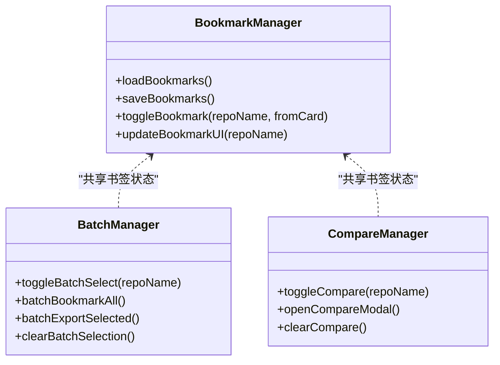
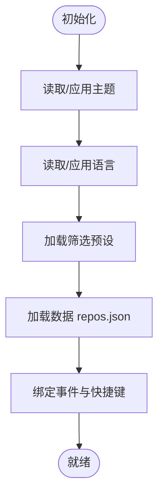
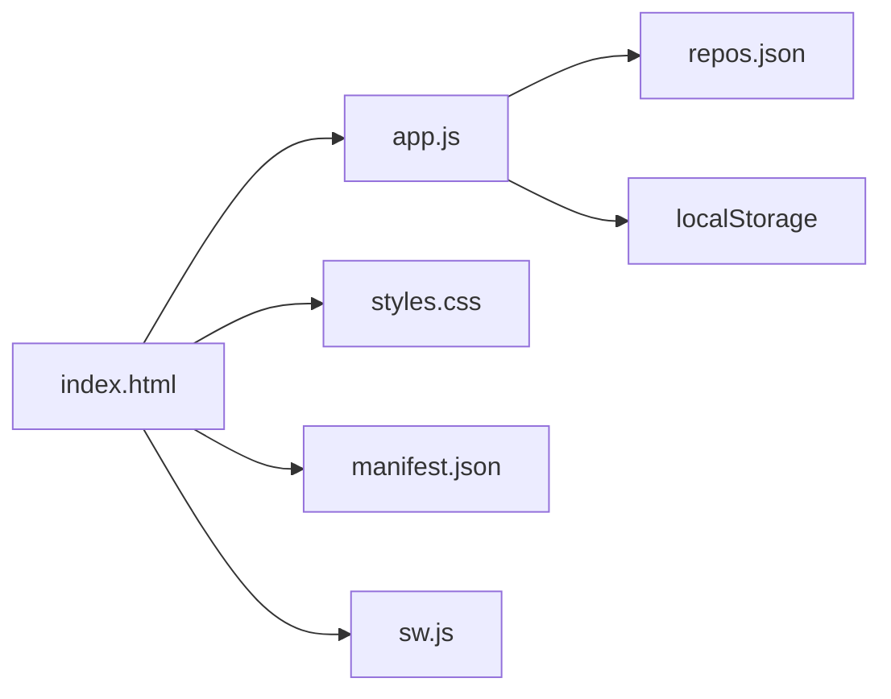

# 核心功能

<cite>
**本文引用的文件**   
- [README.md](file://README.md)
- [index.html](file://web/index.html)
- [app.js](file://web/app.js)
- [styles.css](file://web/styles.css)
- [manifest.json](file://web/manifest.json)
- [sw.js](file://web/sw.js)
</cite>

## 目录
1. [简介](#简介)
2. [项目结构](#项目结构)
3. [核心组件](#核心组件)
4. [架构总览](#架构总览)
5. [详细组件分析](#详细组件分析)
6. [依赖关系分析](#依赖关系分析)
7. [性能考量](#性能考量)
8. [故障排查指南](#故障排查指南)
9. [结论](#结论)
10. [附录](#附录)

## 简介
GitHub Treasure Repo 是一个开源、全自动化的 GitHub 高质量仓库聚合器。它整合多个数据源，提供“发现”、“过滤与搜索”、“收藏管理”和“用户体验优化”等核心能力，支持深色/浅色主题、中英文国际化、PWA 离线缓存以及完整的键盘导航。

## 项目结构
前端采用零构建的纯 HTML/CSS/JS 方案，通过 Service Worker 实现 PWA 离线支持；数据由 Python 脚本抓取并生成 JSON 供前端加载。

图表来源
- [index.html:1-284](file://web/index.html#L1-L284)
- [app.js:1-2624](file://web/app.js#L1-L2624)
- [styles.css:1-800](file://web/styles.css#L1-L800)
- [manifest.json:1-16](file://web/manifest.json#L1-L16)
- [sw.js:1-50](file://web/sw.js#L1-L50)

章节来源
- [README.md:123-148](file://README.md#L123-L148)

## 核心组件
- 数据层：从 ../data/repos.json 加载仓库集合，解析统计信息、语言分布、标签分类等。
- 过滤与搜索：多维度筛选（语言、Stars/Forks/评分阈值）、实时搜索、排序（综合评分、Stars、Forks、今日增长、飙升指数）。
- 收藏与对比：基于 localStorage 的书签、批量操作、两两对比、JSON 导出。
- 发现模式：灵感模式（全屏卡片浏览、滑动/键盘切换、自动播放、翻转详情）、智能推荐（基于已收藏语言与关键词）、随机宝藏（按权重随机抽取）、飙升指数（按 today_stars/stars 排序）。
- 分享与可复现：可分享的筛选 URL（查询参数同步），保存筛选预设（本地持久化）。
- 体验增强：深色/浅色主题、中英文 i18n、PWA 离线、完整键盘导航。

章节来源
- [README.md:15-40](file://README.md#L15-L40)
- [app.js:1016-1049](file://web/app.js#L1016-L1049)
- [app.js:1588-1682](file://web/app.js#L1588-L1682)
- [app.js:1691-1715](file://web/app.js#L1691-L1715)
- [app.js:1717-1790](file://web/app.js#L1717-L1790)
- [app.js:1792-2606](file://web/app.js#L1792-L2606)

## 架构总览
前端以单页应用形式运行，所有交互在浏览器内完成。数据来源于静态 JSON，通过 fetch 获取；用户偏好（主题、语言、书签、筛选预设）保存在 localStorage；Service Worker 负责资源缓存与离线访问。

图表来源
- [index.html:276-282](file://web/index.html#L276-L282)
- [sw.js:1-50](file://web/sw.js#L1-L50)
- [app.js:404-443](file://web/app.js#L404-L443)
- [app.js:296-309](file://web/app.js#L296-L309)
- [app.js:1340-1393](file://web/app.js#L1340-L1393)

## 详细组件分析

### 发现功能
- 灵感模式
  - 全屏卡片式浏览，支持左右滑动/键盘切换、自动播放、翻转查看详细信息、撤销/重做、进度条、已浏览计数、语言筛选、无障碍播报。
  - 使用示例：点击“灵感模式”，进入后按空格收藏当前项目，按 Enter 打开 GitHub，按 F 翻转卡片查看详情，按 P 开启自动播放。
  - 界面截图描述：顶部显示语言筛选与已浏览标记，中部为项目名/作者/描述，底部为 Stars/Forks/评分等指标，右侧有收藏、翻转、打开、分享、自动播放、撤销/重做按钮。
  - 交互流程：见下方序列图。

图表来源
- [app.js:1792-2606](file://web/app.js#L1792-L2606)
- [index.html:219-267](file://web/index.html#L219-L267)

- 智能推荐
  - 根据已收藏项目的语言分布与高频关键词计算相似度，返回 Top-N 推荐。
  - 使用示例：先收藏若干项目，点击“智能推荐”，弹出推荐列表，点击任意推荐项进入详情。
  - 界面截图描述：弹窗标题“智能推荐”，子项包含图标、名称、摘要、Stars 与语言。
  - 交互流程：见下方流程图。

图表来源
- [app.js:1588-1682](file://web/app.js#L1588-L1682)

- 随机宝藏
  - 在当前筛选结果中按权重（score/1000）随机选择一项打开详情。
  - 使用示例：设置筛选条件后点击“发现宝藏”，系统随机打开一个项目。
  - 界面截图描述：与常规详情弹窗一致，仅入口不同。
  - 交互流程：见下方流程图。

图表来源
- [app.js:1691-1715](file://web/app.js#L1691-L1715)

- 飙升指数
  - 排序方式之一，按 today_stars / stars 降序排列，快速定位近期增长最快的项目。
  - 使用示例：在“排序”下拉中选择“飙升指数”，列表即时刷新。
  - 界面截图描述：列表按飙升指数从高到低排列，卡片右上角显示分数徽章。
  - 交互流程：见下方流程图。

图表来源
- [app.js:1016-1049](file://web/app.js#L1016-L1049)

章节来源
- [app.js:1792-2606](file://web/app.js#L1792-L2606)
- [app.js:1588-1682](file://web/app.js#L1588-L1682)
- [app.js:1691-1715](file://web/app.js#L1691-L1715)
- [app.js:1016-1049](file://web/app.js#L1016-L1049)

### 过滤与搜索功能
- 多维度过滤
  - 语言下拉、Stars/Forks/评分滑块、重置按钮。
  - 使用示例：将 Stars≥5k、Forks≥500、评分≥10000 组合筛选，列表实时更新。
  - 界面截图描述：筛选面板包含搜索框、语言/排序下拉、三个范围滑块与重置按钮。
- 实时搜索
  - 输入即搜，带搜索预览（最多 6 条匹配项），点击预览项直接打开详情。
  - 使用示例：输入“react”，出现预览列表，点击某项直接进入详情。
- 可分享筛选 URL
  - 将当前筛选状态编码到 URL 查询参数，复制后可与他人共享相同视图。
  - 使用示例：设置好筛选后点击“分享筛选”，复制链接发给同事，对方打开即看到相同结果。
- 保存的筛选预设
  - 将当前筛选保存为命名预设，随时一键恢复。
  - 使用示例：保存名为“Python 高星”的预设，下次点击即可复用。

图表来源
- [app.js:1016-1049](file://web/app.js#L1016-L1049)
- [app.js:1340-1393](file://web/app.js#L1340-L1393)
- [app.js:1717-1790](file://web/app.js#L1717-L1790)
- [app.js:721-777](file://web/app.js#L721-L777)

章节来源
- [app.js:1016-1049](file://web/app.js#L1016-L1049)
- [app.js:1340-1393](file://web/app.js#L1340-L1393)
- [app.js:1717-1790](file://web/app.js#L1717-L1790)
- [app.js:721-777](file://web/app.js#L721-L777)

### 收藏管理功能
- localStorage 支持的书签
  - 单个收藏/取消收藏，详情页与卡片均同步状态。
  - 使用示例：点击卡片上的书签图标，立即变亮表示已收藏。
- 批量操作
  - 勾选多个项目后，支持“收藏全部”、“导出选中”、“清空选择”。
  - 使用示例：勾选 5 个项目，点击“收藏全部”，这 5 个项目同时加入收藏。
- 项目对比
  - 选择两个项目后，弹出对比弹窗，直观比较 Stars/Forks/Score 等指标。
  - 使用示例：分别点击两个项目的对比按钮，然后点击“对比”查看横向对比。
- JSON 导出
  - 导出全部收藏或选中的项目为 JSON 文件，便于归档与分享。
  - 使用示例：点击“导出收藏”，下载 bookmarks-日期.json。

图表来源
- [app.js:296-350](file://web/app.js#L296-L350)
- [app.js:1529-1586](file://web/app.js#L1529-L1586)
- [app.js:1395-1527](file://web/app.js#L1395-L1527)

章节来源
- [app.js:296-350](file://web/app.js#L296-L350)
- [app.js:1529-1586](file://web/app.js#L1529-L1586)
- [app.js:1395-1527](file://web/app.js#L1395-L1527)

### 用户体验优化
- 深色/浅色主题
  - 默认深色，支持一键切换并持久化。
  - 使用示例：点击右上角主题按钮切换，刷新后仍保持。
- 中英文国际化
  - 支持中文/英文切换，界面文案即时更新。
  - 使用示例：点击语言按钮，界面文案变为英文。
- PWA 离线支持
  - 通过 manifest 与 Service Worker 缓存关键资源，断网仍可访问。
  - 使用示例：首次在线加载后，断开网络再次打开仍可显示页面。
- 完整键盘导航
  - 全局快捷键：/聚焦搜索、T 切换主题、B 书签视图、L 切换语言、? 帮助、↑↓←→ 导航、Enter 打开详情、Space 收藏、C 加入对比、←/→ 灵感模式翻页、P 自动播放、F 翻转卡片。
  - 使用示例：按 / 聚焦搜索框，输入关键词后回车打开第一个匹配项。

图表来源
- [app.js:196-221](file://web/app.js#L196-L221)
- [app.js:223-294](file://web/app.js#L223-L294)
- [app.js:2617-2624](file://web/app.js#L2617-L2624)
- [index.html:276-282](file://web/index.html#L276-L282)
- [manifest.json:1-16](file://web/manifest.json#L1-L16)
- [sw.js:1-50](file://web/sw.js#L1-L50)

章节来源
- [app.js:196-221](file://web/app.js#L196-L221)
- [app.js:223-294](file://web/app.js#L223-L294)
- [app.js:2617-2624](file://web/app.js#L2617-L2624)
- [index.html:276-282](file://web/index.html#L276-L282)
- [manifest.json:1-16](file://web/manifest.json#L1-L16)
- [sw.js:1-50](file://web/sw.js#L1-L50)

## 依赖关系分析
- 模块耦合
  - app.js 集中承载数据加载、过滤、渲染、交互与状态管理；index.html 提供 DOM 结构与入口；styles.css 提供主题变量与布局；sw.js 与 manifest.json 支撑 PWA。
- 外部依赖
  - 运行时依赖：浏览器 API（fetch、localStorage、navigator.clipboard、serviceWorker）。
  - 数据依赖：../data/repos.json（由 Python 脚本生成）。
- 潜在循环依赖
  - 前端内部函数相互调用但无循环 import，风险较低。
- 接口契约
  - repos.json 需包含 repos 数组及 fetched_at 字段；每条仓库对象至少包含 name、description、language、stars、forks、score、today_stars、url、source 等字段。

图表来源
- [index.html:1-284](file://web/index.html#L1-L284)
- [app.js:1-2624](file://web/app.js#L1-L2624)
- [styles.css:1-800](file://web/styles.css#L1-L800)
- [manifest.json:1-16](file://web/manifest.json#L1-L16)
- [sw.js:1-50](file://web/sw.js#L1-L50)

章节来源
- [README.md:123-148](file://README.md#L123-L148)

## 性能考量
- 虚拟滚动：当结果超过 100 条时启用虚拟滚动，仅渲染可视区域卡片，降低 DOM 压力。
- 防抖：搜索与筛选变更使用 200ms 防抖，避免频繁重排。
- 预取与缓存：Service Worker 缓存静态资源与数据文件，提升二次访问速度。
- 建议
  - 大数据集下可考虑分页加载或增量渲染。
  - 图片/图标尽量使用 SVG 以减少请求。
  - 复杂筛选可引入索引或分桶加速。

[本节为通用指导，不直接分析具体文件]

## 故障排查指南
- “无法加载数据”
  - 现象：页面显示错误提示。
  - 原因：通过 file:// 协议直接打开或数据文件缺失。
  - 解决：使用本地 HTTP 服务启动 web 目录，或在根目录运行抓取脚本生成数据。
- 触发 GitHub API 速率限制
  - 说明：数据抓取阶段可能受限，可通过环境变量设置令牌提升配额。
- 部署到自有 Fork
  - 步骤：Fork 仓库 → Settings → Pages → Source 选择 GitHub Actions → 推送后自动部署。

章节来源
- [README.md:164-176](file://README.md#L164-L176)
- [app.js:428-443](file://web/app.js#L428-L443)

## 结论
本项目以极简的前端技术栈实现了强大的仓库发现与管理能力。其亮点在于：
- 发现体验丰富：灵感模式、智能推荐、随机宝藏、飙升指数覆盖多场景需求。
- 筛选与分享高效：多维筛选、实时搜索、可分享 URL 与预设让协作更顺畅。
- 收藏与对比实用：书签、批量操作、对比与导出形成闭环。
- 体验完善：主题、i18n、PWA、键盘导航全面提升可用性。

[本节为总结性内容，不直接分析具体文件]

## 附录
- 键盘快捷键速查
  - / 聚焦搜索、T 切换主题、B 书签视图、L 切换语言、? 帮助、↑↓←→ 导航、Enter 打开详情、Space 收藏、C 加入对比、←/→ 灵感模式翻页、P 自动播放、F 翻转卡片。
- 数据来源
  - Awesome Lists、GitHub Search API、Hacker News、DEV.to。
- 评分算法
  - score = stars + forks + (forks / stars) × 1000 + today_stars × 10 + commit_activity × 2。

章节来源
- [README.md:79-121](file://README.md#L79-L121)