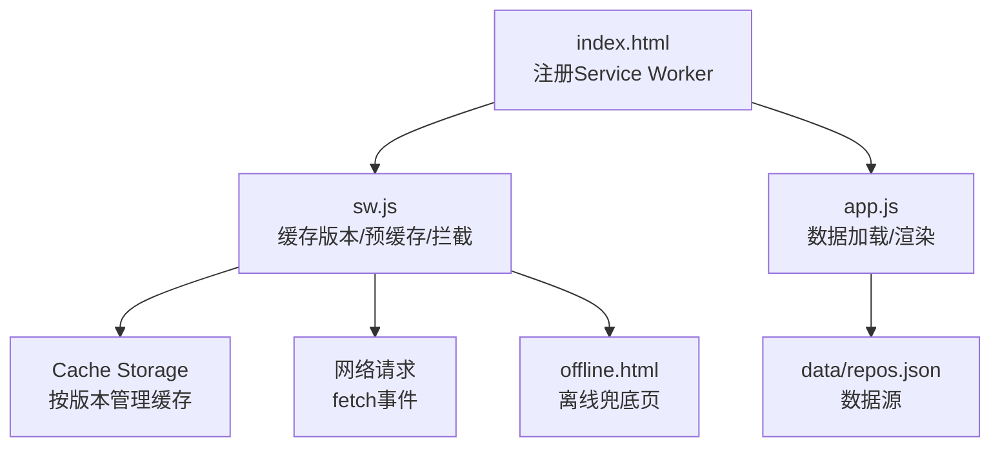
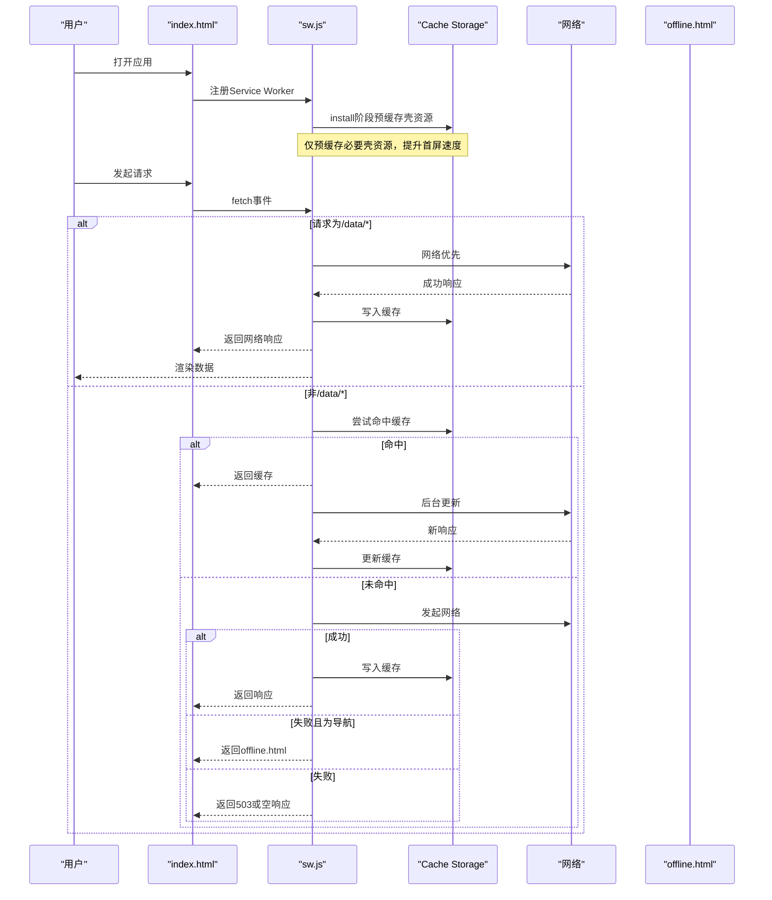
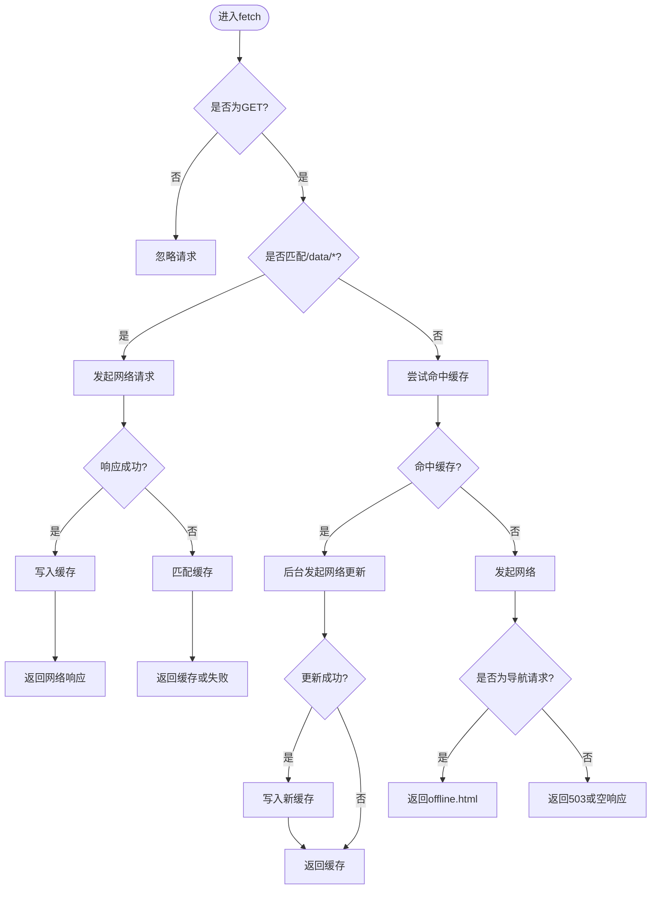
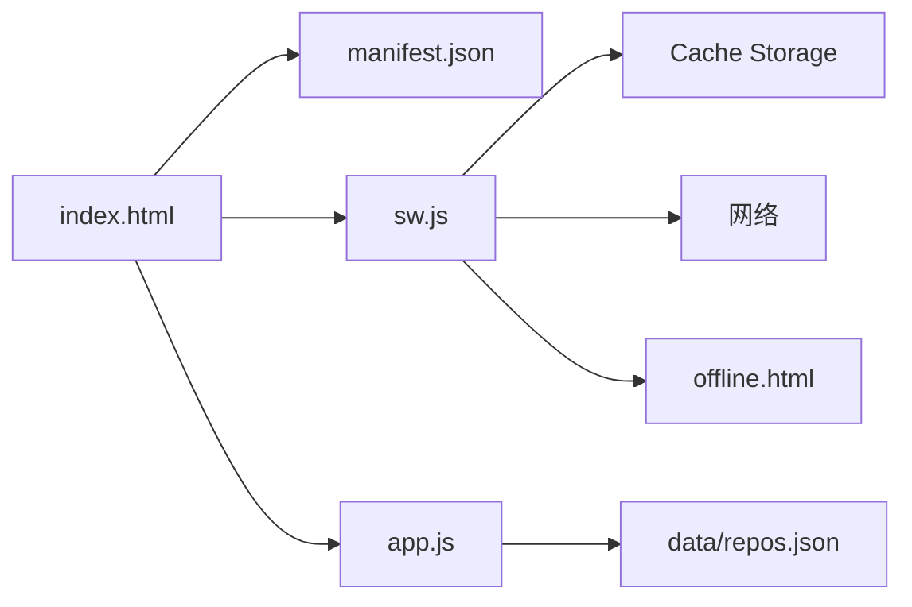

# PWA离线支持

<cite>
**本文引用的文件**
- [web/sw.js](file://web/sw.js)
- [web/manifest.json](file://web/manifest.json)
- [web/index.html](file://web/index.html)
- [web/app.js](file://web/app.js)
- [web/offline.html](file://web/offline.html)
</cite>

## 目录
1. [简介](#简介)
2. [项目结构](#项目结构)
3. [核心组件](#核心组件)
4. [架构总览](#架构总览)
5. [详细组件分析](#详细组件分析)
6. [依赖关系分析](#依赖关系分析)
7. [性能考量](#性能考量)
8. [故障排除指南](#故障排除指南)
9. [结论](#结论)
10. [附录](#附录)

## 简介
本文件面向GitHub Treasure Repo的PWA离线能力，系统性说明Service Worker配置与缓存策略、应用清单与安装提示、离线数据加载与失效处理、网络状态监听、跨浏览器兼容性与性能优化技巧，并提供调试与排障指南。目标是帮助开发者快速理解并维护该PWA的离线体验。

## 项目结构
PWA相关的前端资源位于web目录，关键文件如下：
- Service Worker: web/sw.js
- 应用清单: web/manifest.json
- 入口页面: web/index.html（注册SW）
- 主逻辑脚本: web/app.js（数据加载与UI交互）
- 离线兜底页: web/offline.html

图表来源
- [web/index.html:276-282](file://web/index.html#L276-L282)
- [web/sw.js:1-78](file://web/sw.js#L1-L78)
- [web/app.js:401-453](file://web/app.js#L401-L453)
- [web/offline.html:1-70](file://web/offline.html#L1-L70)

章节来源
- [web/index.html:1-284](file://web/index.html#L1-L284)
- [web/sw.js:1-128](file://web/sw.js#L1-L128)
- [web/manifest.json:1-16](file://web/manifest.json#L1-L16)
- [web/app.js:1-800](file://web/app.js#L1-L800)
- [web/offline.html:1-70](file://web/offline.html#L1-L70)

## 核心组件
- Service Worker（sw.js）
  - 定义缓存版本号，用于增量更新与清理旧缓存
  - 在install阶段预缓存“壳资源”（HTML/CSS/JS/离线页）
  - 在activate阶段清理旧缓存并接管客户端
  - 在fetch阶段实现差异化策略：
    - /data/路径：网络优先，成功后写入缓存；失败回退到缓存
    - 其他静态资源：先命中缓存，再后台更新；导航失败时返回离线页
- 应用清单（manifest.json）
  - 提供应用名称、启动URL、显示模式、主题色、图标等
- 入口页面（index.html）
  - 声明manifest链接
  - 条件注册Service Worker
- 主逻辑（app.js）
  - 负责从data/repos.json加载数据，包含重试与错误提示
- 离线兜底页（offline.html）
  - 简洁的离线提示与重试按钮

章节来源
- [web/sw.js:1-78](file://web/sw.js#L1-L78)
- [web/manifest.json:1-16](file://web/manifest.json#L1-L16)
- [web/index.html:276-282](file://web/index.html#L276-L282)
- [web/app.js:401-453](file://web/app.js#L401-L453)
- [web/offline.html:1-70](file://web/offline.html#L1-L70)

## 架构总览
下图展示PWA在首次访问与后续访问中的关键流程：注册SW、预缓存、请求拦截、缓存命中与回退。

图表来源
- [web/index.html:276-282](file://web/index.html#L276-L282)
- [web/sw.js:11-78](file://web/sw.js#L11-L78)
- [web/offline.html:1-70](file://web/offline.html#L1-L70)

## 详细组件分析

### Service Worker（sw.js）
- 缓存版本管理
  - 使用常量定义当前缓存版本名，便于增量升级与清理旧缓存
  - activate事件中遍历所有缓存键，删除非当前版本的缓存
- 预缓存策略
  - install事件中打开当前版本缓存，批量添加壳资源（首页、样式、脚本、离线页）
- 请求拦截策略
  - 过滤非GET请求
  - 对/data/路径采用“网络优先+缓存回退”，并在成功时写回缓存
  - 对其他资源采用“缓存优先+后台更新”，导航失败时返回离线页
- 激活与接管
  - activate后调用clients.claim()使新SW立即生效于已打开的页面

图表来源
- [web/sw.js:33-78](file://web/sw.js#L33-L78)
- [web/offline.html:1-70](file://web/offline.html#L1-L70)

章节来源
- [web/sw.js:1-78](file://web/sw.js#L1-L78)

### 应用清单（manifest.json）
- 应用元信息
  - name/short_name/description：应用名称与描述
  - start_url：应用启动入口
  - display：standalone，以独立窗口运行
  - background_color/theme_color：主题与背景色
- 图标设置
  - icons数组中通过SVG data URI提供矢量图标，适配不同尺寸
- 安装提示逻辑
  - 清单本身不触发安装提示；通常由前端根据可安装性判断后调用Web App Install Prompt API
  - 本项目清单满足基本字段要求，可作为安装前提之一

章节来源
- [web/manifest.json:1-16](file://web/manifest.json#L1-L16)

### 入口页面（index.html）
- 声明manifest链接，供浏览器识别PWA能力
- 条件注册Service Worker：检测navigator.serviceWorker存在后，在window.load时注册./sw.js
- 引入主脚本app.js

章节来源
- [web/index.html:9-13](file://web/index.html#L9-L13)
- [web/index.html:276-282](file://web/index.html#L276-L282)

### 主逻辑（app.js）
- 数据加载
  - 定义DATA_URL指向../data/repos.json，并尝试多个相对路径作为备选
  - 具备重试机制与友好错误提示（包括file协议与本地服务器提示）
- UI与交互
  - 大量业务逻辑（筛选、排序、书签、对比、分享等），与PWA离线能力无直接耦合
- 与PWA的关系
  - 当网络不可用时，若/data/repos.json已被缓存，则可通过缓存读取；否则需依赖后端或离线数据

章节来源
- [web/app.js:1-10](file://web/app.js#L1-L10)
- [web/app.js:401-453](file://web/app.js#L401-L453)

### 离线兜底页（offline.html）
- 纯静态页面，提供离线提示与重试按钮
- 被sw.js在导航失败时返回，确保用户体验一致

章节来源
- [web/offline.html:1-70](file://web/offline.html#L1-L70)

## 依赖关系分析
- index.html依赖manifest.json与sw.js
- sw.js依赖Cache Storage与网络层
- app.js依赖data/repos.json
- sw.js在特定条件下返回offline.html

图表来源
- [web/index.html:9-13](file://web/index.html#L9-L13)
- [web/sw.js:1-78](file://web/sw.js#L1-L78)
- [web/app.js:401-453](file://web/app.js#L401-L453)
- [web/offline.html:1-70](file://web/offline.html#L1-L70)

章节来源
- [web/index.html:1-284](file://web/index.html#L1-L284)
- [web/sw.js:1-128](file://web/sw.js#L1-L128)
- [web/app.js:1-800](file://web/app.js#L1-L800)
- [web/offline.html:1-70](file://web/offline.html#L1-L70)

## 性能考量
- 预缓存最小化
  - 仅预缓存壳资源，避免将大体积数据纳入预缓存，减少首次安装时间
- 按需缓存
  - 对/data/*采用网络优先，保证数据新鲜度；仅在成功时写入缓存，避免污染脏数据
- 后台更新
  - 对静态资源采用缓存优先+后台更新，兼顾速度与一致性
- 导航回退
  - 导航失败返回轻量离线页，降低带宽与渲染开销
- 版本化与清理
  - 通过版本常量与activate清理旧缓存，防止存储膨胀

[本节为通用指导，无需源码引用]

## 故障排除指南
- 无法加载数据
  - 现象：页面提示“无法加载数据”
  - 原因：通过file://协议直接打开页面，浏览器阻止fetch；或本地数据文件缺失
  - 解决：使用本地HTTP服务（如python3 -m http.server 8000）或在仓库根目录执行数据抓取脚本生成repos.json
- 离线状态下无法获取最新数据
  - 现象：刷新后仍显示旧数据或空白
  - 原因：/data/*在网络失败时回退到缓存；若缓存为空则无数据
  - 解决：恢复网络后刷新；或检查sw.js是否正确缓存了/data/repos.json
- 安装提示未出现
  - 现象：浏览器未弹出安装提示
  - 原因：清单不完整、HTTPS限制、未满足可安装性条件、未在前端调用安装API
  - 解决：确认manifest字段完整、部署在HTTPS环境、在合适时机调用安装API
- Service Worker未生效
  - 现象：修改sw.js后行为未变化
  - 原因：旧SW仍在控制页面
  - 解决：在activate中调用clients.claim()（已实现），或通过开发者工具强制更新/卸载旧SW

章节来源
- [web/app.js:401-453](file://web/app.js#L401-L453)
- [web/sw.js:20-31](file://web/sw.js#L20-L31)
- [web/manifest.json:1-16](file://web/manifest.json#L1-L16)

## 结论
该PWA通过合理的缓存版本管理、最小化的预缓存、差异化的请求拦截策略以及离线兜底页，实现了良好的离线可用性与性能表现。建议在后续迭代中补充显式的安装提示逻辑、完善网络状态监听与更细粒度的缓存失效策略，以提升整体用户体验与可维护性。

[本节为总结，无需源码引用]

## 附录

### PWA安装流程（概念）
- 前置条件
  - 有效的manifest.json
  - HTTPS环境
  - 至少一个可安装的图标
- 触发安装
  - 前端检测可安装性后，调用安装API弹出系统提示
  - 用户确认后，应用添加到桌面并可独立运行
- 卸载与更新
  - 通过系统设置卸载
  - 新版本发布后，SW会在activate阶段接管并清理旧缓存

[本节为概念说明，无需源码引用]

### 跨浏览器兼容性处理（概念）
- 特性检测
  - 注册SW前检测navigator.serviceWorker
  - 安装提示前检测beforeinstallprompt或自定义可安装性判断
- 降级策略
  - 不支持PWA的浏览器仍可正常访问在线功能
  - 离线场景下尽可能提供基础内容或明确提示

[本节为概念说明，无需源码引用]

### 调试PWA应用的工具与步骤
- Chrome DevTools
  - Application面板查看Manifest、Service Workers、Cache Storage
  - Network面板勾选Offline模拟离线场景
  - Performance面板评估首屏与缓存命中
- 常见操作
  - 强制更新SW：在Application > Service Workers中点击Update
  - 删除缓存：在Cache Storage中删除对应版本
  - 验证离线：切换到Offline后刷新，观察是否命中缓存或返回离线页

[本节为通用指导，无需源码引用]