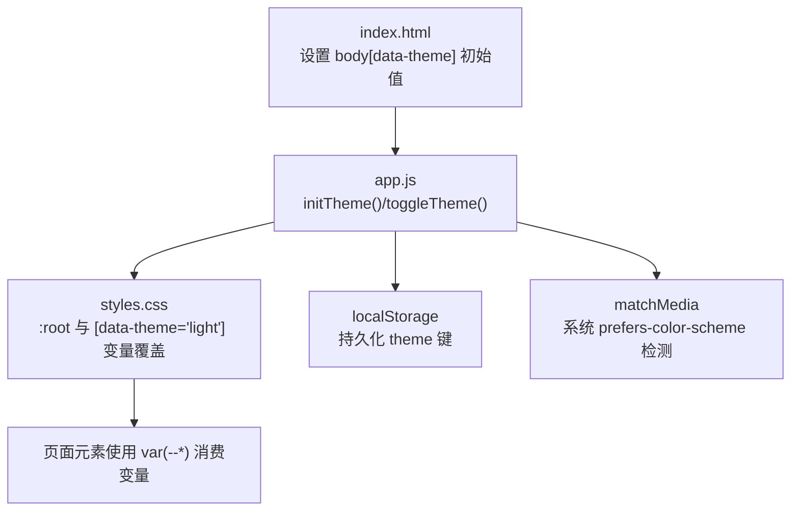
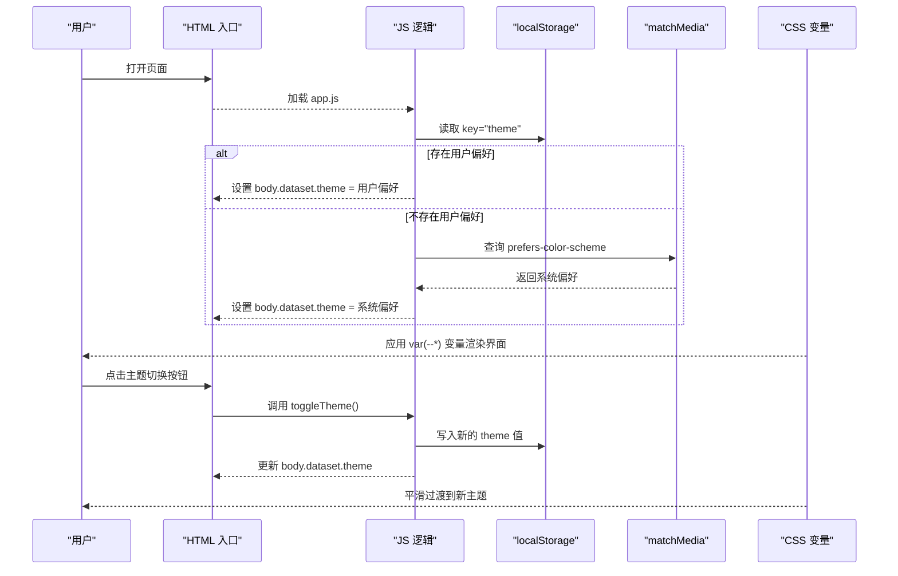
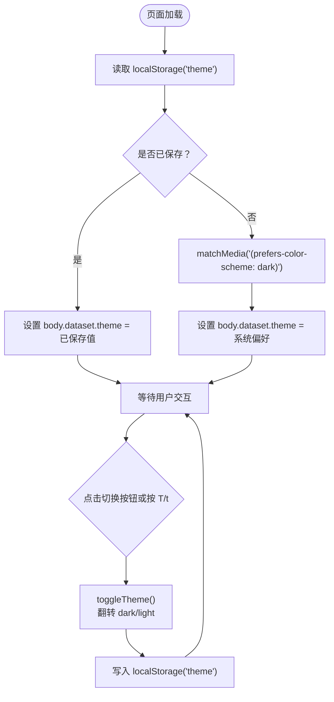
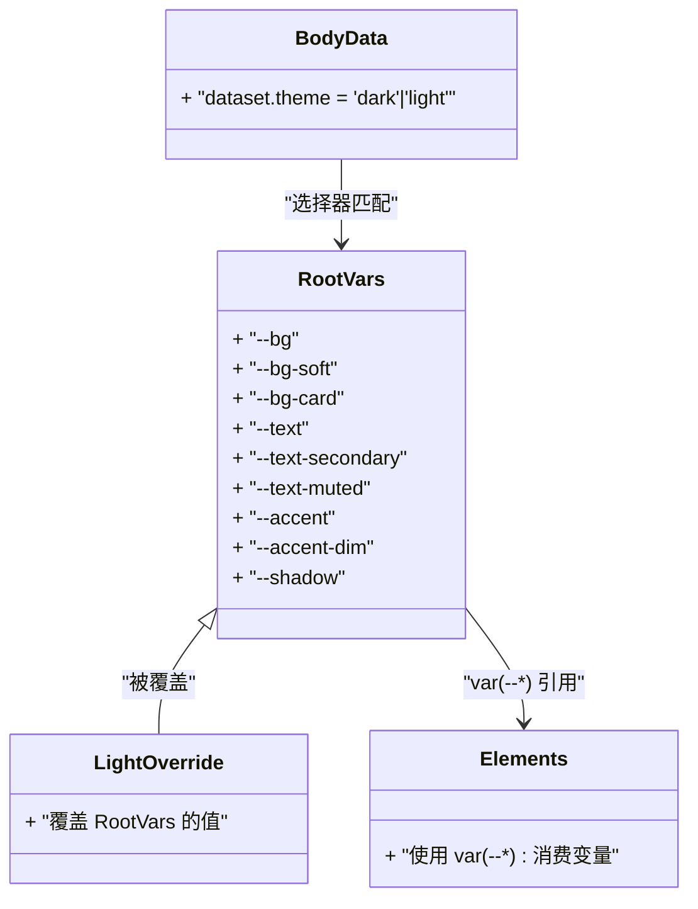
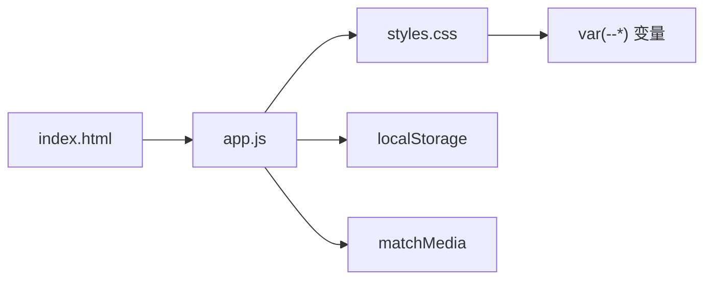

# 主题系统

<cite>
**本文引用的文件**   
- [web/app.js](file://web/app.js)
- [web/styles.css](file://web/styles.css)
- [web/index.html](file://web/index.html)
</cite>

## 目录
1. [简介](#简介)
2. [项目结构](#项目结构)
3. [核心组件](#核心组件)
4. [架构总览](#架构总览)
5. [详细组件分析](#详细组件分析)
6. [依赖关系分析](#依赖关系分析)
7. [性能考虑](#性能考虑)
8. [故障排查指南](#故障排查指南)
9. [结论](#结论)
10. [附录：扩展新主题变体](#附录扩展新主题变体)

## 简介
本文件为 GitHub Treasure Repo 的主题系统提供深入文档，重点解释深色/浅色主题切换的实现机制，包括 CSS 变量管理、localStorage 持久化存储与系统偏好检测；详细说明 initTheme() 与 toggleTheme() 函数的实现原理、document.body.dataset.theme 的使用方式，以及 CSS 中 var(--*) 变量的动态切换机制。同时涵盖主题兼容性处理、过渡动画效果与性能优化策略，并提供扩展新主题变体的具体方法（以代码片段路径形式给出）。

## 项目结构
主题系统由三个关键文件协作完成：
- HTML 入口：提供初始 data-theme 属性与主题切换按钮
- CSS 样式：定义 CSS 变量与基于 data-theme 的覆盖规则
- JS 逻辑：负责读取用户偏好、系统偏好并驱动 UI 状态更新

图表来源
- [web/index.html:15-30](file://web/index.html#L15-L30)
- [web/app.js:192-205](file://web/app.js#L192-L205)
- [web/styles.css:5-36](file://web/styles.css#L5-L36)

章节来源
- [web/index.html:15-30](file://web/index.html#L15-L30)
- [web/app.js:192-205](file://web/app.js#L192-L205)
- [web/styles.css:5-36](file://web/styles.css#L5-L36)

## 核心组件
- 初始化函数 initTheme()
  - 从 localStorage 读取已保存的主题
  - 若未保存，则通过 matchMedia('(prefers-color-scheme: dark)') 检测系统偏好
  - 将最终主题写入 document.body.dataset.theme
- 切换函数 toggleTheme()
  - 读取当前 body 上的 data-theme 值
  - 在 'dark' 与 'light' 之间翻转
  - 写回 body 的 dataset 并持久化到 localStorage
- CSS 变量体系
  - :root 下定义默认（深色）变量
  - [data-theme="light"] 选择器覆盖为浅色变量
  - 全局元素通过 var(--*) 引用这些变量，实现无刷新换肤
- 事件绑定
  - 点击主题切换按钮触发 toggleTheme()
  - 键盘快捷键 T/t 也可触发切换

章节来源
- [web/app.js:192-205](file://web/app.js#L192-L205)
- [web/app.js:1094-1096](file://web/app.js#L1094-L1096)
- [web/app.js:1270-1272](file://web/app.js#L1270-L1272)
- [web/styles.css:5-36](file://web/styles.css#L5-L36)
- [web/index.html:22-30](file://web/index.html#L22-L30)

## 架构总览
主题系统的运行流程如下：

图表来源
- [web/app.js:192-205](file://web/app.js#L192-L205)
- [web/app.js:1094-1096](file://web/app.js#L1094-L1096)
- [web/styles.css:5-36](file://web/styles.css#L5-L36)

## 详细组件分析

### 初始化与切换流程
- 初始化顺序
  - 页面加载后执行 initTheme()，优先使用 localStorage 中的主题，否则回退到系统偏好
  - 随后初始化语言、书签等其它功能
- 切换交互
  - 点击主题切换按钮或按下 T/t 键时调用 toggleTheme()
  - 切换后立即更新 body.dataset.theme 并持久化

图表来源
- [web/app.js:192-205](file://web/app.js#L192-L205)
- [web/app.js:1270-1272](file://web/app.js#L1270-L1272)
- [web/app.js:2614-2616](file://web/app.js#L2614-L2616)

章节来源
- [web/app.js:192-205](file://web/app.js#L192-L205)
- [web/app.js:1270-1272](file://web/app.js#L1270-L1272)
- [web/app.js:2614-2616](file://web/app.js#L2614-L2616)

### CSS 变量与动态切换机制
- 变量定义
  - :root 下声明一组基础变量（背景、文字、边框、阴影等），作为深色主题默认值
  - [data-theme="light"] 选择器对同一组变量进行覆盖，形成浅色主题
- 动态切换
  - JS 仅修改 body.dataset.theme，不直接操作样式
  - CSS 根据 data-theme 自动重算 var(--*)，从而改变所有引用该变量的元素
- 过渡与动画
  - body 及多个容器设置了 transition，使背景与颜色变化具备平滑过渡效果
  - 图标显示/隐藏通过 [data-theme="light"] 控制 .icon-sun/.icon-moon 的 display

图表来源
- [web/styles.css:5-36](file://web/styles.css#L5-L36)
- [web/styles.css:48-56](file://web/styles.css#L48-L56)
- [web/styles.css:113-121](file://web/styles.css#L113-L121)

章节来源
- [web/styles.css:5-36](file://web/styles.css#L5-L36)
- [web/styles.css:48-56](file://web/styles.css#L48-L56)
- [web/styles.css:113-121](file://web/styles.css#L113-L121)

### 事件绑定与快捷键
- 点击切换
  - 按钮 #themeToggle 绑定 click 事件，调用 toggleTheme()
- 键盘切换
  - 监听全局 keydown，当按键为 t/T 时调用 toggleTheme()
- 无障碍提示
  - 按钮包含 aria-label，便于屏幕阅读器识别

章节来源
- [web/app.js:1094-1096](file://web/app.js#L1094-L1096)
- [web/app.js:1270-1272](file://web/app.js#L1270-L1272)
- [web/index.html:22-30](file://web/index.html#L22-L30)

## 依赖关系分析
- 模块耦合
  - app.js 依赖 DOM API（body.dataset）、浏览器存储（localStorage）、媒体查询（matchMedia）
  - styles.css 通过选择器与变量名与 app.js 约定契约
- 外部依赖
  - 无第三方库依赖，纯原生实现
- 潜在循环依赖
  - 无循环依赖，职责清晰：HTML 提供入口，JS 驱动状态，CSS 消费状态

图表来源
- [web/index.html:15-30](file://web/index.html#L15-L30)
- [web/app.js:192-205](file://web/app.js#L192-L205)
- [web/styles.css:5-36](file://web/styles.css#L5-L36)

章节来源
- [web/index.html:15-30](file://web/index.html#L15-L30)
- [web/app.js:192-205](file://web/app.js#L192-L205)
- [web/styles.css:5-36](file://web/styles.css#L5-L36)

## 性能考虑
- 最小化重排重绘
  - 仅修改 body.dataset.theme，避免逐个元素样式变更
  - CSS 使用 transition 平滑过渡，减少视觉闪烁
- 存储读写开销
  - localStorage 仅在初始化与切换时读写，频率低
- 媒体查询监听
  - 当前实现仅在初始化时检测一次系统偏好，未监听系统主题变化；如需实时响应系统主题切换，可添加 matchMedia 监听器并在回调中同步 body.dataset.theme

[本节为通用指导，无需特定文件来源]

## 故障排查指南
- 问题：首次打开页面主题不正确
  - 检查 localStorage 是否存在脏数据（如非法值）
  - 确认 initTheme() 是否在页面加载早期执行
  - 参考路径：[web/app.js:192-205](file://web/app.js#L192-L205)、[web/app.js:2614-2616](file://web/app.js#L2614-L2616)
- 问题：切换按钮无效
  - 确认 #themeToggle 按钮存在且未被其他事件拦截
  - 检查 click 事件绑定是否成功
  - 参考路径：[web/app.js:1094-1096](file://web/app.js#L1094-L1096)
- 问题：快捷键 T/t 无效
  - 确认全局 keydown 监听未被输入框聚焦阻断
  - 参考路径：[web/app.js:1270-1272](file://web/app.js#L1270-L1272)
- 问题：浅色模式下图标未切换
  - 检查 [data-theme="light"] 下的 .icon-sun/.icon-moon 显示规则
  - 参考路径：[web/styles.css:113-121](file://web/styles.css#L113-L121)

章节来源
- [web/app.js:192-205](file://web/app.js#L192-L205)
- [web/app.js:1094-1096](file://web/app.js#L1094-L1096)
- [web/app.js:1270-1272](file://web/app.js#L1270-L1272)
- [web/styles.css:113-121](file://web/styles.css#L113-L121)

## 结论
该主题系统采用“状态即属性”的设计思路：通过 body.dataset.theme 驱动 CSS 变量覆盖，结合 localStorage 与系统偏好检测，实现了简洁、可扩展且高性能的深色/浅色主题切换方案。其优势在于：
- 零依赖、易维护
- 通过 CSS 变量集中管理配色，易于扩展
- 过渡动画提升用户体验
- 支持键盘快捷键与无障碍标签

[本节为总结性内容，无需特定文件来源]

## 附录：扩展新主题变体
以下说明如何在不破坏现有行为的前提下，新增一个自定义主题变体（例如“高对比度模式”）。步骤如下：

- 在 CSS 中为新主题定义变量覆盖
  - 新增选择器，例如 [data-theme="high-contrast"]，覆盖必要的 --* 变量
  - 参考路径：[web/styles.css:5-36](file://web/styles.css#L5-L36)
- 在 JS 中扩展切换逻辑
  - 在 toggleTheme() 中增加对新主题的轮转逻辑（例如 dark -> light -> high-contrast -> dark）
  - 参考路径：[web/app.js:199-205](file://web/app.js#L199-L205)
- 可选：在初始化时支持从 URL 参数或预设加载新主题
  - 参考路径：[web/app.js:1359-1380](file://web/app.js#L1359-L1380)
- 测试要点
  - 验证 localStorage 持久化是否正确
  - 验证 CSS 变量覆盖是否生效
  - 验证过渡动画与图标切换是否正常

示例路径（不包含代码内容）
- 新增主题变量覆盖：[web/styles.css:5-36](file://web/styles.css#L5-L36)
- 切换逻辑扩展点：[web/app.js:199-205](file://web/app.js#L199-L205)
- 初始化入口：[web/app.js:2614-2616](file://web/app.js#L2614-L2616)

章节来源
- [web/styles.css:5-36](file://web/styles.css#L5-L36)
- [web/app.js:199-205](file://web/app.js#L199-L205)
- [web/app.js:2614-2616](file://web/app.js#L2614-L2616)