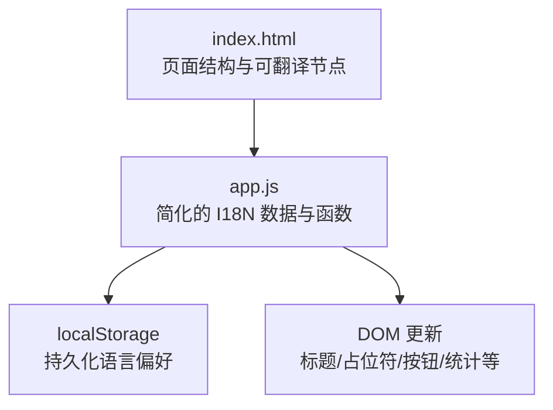
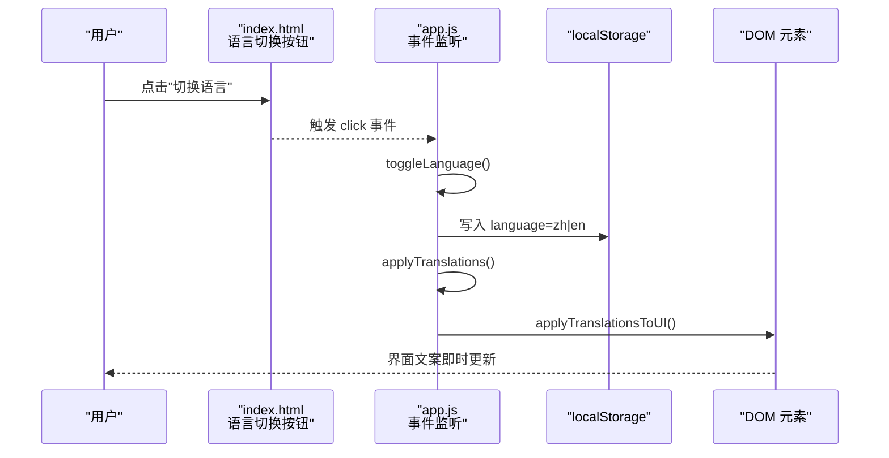
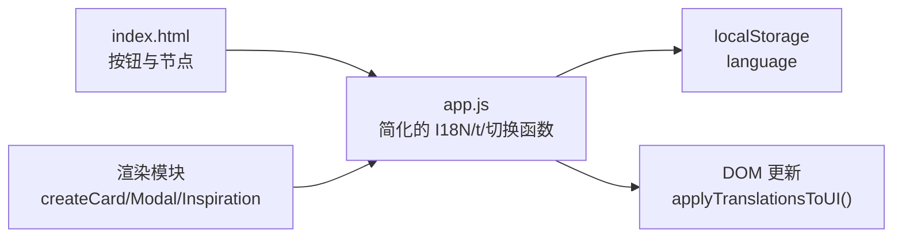
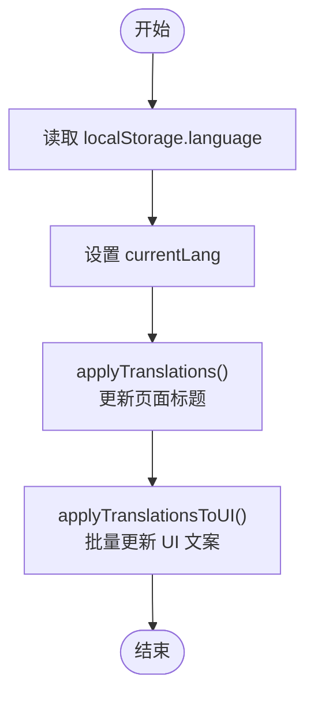

# 国际化系统

<cite>
**本文引用的文件**
- [web/app.js](file://web/app.js)
- [web/index.html](file://web/index.html)
</cite>

## 更新摘要
**变更内容**
- 重构了 I18N 对象架构，采用简化的扁平化结构
- 移除了复杂的嵌套层级，直接在同一对象中维护中英文翻译
- 保持了完整的双语支持功能，同时提升了代码可维护性

## 目录
1. [简介](#简介)
2. [项目结构](#项目结构)
3. [核心组件](#核心组件)
4. [架构总览](#架构总览)
5. [详细组件分析](#详细组件分析)
6. [依赖关系分析](#依赖关系分析)
7. [性能考量](#性能考量)
8. [故障排查指南](#故障排查指南)
9. [结论](#结论)
10. [附录](#附录)

## 简介
本文件聚焦于 GitHub Treasure Repo 的前端国际化（i18n）系统，围绕中英文双语支持进行系统化说明。内容涵盖：
- 简化的 I18N 对象结构与键值组织
- t() 翻译函数的实现机制
- 动态语言切换流程（initLanguage、toggleLanguage、applyTranslationsToUI）
- localStorage 中的语言偏好存储策略
- HTML 元素的动态文本更新策略
- 新增语言的扩展方法、翻译键值管理规范与最佳实践

## 项目结构
国际化相关逻辑集中在前端单页应用中，入口为 web/index.html，业务与交互逻辑位于 web/app.js。HTML 提供 UI 骨架与可被 i18n 更新的元素标识；JS 负责加载语言包、维护当前语言状态、并在用户交互时刷新界面文案。



**图表来源**
- [web/index.html:1-284](file://web/index.html#L1-L284)
- [web/app.js:38-191](file://web/app.js#L38-L191)

**章节来源**
- [web/index.html:1-284](file://web/index.html#L1-L284)
- [web/app.js:38-191](file://web/app.js#L38-L191)

## 核心组件
- **简化的 I18N 字典**：采用扁平化结构，直接在 I18N 对象下定义 zh 和 en 两个属性，每个属性包含该语言的所有文案键值对。
- currentLang：当前语言状态变量，默认中文。
- t(key)：根据 currentLang 从 I18N 中取对应文案，若缺失则回退到 key 本身。
- initLanguage()：初始化语言，优先读取 localStorage 的 language 字段，否则使用默认语言，并应用基础翻译。
- toggleLanguage()：在 zh 与 en 之间切换，写入 localStorage，触发基础翻译与 UI 文案刷新。
- applyTranslations()：仅更新 document.title 等全局性文案。
- applyTranslationsToUI()：批量更新页面可见文案（标题、副标题、搜索框占位、筛选标签、排序选项、范围滑块标签、重置按钮、收藏按钮、统计项、模态框链接等）。

**章节来源**
- [web/app.js:38-191](file://web/app.js#L38-L191)
- [web/app.js:207-291](file://web/app.js#L207-L291)

## 架构总览
下图展示了语言切换的关键时序：用户点击语言切换按钮后，状态变更、持久化、以及 UI 文案刷新的调用链。



**图表来源**
- [web/index.html:32-35](file://web/index.html#L32-L35)
- [web/app.js:1095-1096](file://web/app.js#L1095-L1096)
- [web/app.js:213-218](file://web/app.js#L213-L218)
- [web/app.js:220-291](file://web/app.js#L220-L291)

## 详细组件分析

### 简化的 I18N 对象与 t() 函数
**更新** I18N 对象现在采用简化的扁平化架构，移除了复杂的嵌套层级。

- **扁平化结构**：I18N 对象直接包含 zh 和 en 两个顶级属性，每个属性对应一种语言的完整翻译集合。
- **统一的键名**：两种语言使用完全相同的键名，确保语义清晰且易于维护。
- **t(key) 函数**：通过 currentLang 索引 I18N，若找不到对应键则返回 key 作为降级显示，避免空白文案。

建议
- 新增语言时，务必保持键集合一致，避免运行时出现回退键暴露给用户。
- 文案尽量短小明确，便于在不同语言下排版稳定。

**章节来源**
- [web/app.js:38-191](file://web/app.js#L38-L191)

### 初始化与切换流程
- initLanguage()：从 localStorage 读取 language，未设置则使用默认 zh，随后调用 applyTranslations() 更新页面标题等基础信息。
- toggleLanguage()：在 zh 与 en 间切换，写入 localStorage，再依次调用 applyTranslations() 与 applyTranslationsToUI()，确保标题与可见文案同步刷新。
- applyTranslations()：更新 document.title。
- applyTranslationsToUI()：集中更新所有静态文案节点，包括：
  - 标题与副标题
  - 搜索输入占位符
  - 筛选与排序标签
  - 排序下拉各选项文案
  - Stars/Forks/评分范围滑块标签
  - 重置按钮文案
  - 收藏按钮文案
  - 统计项标签
  - 模态框内"在 GitHub 查看"等链接文案
  - 当处于收藏视图时的空状态提示

注意
- 部分动态渲染区域（如卡片描述、活动等级提示、分享菜单等）在渲染时直接按 currentLang 分支选择文案，不经过 applyTranslationsToUI()。这类文案需随 currentLang 变化而重新渲染或采用 t() 包装。

**章节来源**
- [web/app.js:207-291](file://web/app.js#L207-L291)

### 语言偏好存储
- 存储键：language
- 存储位置：localStorage
- 生命周期：首次访问无记录时使用默认 zh；后续每次切换都会覆盖旧值，保证跨会话一致性。

**章节来源**
- [web/app.js:207-218](file://web/app.js#L207-L218)

### HTML 元素动态文本更新策略
- 静态文案：由 applyTranslationsToUI() 在语言切换时统一更新。
- 动态文案：在数据渲染或交互过程中，依据 currentLang 分支或调用 t() 生成文案，例如：
  - 卡片描述的空状态提示
  - 活动等级文案
  - 分享菜单文案
  - 键盘帮助弹窗文案
  - 灵感模式内的提示与操作文案

建议
- 将更多硬编码文案迁移至 I18N 并通过 t() 获取，减少 if(currentLang==='zh') 分支，提升可维护性与可扩展性。

**章节来源**
- [web/app.js:224-291](file://web/app.js#L224-L291)
- [web/app.js:914-993](file://web/app.js#L914-L993)
- [web/app.js:613-632](file://web/app.js#L613-632)
- [web/app.js:670-716](file://web/app.js#L670-716)
- [web/app.js:776-817](file://web/app.js#L776-817)
- [web/app.js:2292-2399](file://web/app.js#L2292-2399)

### 新增语言的扩展方法
步骤
1. 在 I18N 中添加新语言键（如 ja），补齐所有现有键的对应文案。
2. 如需支持更多语言，可在 toggleLanguage() 中扩展循环切换逻辑，或改为显式选择器。
3. 在 applyTranslationsToUI() 中补充需要本地化的新增 UI 节点。
4. 检查所有动态渲染路径，确保使用 t() 或按 currentLang 分支输出文案。
5. 验证 localStorage 的 language 值与新语言代码一致。

风险点
- 遗漏键会导致回退到 key 显示，影响体验。
- 新增 UI 节点未纳入 applyTranslationsToUI() 会导致切换后文案不变。

**章节来源**
- [web/app.js:38-191](file://web/app.js#L38-L191)
- [web/app.js:213-218](file://web/app.js#L213-L218)
- [web/app.js:224-291](file://web/app.js#L224-L291)

### 翻译键值管理规范
- 命名约定：使用语义化英文键名（如 searchPlaceholder、sortScore、noBookmarks），避免缩写歧义。
- 键集合一致性：每种语言必须包含相同键集合，缺失时 t() 会回退到键名。
- 分类组织：可按功能域分组注释（如搜索、排序、统计、模态框、灵感模式），便于维护。
- 文案长度控制：考虑不同语言字符长度差异，避免布局溢出。

**章节来源**
- [web/app.js:38-191](file://web/app.js#L38-L191)

### 多语言内容的最佳实践
- 优先使用 t() 获取文案，避免多处 if(currentLang==='zh') 分支。
- 将模板字符串中的文案抽取为键，统一由 t() 注入。
- 对于大量列表项的动态文案，建议在渲染函数内部调用 t()，确保切换语言后再次渲染能正确显示。
- 对不可见但可被读屏器读取的提示（aria-live 区域）也应遵循 t() 规范，保障无障碍体验。

**章节来源**
- [web/app.js:224-291](file://web/app.js#L224-L291)
- [web/app.js:914-993](file://web/app.js#L914-L993)
- [web/app.js:2292-2399](file://web/app.js#L2292-2399)

## 依赖关系分析
- index.html 提供语言切换按钮与待翻译的 DOM 节点。
- app.js 定义简化的 I18N、currentLang、t() 及语言切换函数，并通过事件监听绑定到按钮。
- localStorage 用于持久化语言偏好。
- 其他模块（如筛选、排序、渲染）在渲染时可能直接使用 currentLang 分支或 t()，形成间接依赖。



**图表来源**
- [web/index.html:32-35](file://web/index.html#L32-L35)
- [web/app.js:1095-1096](file://web/app.js#L1095-L1096)
- [web/app.js:207-291](file://web/app.js#L207-L291)
- [web/app.js:914-993](file://web/app.js#L914-L993)
- [web/app.js:2292-2399](file://web/app.js#L2292-2399)

**章节来源**
- [web/index.html:32-35](file://web/index.html#L32-L35)
- [web/app.js:1095-1096](file://web/app.js#L1095-L1096)
- [web/app.js:207-291](file://web/app.js#L207-L291)
- [web/app.js:914-993](file://web/app.js#L914-L993)
- [web/app.js:2292-2399](file://web/app.js#L2292-2399)

## 性能考量
- 语言切换属于轻量级操作，主要开销在于 DOM 查询与赋值，整体耗时极低。
- 简化的 I18N 结构减少了对象嵌套层级，提升了访问性能。
- 若未来增加更多语言或更复杂的文案模板，建议：
  - 缓存已解析的文案结果（可选）
  - 将频繁更新的文案节点 ID 缓存，减少重复 querySelector
  - 使用 DocumentFragment 批量插入，减少重排

## 故障排查指南
常见问题
- 切换语言后部分文案未更新：检查是否遗漏了 applyTranslationsToUI() 中的对应节点，或该文案是否在渲染时使用了硬编码分支而非 t()。
- 首次打开页面语言不正确：确认 localStorage 中是否存在 language 键，或浏览器环境是否允许读写 localStorage。
- 新增语言后出现键名原文：核对 I18N 中是否补全了所有键，确保键集合一致。

定位要点
- 事件绑定是否正确挂载到语言切换按钮。
- toggleLanguage() 是否同时调用了 applyTranslations() 与 applyTranslationsToUI()。
- 动态渲染路径是否使用 t() 或按 currentLang 分支输出。

**章节来源**
- [web/app.js:1095-1096](file://web/app.js#L1095-L1096)
- [web/app.js:213-218](file://web/app.js#L213-L218)
- [web/app.js:224-291](file://web/app.js#L224-L291)
- [web/app.js:914-993](file://web/app.js#L914-L993)
- [web/app.js:2292-2399](file://web/app.js#L2292-2399)

## 结论
本项目的前端国际化方案经过架构重构后更加简洁高效：采用简化的扁平化 I18N 字典结构、t() 为统一访问入口、localStorage 持久化语言偏好，配合 applyTranslationsToUI() 集中刷新静态文案。这种设计既保持了完整的双语支持功能，又显著提升了代码的可维护性和可扩展性。为保证良好的用户体验，建议逐步将动态渲染中的硬编码文案迁移至 I18N，并通过 t() 注入，从而降低分支复杂度，提升新增语言时的可靠性与一致性。

## 附录

### 关键流程图：语言切换


**图表来源**
- [web/app.js:207-218](file://web/app.js#L207-L218)
- [web/app.js:220-291](file://web/app.js#L220-L291)

### I18N 对象结构示例
**更新** 展示简化后的扁平化 I18N 对象结构：

```javascript
const I18N = {
  zh: {
    searchPlaceholder: '搜索项目名称或描述...',
    languageLabel: '语言',
    sortLabel: '排序',
    // ... 其他中文翻译
  },
  en: {
    searchPlaceholder: 'Search projects...',
    languageLabel: 'Language',
    sortLabel: 'Sort',
    // ... 其他英文翻译
  }
};
```

这种结构相比之前的嵌套架构更加直观，减少了对象访问层级，提升了代码可读性和维护性。