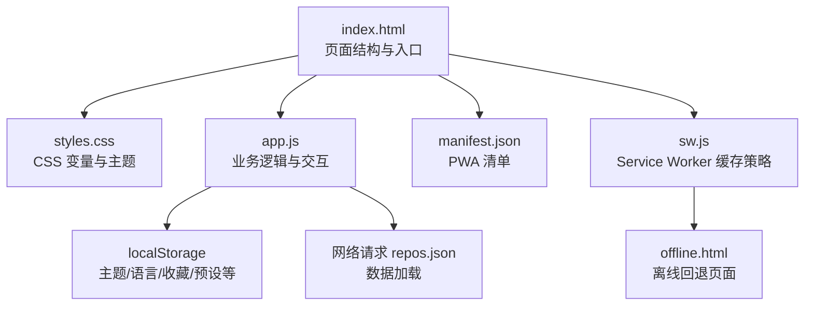
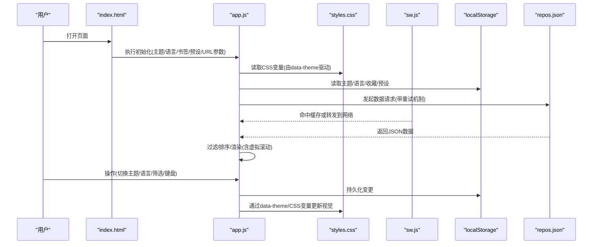
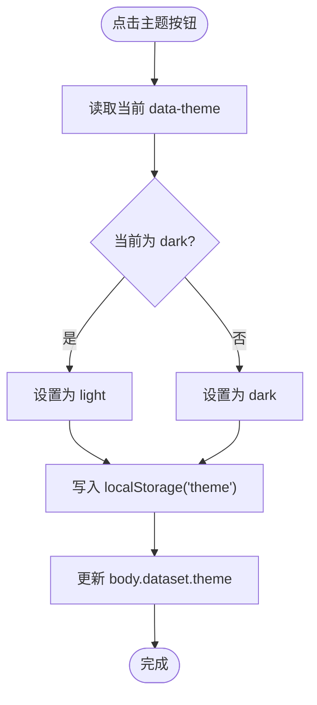
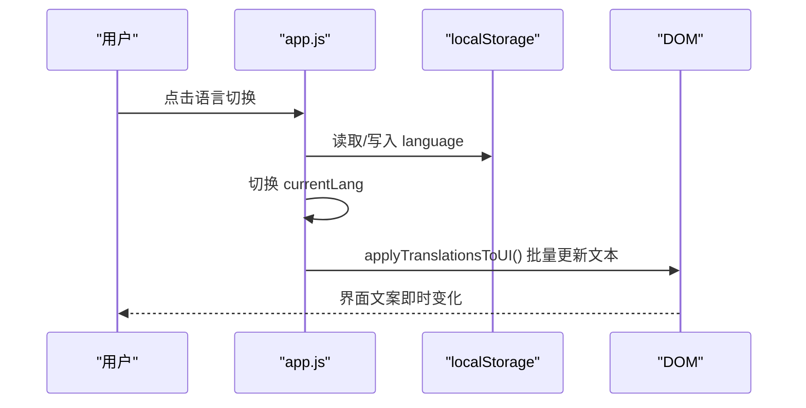
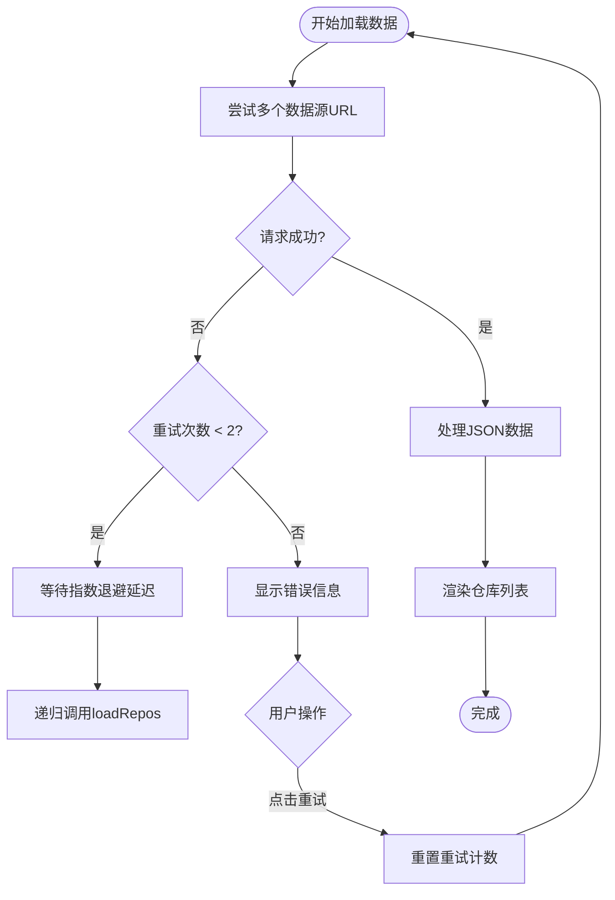
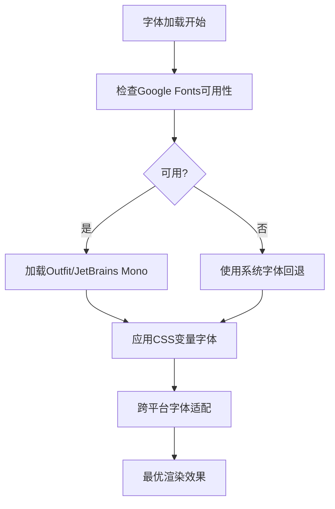
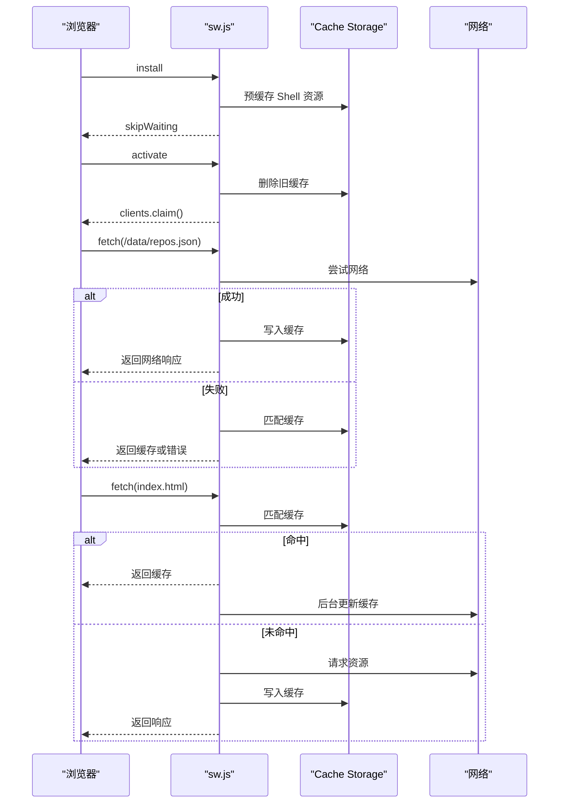
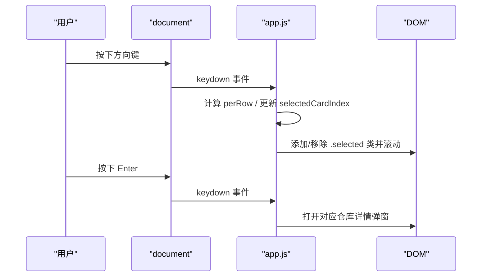
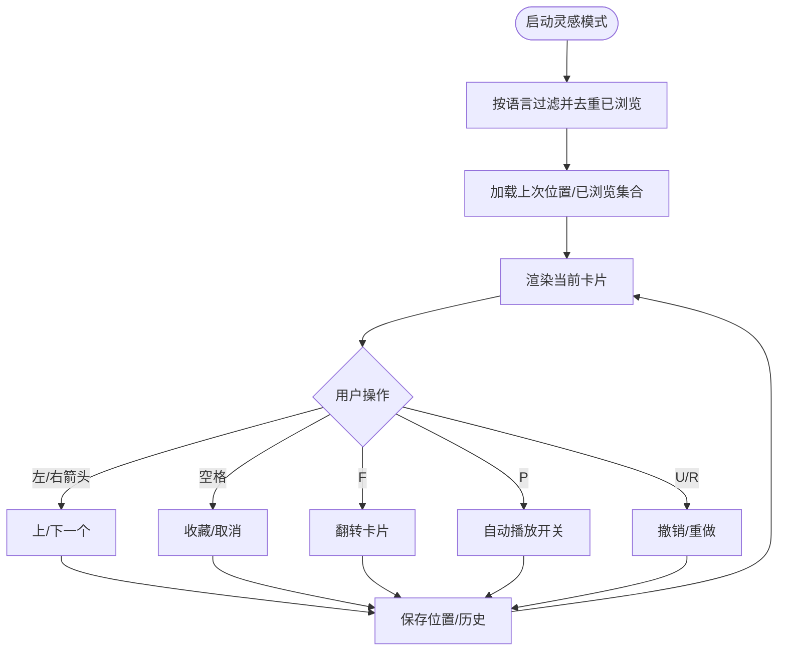
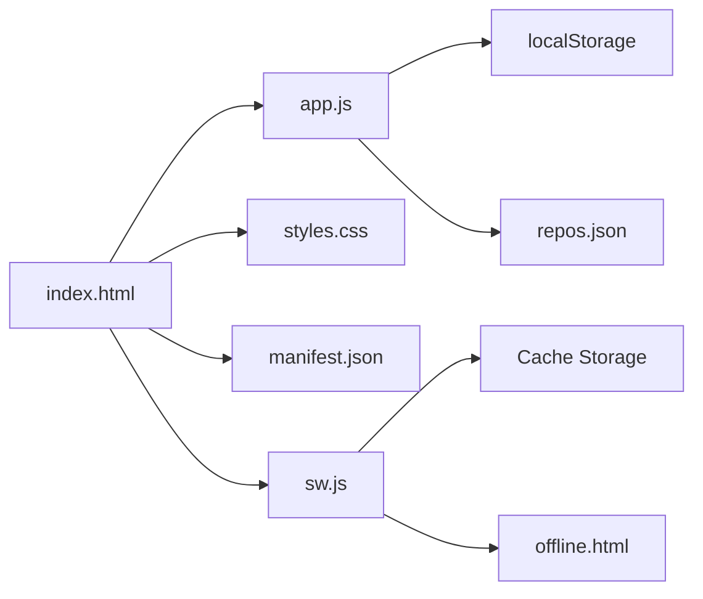

# 用户体验优化

<cite>
**本文引用的文件**   
- [web/index.html](file://web/index.html)
- [web/app.js](file://web/app.js)
- [web/styles.css](file://web/styles.css)
- [web/sw.js](file://web/sw.js)
- [web/manifest.json](file://web/manifest.json)
- [web/offline.html](file://web/offline.html)
</cite>

## 更新摘要
**所做更改**   
- 增强了数据加载的错误处理和重试机制，实现指数退避算法
- 改进了字体渲染系统，提供全面的跨平台字体回退支持
- 完善了PWA离线体验功能，包括智能缓存策略和离线页面
- 优化了键盘导航系统的焦点管理和无障碍支持

## 目录
1. [简介](#简介)
2. [项目结构](#项目结构)
3. [核心组件](#核心组件)
4. [架构总览](#架构总览)
5. [详细组件分析](#详细组件分析)
6. [依赖关系分析](#依赖关系分析)
7. [性能考量](#性能考量)
8. [故障排查指南](#故障排查指南)
9. [结论](#结论)

## 简介
本文件聚焦 GitHub Treasure Repo 的前端用户体验优化能力，围绕以下四个维度展开：
- 深色/浅色主题切换：基于 CSS 变量与本地存储的持久化方案
- 中英文国际化：集中式翻译字典、动态 UI 文本更新与语言偏好持久化
- PWA 离线支持：Service Worker 注册、智能缓存策略与离线回退
- 完整键盘导航系统：快捷键映射、焦点管理与无障碍辅助

文档提供代码级实现说明、流程图与时序图，并给出性能优化与兼容性处理建议。

## 项目结构
前端资源位于 web 目录下，包含入口 HTML、主逻辑 JS、样式表、PWA 清单与服务工作者脚本。

图表来源
- [web/index.html:1-20](file://web/index.html#L1-L20)
- [web/styles.css:5-36](file://web/styles.css#L5-L36)
- [web/app.js:1-20](file://web/app.js#L1-L20)
- [web/manifest.json:1-16](file://web/manifest.json#L1-L16)
- [web/sw.js:1-20](file://web/sw.js#L1-L20)
- [web/offline.html:1-20](file://web/offline.html#L1-L20)

章节来源
- [web/index.html:1-20](file://web/index.html#L1-L20)
- [web/manifest.json:1-16](file://web/manifest.json#L1-L16)

## 核心组件
- 主题系统：通过 body 的 data-theme 属性切换，配合 CSS 变量覆盖默认色板；用户选择写入 localStorage 持久化。
- 国际化系统：集中 I18N 字典对象，按当前语言 key 取值；UI 文本在初始化与切换时批量刷新。
- PWA 离线：页面加载时注册 Service Worker；SW 对静态资源采用"先缓存后网络"或"陈旧重验证"，对数据文件采用"网络优先+缓存回退"。
- 键盘导航：全局监听键盘事件，维护卡片选中索引，支持方向键移动、Enter 打开详情、Esc 关闭弹窗、快捷开关主题/语言/书签视图等。

章节来源
- [web/app.js:193-218](file://web/app.js#L193-L218)
- [web/styles.css:5-36](file://web/styles.css#L5-L36)
- [web/sw.js:33-78](file://web/sw.js#L33-L78)
- [web/app.js:1255-1333](file://web/app.js#L1255-L1333)

## 架构总览
下图展示关键模块间的调用关系与数据流：HTML 作为入口，JS 负责状态管理、渲染与交互；CSS 提供主题变量；SW 拦截网络请求并提供离线能力。

图表来源
- [web/index.html:276-282](file://web/index.html#L276-L282)
- [web/app.js:2614-2621](file://web/app.js#L2614-L2621)
- [web/sw.js:33-78](file://web/sw.js#L33-L78)

## 详细组件分析

### 主题切换（深色/浅色）
- 实现要点
  - 使用 body[data-theme] 控制主题模式，CSS 中定义两套 :root 与 [data-theme="light"] 变量集合，所有颜色通过 var() 引用。
  - 初始化时从 localStorage 读取用户选择，若未设置则根据 prefers-color-scheme 自动推断。
  - 切换时将新值写回 localStorage，并立即更新 DOM 属性以触发 CSS 变量重绘。
- 交互流程

图表来源
- [web/app.js:193-205](file://web/app.js#L193-L205)
- [web/styles.css:5-36](file://web/styles.css#L5-L36)

章节来源
- [web/app.js:193-205](file://web/app.js#L193-L205)
- [web/styles.css:5-36](file://web/styles.css#L5-L36)

### 中英文国际化
- 架构设计
  - 集中式字典对象 I18N，包含 zh 与 en 两套文案。
  - 提供 t(key) 取词函数，结合 currentLang 状态进行检索。
  - 初始化阶段应用标题与基础文案；切换语言时批量刷新 UI 文本。
- 动态翻译加载
  - 当前实现为内联字典，无远程加载；如需扩展可按 key 前缀分片或按需拉取。
- 关键流程

图表来源
- [web/app.js:38-187](file://web/app.js#L38-L187)
- [web/app.js:207-218](file://web/app.js#L207-L218)
- [web/app.js:220-291](file://web/app.js#L220-L291)

章节来源
- [web/app.js:38-187](file://web/app.js#L38-L187)
- [web/app.js:207-218](file://web/app.js#L207-L218)
- [web/app.js:220-291](file://web/app.js#L220-L291)

### 增强的数据加载与错误处理
**新增** 实现了指数退避重试机制，提升数据加载的可靠性

- 重试机制
  - 最大重试次数：2次
  - 指数退避延迟：第1次重试等待2秒，第2次等待4秒
  - 多URL尝试：依次尝试 ../data/repos.json、./data/repos.json、data/repos.json
- 错误处理
  - 检测 file:// 协议环境，提供针对性的错误提示
  - 显示友好的错误信息和重试按钮
  - 保持加载状态的同步更新
- 用户体验
  - 骨架屏加载动画
  - 清晰的错误反馈和操作指引
  - 支持手动重试功能

图表来源
- [web/app.js:401-453](file://web/app.js#L401-L453)

章节来源
- [web/app.js:401-453](file://web/app.js#L401-L453)

### 改进的字体渲染系统
**新增** 提供全面的跨平台字体回退支持，确保在不同操作系统和设备上的最佳显示效果

- 字体栈设计
  - 无衬线字体：'Outfit', -apple-system, 'BlinkMacSystemFont', 'Segoe UI', 'PingFang SC', 'Microsoft YaHei', sans-serif
  - 等宽字体：'JetBrains Mono', 'SF Mono', 'Cascadia Code', 'Fira Code', 'Consolas', monospace
- 跨平台优化
  - macOS/iOS：优先使用系统字体 (-apple-system, BlinkMacSystemFont)
  - Windows：支持 Segoe UI 和中文字体 (Microsoft YaHei)
  - Linux：支持 PingFang SC 和其他开源字体
  - 移动端：适配各平台的默认字体渲染
- 性能考虑
  - 使用 Google Fonts 预连接优化
  - 字体加载失败时的优雅降级
  - 避免字体闪烁和布局偏移

图表来源
- [web/styles.css:18-21](file://web/styles.css#L18-21)
- [web/index.html:11-13](file://web/index.html#L11-13)

章节来源
- [web/styles.css:18-21](file://web/styles.css#L18-21)
- [web/index.html:11-13](file://web/index.html#L11-13)

### PWA 离线支持（Service Worker）
- 注册时机
  - 页面加载完成后检测 serviceWorker 能力并注册 sw.js。
- 缓存策略
  - 安装期预缓存 Shell 资源（HTML/CSS/JS/离线页）。
  - 激活期清理旧版本缓存。
  - 请求拦截：
    - 数据文件（/data/*）：网络优先，成功后回写缓存；失败则回退到缓存。
    - 其他静态资源：先查缓存，再并行 fetch 更新缓存；最终回退到缓存或离线页。
- 离线回退
  - 导航请求无法获取资源时返回 offline.html。
- 时序图

图表来源
- [web/index.html:276-282](file://web/index.html#L276-L282)
- [web/sw.js:11-31](file://web/sw.js#L11-L31)
- [web/sw.js:33-78](file://web/sw.js#L33-L78)

章节来源
- [web/index.html:276-282](file://web/index.html#L276-L282)
- [web/sw.js:1-128](file://web/sw.js#L1-L128)

### 完整键盘导航系统
- 快捷键映射
  - 导航：↑↓←→ 移动卡片焦点；Enter 打开详情；Esc 关闭弹窗。
  - 操作：Space 收藏/取消；C 加入对比；/ 聚焦搜索框。
  - 切换：T 切换主题；B 书签视图；L 切换语言；?/h/H 显示帮助。
- 焦点管理
  - 维护 selectedCardIndex，计算每行列数以支持上下左右移动。
  - 选中项自动平滑滚动进入视口，确保可见性。
  - 模态框打开/关闭时锁定/恢复 body 滚动。
- 交互序列

图表来源
- [web/app.js:1234-1333](file://web/app.js#L1234-L1333)

章节来源
- [web/app.js:1234-1333](file://web/app.js#L1234-L1333)

### 灵感模式（可选增强体验）
- 功能概览
  - 卡片式浏览：支持左右滑动/键盘切换、翻转查看、收藏、分享、自动播放、撤销/重做、进度条与已浏览计数。
  - 状态持久化：记录已浏览仓库集合与最后位置，支持按语言筛选。
  - 无障碍：aria-live 播报、ARIA 标签与角色、键盘可达性。
- 关键流程

图表来源
- [web/app.js:1817-2603](file://web/app.js#L1817-L2603)

章节来源
- [web/app.js:1817-2603](file://web/app.js#L1817-L2603)

## 依赖关系分析
- 模块耦合
  - app.js 强依赖 DOM 元素 ID 与 CSS 类名；主题与国际化均通过 data-* 与 class 驱动。
  - sw.js 与 index.html 通过相对路径约定进行资源匹配。
- 外部依赖
  - 字体资源通过 Google Fonts 引入，存在跨域与可用性风险，可考虑自托管或预连接优化。
- 潜在循环依赖
  - 当前为单页脚本，未见循环引用。

图表来源
- [web/index.html:1-20](file://web/index.html#L1-20)
- [web/app.js:1-20](file://web/app.js#L1-20)
- [web/sw.js:1-20](file://web/sw.js#L1-20)
- [web/offline.html:1-20](file://web/offline.html#L1-20)

章节来源
- [web/index.html:1-20](file://web/index.html#L1-20)
- [web/app.js:1-20](file://web/app.js#L1-20)
- [web/sw.js:1-20](file://web/sw.js#L1-20)

## 性能考量
- 主题切换
  - 仅修改 data-theme 与 CSS 变量，避免大量重排；过渡动画使用 transition 提升观感。
- 国际化
  - 批量更新 UI 文本，减少多次 reflow；必要时可对长列表文案进行增量更新。
- 数据加载与渲染
  - 虚拟滚动：当结果集大于阈值时启用绝对定位与可视区域渲染，降低 DOM 节点数量。
  - 防抖：搜索输入与滚动事件使用 debounce，降低高频回调开销。
  - 指数退避重试：网络请求失败时使用指数退避算法，避免雪崩效应。
- PWA 缓存
  - 数据文件网络优先，保证新鲜度；Shell 资源陈旧重验证，兼顾速度与一致性。
- 字体与资源
  - 使用 preconnect 预连接字体域名，减少首屏阻塞；可考虑将字体本地化以提升稳定性。
  - 多层字体回退确保在各种环境下的可读性和美观性。

[本节为通用指导，不直接分析具体文件]

## 故障排查指南
- 本地 file:// 协议导致数据加载失败
  - 现象：提示需通过本地服务器访问或运行抓取脚本。
  - 处理：在 web 目录启动本地 HTTP 服务，或使用构建工具部署。
- Service Worker 未生效
  - 检查浏览器是否支持 serviceWorker；确认 sw.js 路径正确且可被访问；清除旧缓存后重试。
- 主题/语言未持久化
  - 检查 localStorage 权限与存储空间；确认初始化顺序是否正确（先读后写）。
- 键盘导航异常
  - 确认当前焦点不在输入控件；检查 selectedCardIndex 边界与 perRow 计算；确保 modal 打开时阻止默认行为。
- 字体显示问题
  - 检查网络连接是否正常；确认 Google Fonts 是否被防火墙阻止；查看控制台是否有字体加载错误。
- 数据加载失败
  - 检查网络请求是否成功；确认数据文件路径是否正确；查看重试机制是否正常工作。

章节来源
- [web/app.js:401-453](file://web/app.js#L401-L453)
- [web/index.html:276-282](file://web/index.html#L276-L282)
- [web/app.js:1255-1333](file://web/app.js#L1255-L1333)

## 结论
本项目在前端用户体验方面实现了较为完善的主题切换、国际化、PWA 离线支持与键盘导航体系。通过 CSS 变量与 data-theme 的组合，主题切换高效且易维护；集中式 I18N 字典便于扩展与维护；Service Worker 提供了可靠的离线与缓存策略；键盘导航与无障碍特性提升了可访问性与效率。

**最新更新亮点**：
- **增强的错误处理**：指数退避重试机制显著提升了数据加载的鲁棒性
- **优化的字体渲染**：全面的跨平台字体回退确保了最佳的视觉体验
- **完善的离线支持**：智能缓存策略和友好的离线页面提升了用户体验

建议在后续迭代中持续优化字体资源加载、扩展多语言资源加载机制，并对复杂交互增加更细粒度的性能监控与埋点。同时可以考虑进一步优化重试策略和缓存失效机制，以应对更复杂的网络环境和用户需求。