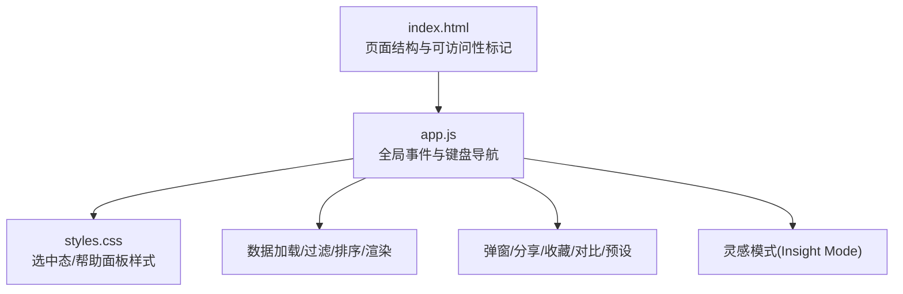
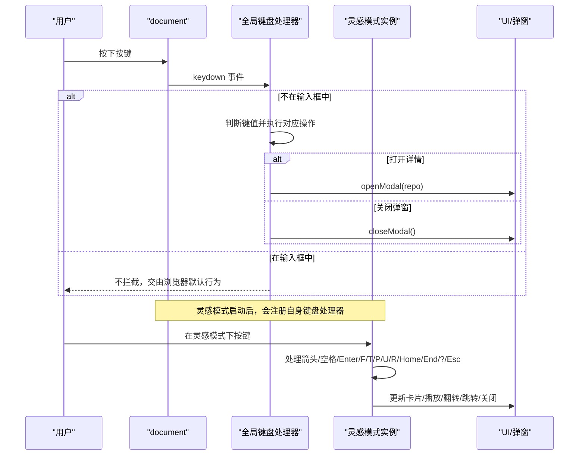
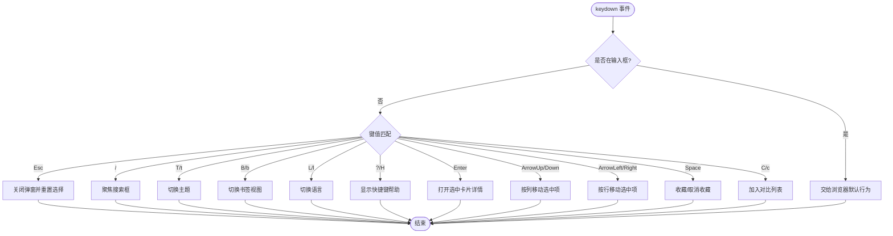
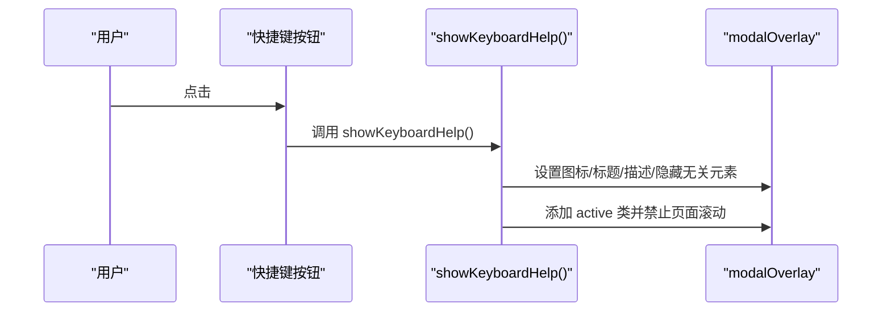
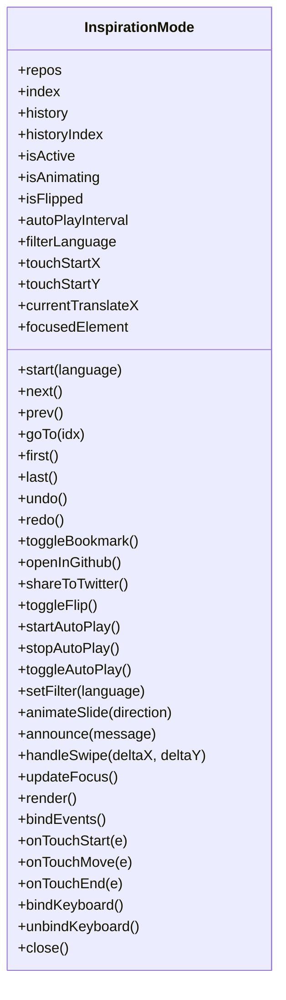
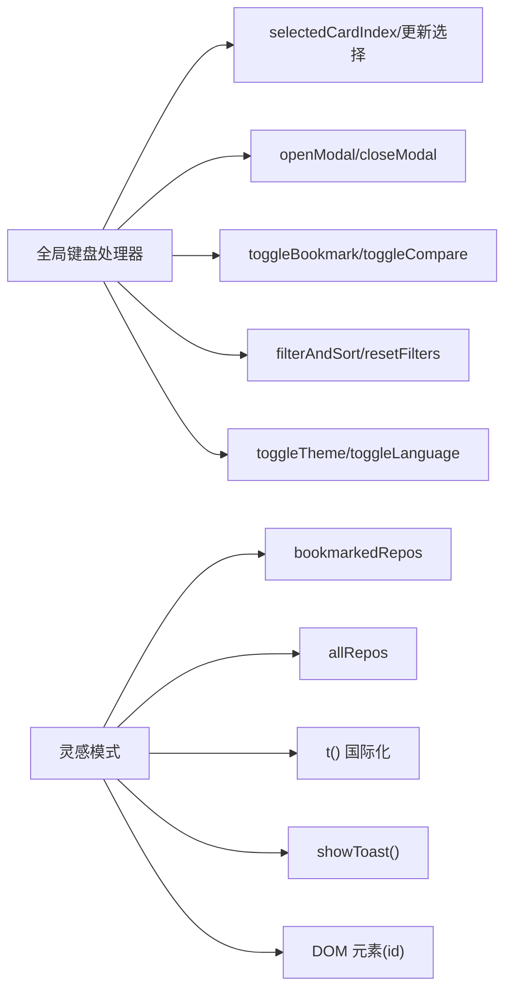

# 键盘导航系统

<cite>
**本文引用的文件**   
- [web/app.js](file://web/app.js)
- [web/index.html](file://web/index.html)
- [web/styles.css](file://web/styles.css)
</cite>

## 目录
1. [简介](#简介)
2. [项目结构](#项目结构)
3. [核心组件](#核心组件)
4. [架构总览](#架构总览)
5. [详细组件分析](#详细组件分析)
6. [依赖关系分析](#依赖关系分析)
7. [性能考量](#性能考量)
8. [故障排查指南](#故障排查指南)
9. [结论](#结论)
10. [附录](#附录)

## 简介
本文件面向 GitHub Treasure Repo 的前端键盘导航系统，系统性说明快捷键映射、焦点管理、可访问性支持、事件监听器的注册与注销机制，以及移动端触摸替代方案。文档覆盖以下关键能力：
- 方向键网格导航（上/下/左/右）
- Enter 确认打开详情弹窗
- Esc 关闭弹窗并重置选择状态
- Space 收藏/取消收藏当前卡片
- C 加入对比列表
- / 聚焦搜索框
- T/B/L 切换主题/书签视图/语言
- ?/H 显示快捷键帮助界面
- 灵感模式下的完整键盘交互与无障碍支持
- 自定义快捷键扩展方法与最佳实践

## 项目结构
前端代码位于 web 目录下，主要包含：
- index.html：页面结构与可访问性标记
- app.js：应用逻辑、事件绑定、键盘导航、灵感模式等
- styles.css：样式与视觉反馈（如选中态、帮助面板布局）

图表来源
- [web/index.html:1-284](file://web/index.html#L1-L284)
- [web/app.js:1246-1346](file://web/app.js#L1246-L1346)
- [web/styles.css:1808-1812](file://web/styles.css#L1808-L1812)

章节来源
- [web/index.html:1-284](file://web/index.html#L1-L284)
- [web/app.js:1-1200](file://web/app.js#L1-L1200)
- [web/styles.css:1800-2000](file://web/styles.css#L1800-L2000)

## 核心组件
- 全局键盘事件处理器：统一处理方向键导航、Enter/Esc、功能快捷键等
- 卡片选择与滚动定位：维护 selectedCardIndex，自动滚动到可视区域
- 快捷键帮助界面：showKeyboardHelp() 复用详情弹窗容器展示帮助内容
- 灵感模式：独立的状态机对象，提供完整的键盘/触摸交互与无障碍播报
- 事件监听器生命周期：在启动时注册，在退出时注销，避免冲突与内存泄漏

章节来源
- [web/app.js:1246-1346](file://web/app.js#L1246-L1346)
- [web/app.js:789-830](file://web/app.js#L789-L830)
- [web/app.js:2533-2615](file://web/app.js#L2533-L2615)

## 架构总览
键盘导航由“全局键盘事件 + 局部模式”的双层架构组成：
- 全局层：监听 document 的 keydown，根据目标元素是否处于输入态决定拦截策略；维护 selectedCardIndex 实现网格导航
- 模式层：灵感模式通过独立的对象实例绑定/解绑键盘事件，拥有自己的快捷键集与状态机

图表来源
- [web/app.js:1268-1346](file://web/app.js#L1268-L1346)
- [web/app.js:2533-2615](file://web/app.js#L2533-L2615)
- [web/app.js:395-399](file://web/app.js#L395-L399)

## 详细组件分析

### 全局键盘导航与快捷键映射
- 方向键网格导航：基于 getCardsPerRow() 动态计算每行卡片数，ArrowUp/Down 按列移动，ArrowLeft/Right 按行移动
- Enter 确认：当存在选中卡片时，打开该仓库详情弹窗
- Esc 关闭：关闭弹窗并清空选中状态
- 快捷操作：Space 收藏/取消收藏当前卡片；C 加入对比列表；/ 聚焦搜索框
- 切换类快捷键：T 切换主题；B 切换书签视图；L 切换语言
- 帮助入口：? 或 H 显示快捷键帮助界面

图表来源
- [web/app.js:1268-1346](file://web/app.js#L1268-L1346)
- [web/app.js:1249-1266](file://web/app.js#L1249-L1266)
- [web/app.js:789-830](file://web/app.js#L789-L830)

章节来源
- [web/app.js:1246-1346](file://web/app.js#L1246-L1346)
- [web/app.js:1249-1266](file://web/app.js#L1249-L1266)
- [web/app.js:789-830](file://web/app.js#L789-L830)
- [web/styles.css:1808-1812](file://web/styles.css#L1808-L1812)

### showKeyboardHelp() 帮助界面
- 复用详情弹窗容器，将标题、描述区替换为快捷键分组信息
- 使用国际化文本 t('keyboardHelp') 等键值渲染
- 隐藏常规详情按钮与链接，仅保留帮助内容

图表来源
- [web/app.js:789-830](file://web/app.js#L789-L830)
- [web/index.html:219-267](file://web/index.html#L219-L267)

章节来源
- [web/app.js:789-830](file://web/app.js#L789-L830)
- [web/index.html:219-267](file://web/index.html#L219-L267)

### 焦点管理与可访问性
- 输入框优先：全局键盘事件在进入 input/select/textarea 时不拦截，保证原生编辑体验
- 选中态可见性：selected 类提供高亮边框与阴影，配合 scrollIntoView 保持可视
- 屏幕阅读器支持：
  - 灵感模式使用 aria-live 区域进行状态播报
  - 各控件具备语义化 aria-label 与 role 属性
- 焦点恢复：离开灵感模式时清理键盘监听并恢复页面滚动

章节来源
- [web/app.js:1268-1270](file://web/app.js#L1268-L1270)
- [web/app.js:1249-1259](file://web/app.js#L1249-L1259)
- [web/app.js:2372-2377](file://web/app.js#L2372-L2377)
- [web/app.js:2605-2615](file://web/app.js#L2605-L2615)

### 事件监听器的注册与注销机制
- 全局键盘监听：document.addEventListener('keydown', ...) 常驻
- 灵感模式：
  - 启动时 bindKeyboard() 注册专用处理器
  - 关闭时 unbindKeyboard() 移除处理器，防止重复触发与内存泄漏
- 其他交互：
  - 模态遮罩点击关闭、复制/克隆按钮等采用一次性或按需绑定
  - 分享菜单动态创建并在点击外部时移除自身与监听

章节来源
- [web/app.js:1268-1346](file://web/app.js#L1268-L1346)
- [web/app.js:2533-2539](file://web/app.js#L2533-L2539)
- [web/app.js:2605-2615](file://web/app.js#L2605-L2615)
- [web/app.js:683-729](file://web/app.js#L683-L729)

### 灵感模式（Inspiration Mode）键盘与触摸
- 键盘快捷键：
  - ←/→ 上一个/下一个
  - Space 收藏
  - Enter 打开 GitHub
  - F 翻转卡片
  - T 分享到 X
  - P 自动播放/暂停
  - Home/End 首尾跳转
  - U/R 撤销/重做
  - ? 显示帮助
  - Esc 关闭
- 触摸手势：
  - touchstart/touchmove/touchend 实现左右滑动切换
  - 实时指示器与阻尼动画提升手感
- 无障碍：
  - 进度条 role="progressbar" 与 aria-valuenow
  - 导航区 role="navigation"，工具栏 role="toolbar"
  - 按钮 aria-label 与禁用态 aria-disabled

图表来源
- [web/app.js:1830-2615](file://web/app.js#L1830-L2615)

章节来源
- [web/app.js:2533-2615](file://web/app.js#L2533-L2615)
- [web/app.js:2495-2531](file://web/app.js#L2495-L2531)
- [web/app.js:2372-2377](file://web/app.js#L2372-L2377)

### 移动端触摸替代方案
- 灵感模式内对卡片绑定 passive 触摸事件，减少滚动抖动
- 根据位移阈值与速度比判定滑动方向，触发 prev/next
- 提供滑动指示器与弹性动画，增强反馈

章节来源
- [web/app.js:2495-2531](file://web/app.js#L2495-L2531)
- [web/app.js:2184-2220](file://web/app.js#L2184-L2220)

## 依赖关系分析
- 全局键盘处理器依赖：
  - 卡片渲染与索引：getCardsPerRow()、updateCardSelection()
  - 弹窗控制：openModal()/closeModal()
  - 业务操作：toggleBookmark()、toggleCompare()、filterAndSort()、toggleTheme()、toggleLanguage()
- 灵感模式依赖：
  - 全局收藏状态 bookmarkedRepos
  - 数据源 allRepos
  - 国际化 t()
  - 通知 showToast()
  - DOM 元素引用（通过 id 获取）

图表来源
- [web/app.js:1246-1346](file://web/app.js#L1246-L1346)
- [web/app.js:1830-2615](file://web/app.js#L1830-L2615)

章节来源
- [web/app.js:1246-1346](file://web/app.js#L1246-L1346)
- [web/app.js:1830-2615](file://web/app.js#L1830-L2615)

## 性能考量
- 虚拟滚动：大数据量时使用 renderVirtualRepos() 与 handleScroll() 节流渲染，降低 DOM 压力
- 防抖：滚动与搜索输入使用 debounce 降低高频事件开销
- 被动监听：触摸事件使用 passive: true 提升滚动流畅度
- 动画优化：CSS transform/opacity 驱动动画，避免重排

章节来源
- [web/app.js:874-925](file://web/app.js#L874-L925)
- [web/app.js:1078-1084](file://web/app.js#L1078-L1084)
- [web/app.js:1348](file://web/app.js#L1348)
- [web/app.js:2496-2498](file://web/app.js#L2496-L2498)

## 故障排查指南
- 快捷键无效
  - 检查是否处于输入框中（input/select/textarea），此时不会拦截
  - 确认相关 DOM 元素是否存在且未被动态移除
- 弹窗无法关闭
  - 检查 modalOverlay 点击事件与 ESC 分支是否被覆盖
- 灵感模式键盘冲突
  - 确认已正确调用 unbindKeyboard()，避免重复监听
- 移动端滑动无响应
  - 检查触摸事件是否绑定到正确的卡片元素，并确保未阻止默认滚动

章节来源
- [web/app.js:1268-1270](file://web/app.js#L1268-L1270)
- [web/app.js:1187-1193](file://web/app.js#L1187-L1193)
- [web/app.js:2533-2539](file://web/app.js#L2533-L2539)
- [web/app.js:2495-2531](file://web/app.js#L2495-L2531)

## 结论
本键盘导航系统以“全局键盘事件 + 模式化子模块”的方式实现了高效、可扩展的交互体验。通过清晰的焦点管理、完善的无障碍支持与合理的性能优化，既满足桌面端的高效操作，也兼顾了移动端的触控体验。未来可通过配置化的快捷键表进一步简化扩展与维护成本。

## 附录

### 快捷键速查表（全局）
- ↑↓←→：选择卡片（网格导航）
- Enter：打开详情
- Esc：关闭弹窗并重置选择
- Space：收藏/取消收藏
- C：加入对比
- /：聚焦搜索
- T：切换主题
- B：书签视图
- L：切换语言
- ?/H：显示快捷键帮助

章节来源
- [web/app.js:1268-1346](file://web/app.js#L1268-L1346)
- [web/app.js:789-830](file://web/app.js#L789-L830)

### 灵感模式快捷键
- ←/→：上一个/下一个
- Space：收藏
- Enter：打开 GitHub
- F：翻转卡片
- T：分享到 X
- P：自动播放/暂停
- Home/End：首/末
- U/R：撤销/重做
- ?：帮助
- Esc：关闭

章节来源
- [web/app.js:2533-2615](file://web/app.js#L2533-L2615)

### 自定义快捷键扩展方法
- 在全局 keydown 处理器中添加新的 if 分支，遵循“非输入态才拦截”的原则
- 若为新功能域，建议仿照灵感模式封装为独立对象，提供 bindKeyboard/unbindKeyboard 接口
- 注意：
  - 避免与已有快捷键冲突
  - 为新增操作提供对应的 UI 提示与可访问性标注
  - 必要时增加防抖/节流，避免频繁触发

章节来源
- [web/app.js:1268-1346](file://web/app.js#L1268-L1346)
- [web/app.js:2533-2539](file://web/app.js#L2533-L2539)

### 移动端触摸最佳实践
- 使用 passive 事件监听提升滚动性能
- 结合位移阈值与速度比判断意图，避免误触
- 提供即时视觉反馈（指示器/动画）与可选触觉反馈
- 确保键盘与触摸路径一致，降低学习成本

章节来源
- [web/app.js:2495-2531](file://web/app.js#L2495-L2531)
- [web/app.js:2184-2220](file://web/app.js#L2184-L2220)

### 可访问性最佳实践清单
- 所有交互控件具备语义化 aria-label
- 重要状态变更通过 aria-live 区域播报
- 禁用态使用 aria-disabled 明确表达
- 键盘可达性与鼠标操作等价
- 颜色与动效不承载唯一信息，辅以文字/图标

章节来源
- [web/app.js:2372-2377](file://web/app.js#L2372-L2377)
- [web/app.js:2384-2395](file://web/app.js#L2384-L2395)
- [web/app.js:2410-2416](file://web/app.js#L2410-L2416)