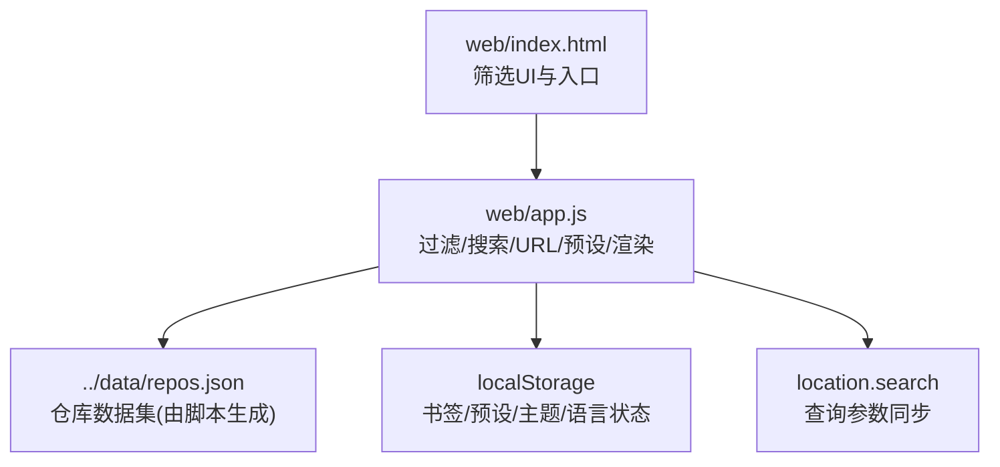
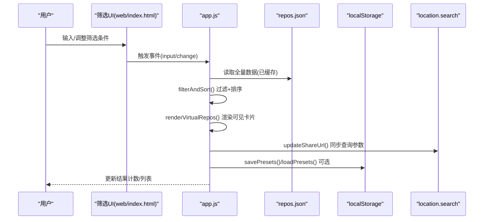
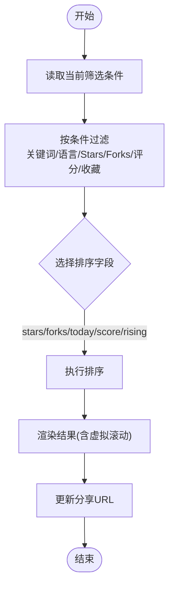
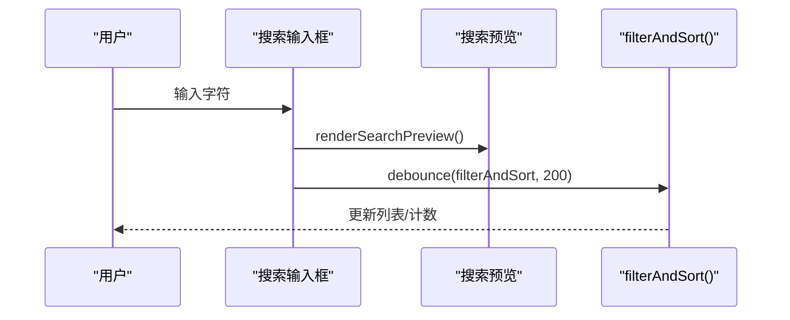
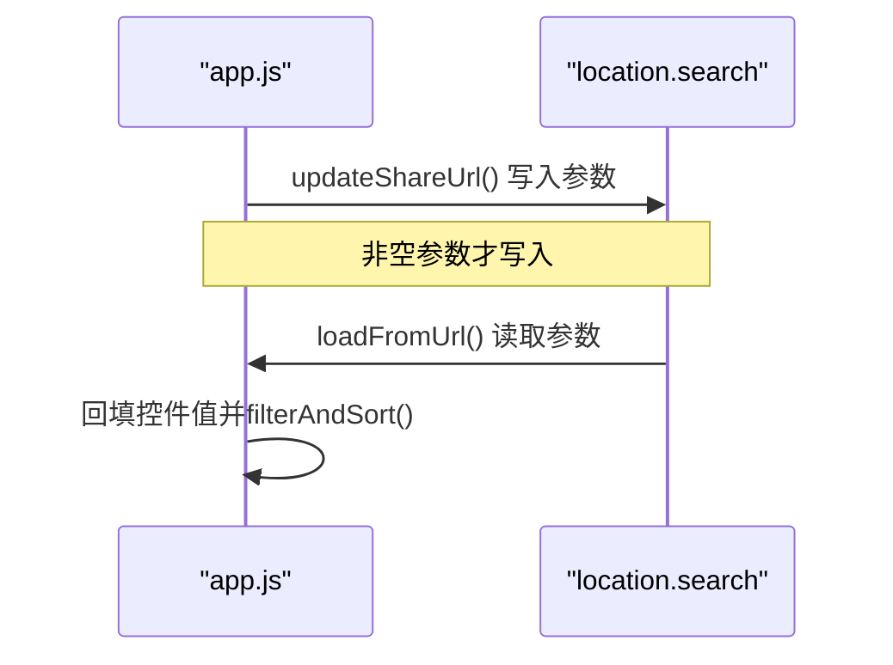
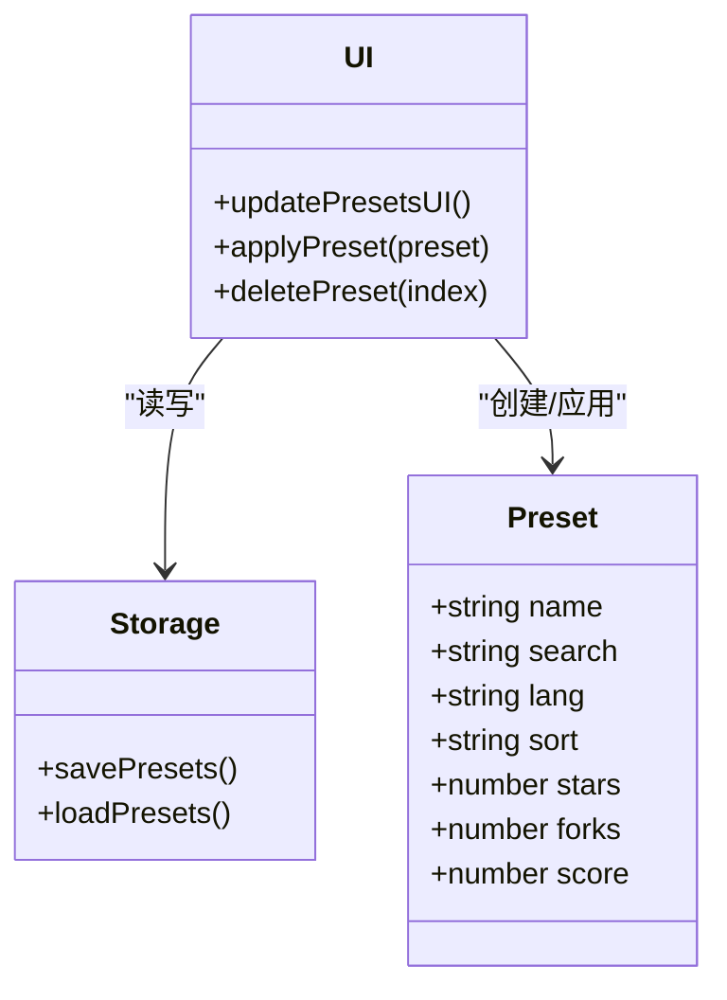
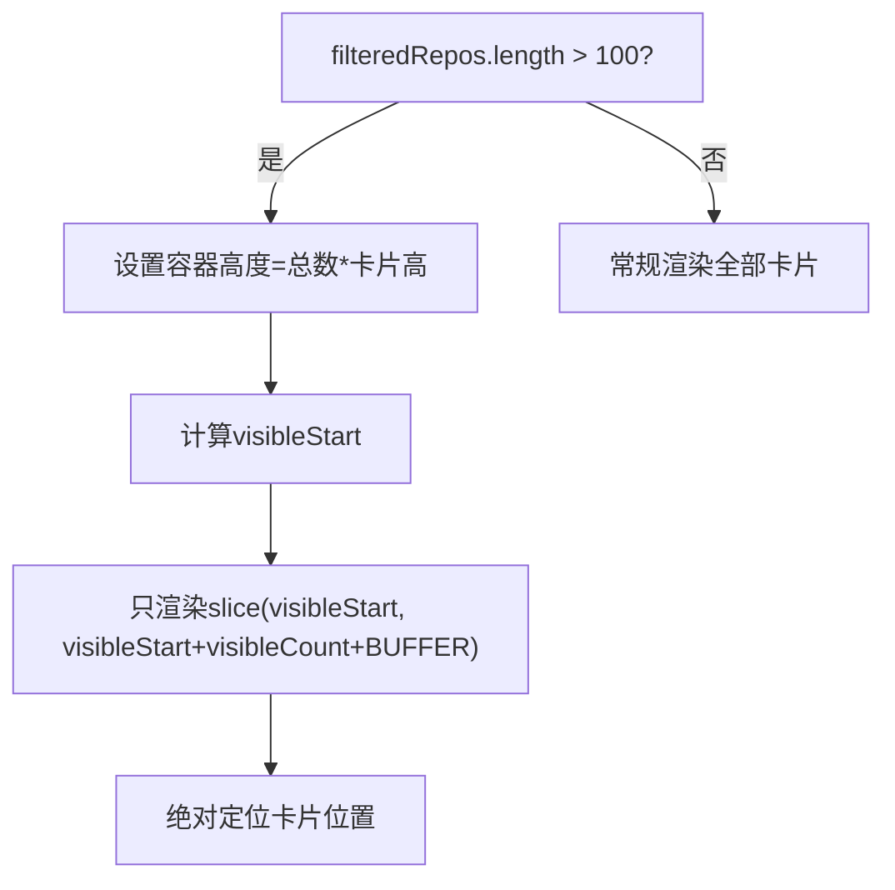
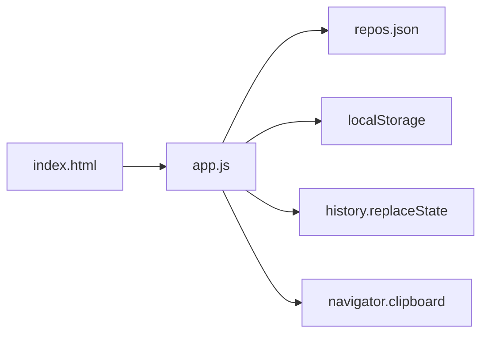

# 过滤与搜索

<cite>
**本文引用的文件**   
- [README.md](file://README.md)
- [web/index.html](file://web/index.html)
- [web/app.js](file://web/app.js)
</cite>

## 目录
1. [简介](#简介)
2. [项目结构](#项目结构)
3. [核心组件](#核心组件)
4. [架构总览](#架构总览)
5. [详细组件分析](#详细组件分析)
6. [依赖关系分析](#依赖关系分析)
7. [性能考量](#性能考量)
8. [故障排查指南](#故障排查指南)
9. [结论](#结论)
10. [附录](#附录)

## 简介
本文件聚焦于 GitHub Treasure Repo 的“过滤与搜索”能力，系统性说明以下方面：
- 多维度过滤系统（语言、Stars、Forks、评分范围）的实现机制与排序规则
- 实时搜索的前端性能优化策略（防抖、虚拟滚动等）
- 可分享筛选 URL 的生成与解析逻辑
- 保存筛选预设的数据持久化方案
- 过滤算法、匹配规则与用户体验细节

## 项目结构
与过滤和搜索相关的代码主要位于前端资源中：
- web/index.html：提供筛选 UI（搜索框、语言下拉、排序下拉、三个数值滑块、重置按钮、分享按钮等）
- web/app.js：实现数据加载、过滤/排序、URL 同步、预设持久化、虚拟滚动、搜索预览等核心逻辑

图表来源
- [web/index.html:50-132](file://web/index.html#L50-L132)
- [web/app.js:1016-1049](file://web/app.js#L1016-L1049)
- [web/app.js:1341-1383](file://web/app.js#L1341-L1383)
- [web/app.js:1717-1790](file://web/app.js#L1717-L1790)

章节来源
- [README.md:123-148](file://README.md#L123-L148)
- [web/index.html:50-132](file://web/index.html#L50-L132)

## 核心组件
- 过滤与排序引擎：统一读取当前筛选条件，对全量数据进行过滤与排序，并驱动视图更新。
- 实时搜索：输入事件触发搜索预览与过滤，使用防抖降低重排开销。
- URL 同步：将筛选状态写入 location.search，支持分享与回读。
- 预设管理：将当前筛选条件保存为本地预设，支持应用与删除。
- 虚拟滚动：大数据量时仅渲染可视区域卡片，提升滚动性能。

章节来源
- [web/app.js:1016-1049](file://web/app.js#L1016-L1049)
- [web/app.js:1068-1074](file://web/app.js#L1068-L1074)
- [web/app.js:864-915](file://web/app.js#L864-L915)
- [web/app.js:1341-1383](file://web/app.js#L1341-L1383)
- [web/app.js:1717-1790](file://web/app.js#L1717-L1790)

## 架构总览
下图展示了用户交互到数据过滤、排序、渲染与 URL/本地存储同步的整体流程。

图表来源
- [web/index.html:50-132](file://web/index.html#L50-L132)
- [web/app.js:1016-1049](file://web/app.js#L1016-L1049)
- [web/app.js:864-915](file://web/app.js#L864-L915)
- [web/app.js:1341-1383](file://web/app.js#L1341-L1383)
- [web/app.js:1717-1790](file://web/app.js#L1717-L1790)

## 详细组件分析

### 多维度过滤与排序
- 过滤维度
  - 关键词：项目名称或描述包含（不区分大小写）
  - 语言：精确匹配所选语言
  - Stars/Forks/评分：大于等于滑块阈值
  - 收藏模式：仅显示已收藏项目
- 排序方式
  - 综合评分、Stars、Forks、今日增长、飙升指数（today_stars / stars）
- 复杂度
  - 过滤 O(N)，排序 O(N log N)，N 为仓库数量

图表来源
- [web/app.js:1016-1049](file://web/app.js#L1016-L1049)

章节来源
- [web/app.js:1016-1049](file://web/app.js#L1016-L1049)

### 实时搜索与预览
- 输入事件监听，调用搜索预览与过滤函数
- 防抖：200ms 延迟执行过滤，避免频繁重排
- 搜索预览：基于名称/描述的子串匹配，限制展示条数，点击后打开详情

图表来源
- [web/app.js:1100-1103](file://web/app.js#L1100-L1103)
- [web/app.js:721-777](file://web/app.js#L721-L777)
- [web/app.js:1068-1074](file://web/app.js#L1068-L1074)

章节来源
- [web/app.js:1100-1103](file://web/app.js#L1100-L1103)
- [web/app.js:721-777](file://web/app.js#L721-L777)
- [web/app.js:1068-1074](file://web/app.js#L1068-L1074)

### 可分享筛选 URL 的生成与解析
- 生成：将当前筛选条件映射为查询参数 q/lang/sort/stars/forks/score/bookmarks，通过 history.replaceState 更新地址栏
- 解析：页面初始化时从 location.search 读取参数，回填对应控件并触发一次过滤

图表来源
- [web/app.js:1341-1383](file://web/app.js#L1341-L1383)

章节来源
- [web/app.js:1341-1383](file://web/app.js#L1341-L1383)

### 保存筛选预设（本地持久化）
- 数据结构：数组项包含 name/search/lang/sort/stars/forks/score
- 持久化：使用 localStorage 键 filterPresets 进行 JSON 序列化存储
- 操作：保存当前筛选为预设、点击应用预设、删除预设

图表来源
- [web/app.js:1717-1790](file://web/app.js#L1717-L1790)

章节来源
- [web/app.js:1717-1790](file://web/app.js#L1717-L1790)

### 虚拟滚动（大数据量渲染优化）
- 当结果超过阈值（>100）时启用虚拟滚动
- 固定卡片高度，计算可视窗口起始索引，仅渲染 visibleCount + BUFFER 个卡片
- 滚动事件节流，动态替换 DOM 节点，减少布局抖动

图表来源
- [web/app.js:864-915](file://web/app.js#L864-L915)

章节来源
- [web/app.js:864-915](file://web/app.js#L864-L915)

### 用户体验优化细节
- 防抖：搜索输入 200ms 防抖，避免高频重排
- 即时反馈：搜索结果数量实时更新；滑块拖动即时更新阈值文本与结果
- 视觉提示：无结果/无收藏时的友好文案；活动度标签与分数单位
- 键盘导航：全局快捷键快速聚焦搜索、切换主题/语言、收藏、对比等
- 一键复制分享链接：点击分享按钮复制当前 URL

章节来源
- [web/app.js:1068-1074](file://web/app.js#L1068-L1074)
- [web/app.js:1385-1393](file://web/app.js#L1385-L1393)
- [web/index.html:50-132](file://web/index.html#L50-L132)

## 依赖关系分析
- 模块耦合
  - app.js 同时承担数据加载、过滤/排序、渲染、URL 同步、预设持久化，职责集中但内聚性良好
  - index.html 仅负责 UI 结构与事件占位，逻辑集中在 app.js
- 外部依赖
  - 数据源：../data/repos.json（由 Python 脚本聚合生成）
  - 浏览器 API：localStorage、history.replaceState、navigator.clipboard、Service Worker（PWA）

图表来源
- [web/index.html:275-282](file://web/index.html#L275-L282)
- [web/app.js:1341-1383](file://web/app.js#L1341-L1383)
- [web/app.js:1717-1790](file://web/app.js#L1717-L1790)

章节来源
- [web/index.html:275-282](file://web/index.html#L275-L282)
- [web/app.js:1341-1383](file://web/app.js#L1341-L1383)
- [web/app.js:1717-1790](file://web/app.js#L1717-L1790)

## 性能考量
- 时间复杂度
  - 过滤 O(N)，排序 O(N log N)，整体每次筛选为 O(N log N)
- 空间复杂度
  - 内存占用主要为 allRepos 与 filteredRepos 两个数组，虚拟滚动显著降低 DOM 节点数量
- 关键优化点
  - 防抖：搜索输入 200ms 防抖
  - 虚拟滚动：>100 条结果时启用，固定卡片高度与绝对定位
  - 增量更新：仅替换可见区 DOM，避免整表重绘
  - 预取相邻卡片：灵感模式下预加载前后卡片，减少切换卡顿

[本节为通用性能讨论，无需具体文件引用]

## 故障排查指南
- 无法加载数据
  - 现象：页面提示“无法加载数据”，建议通过本地 HTTP 服务访问
  - 原因：浏览器在 file:// 协议下禁止 fetch 请求
  - 解决：使用 python3 -m http.server 启动静态服务器
- 分享链接无效
  - 检查是否通过 history.replaceState 更新了 URL；确认浏览器未拦截剪贴板权限
- 预设丢失
  - 检查 localStorage 是否被清理；确认 filterPresets 键存在且格式正确

章节来源
- [web/app.js:404-443](file://web/app.js#L404-L443)
- [web/app.js:1385-1393](file://web/app.js#L1385-L1393)
- [web/app.js:1717-1790](file://web/app.js#L1717-L1790)

## 结论
该项目的过滤与搜索功能以简洁的前端架构实现了高效的多维筛选、实时搜索、可分享 URL 与本地预设持久化。通过防抖与虚拟滚动，在大体量数据场景下仍保持流畅体验。若需进一步扩展，可在匹配规则上引入分词与权重、在排序策略上增加自定义权重组合，并在预设管理中增加导入导出与版本控制。

[本节为总结性内容，无需具体文件引用]

## 附录
- 评分算法参考
  - 公式：score = stars + forks + (forks / stars) × 1000 + today_stars × 10 + commit_activity × 2
  - 说明：today_stars 基于推送/创建时间估算；top-N 趋势仓库会额外拉取提交活跃度数据

章节来源
- [README.md:109-119](file://README.md#L109-L119)