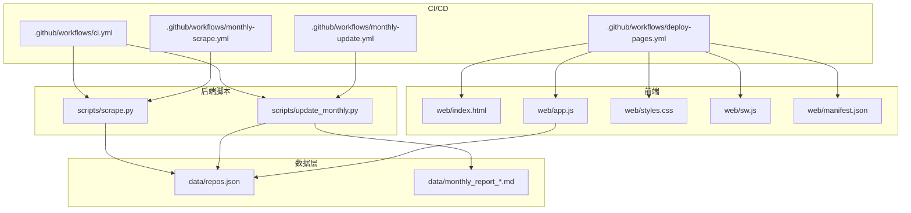
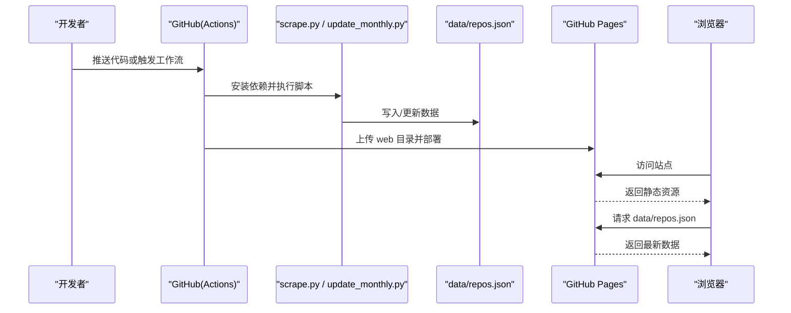
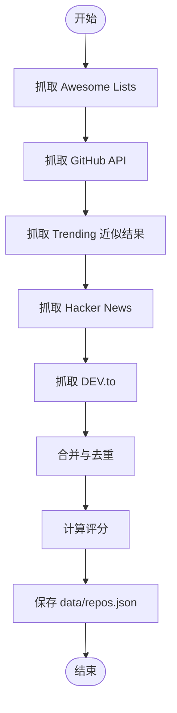
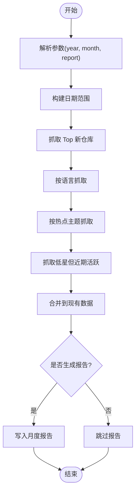
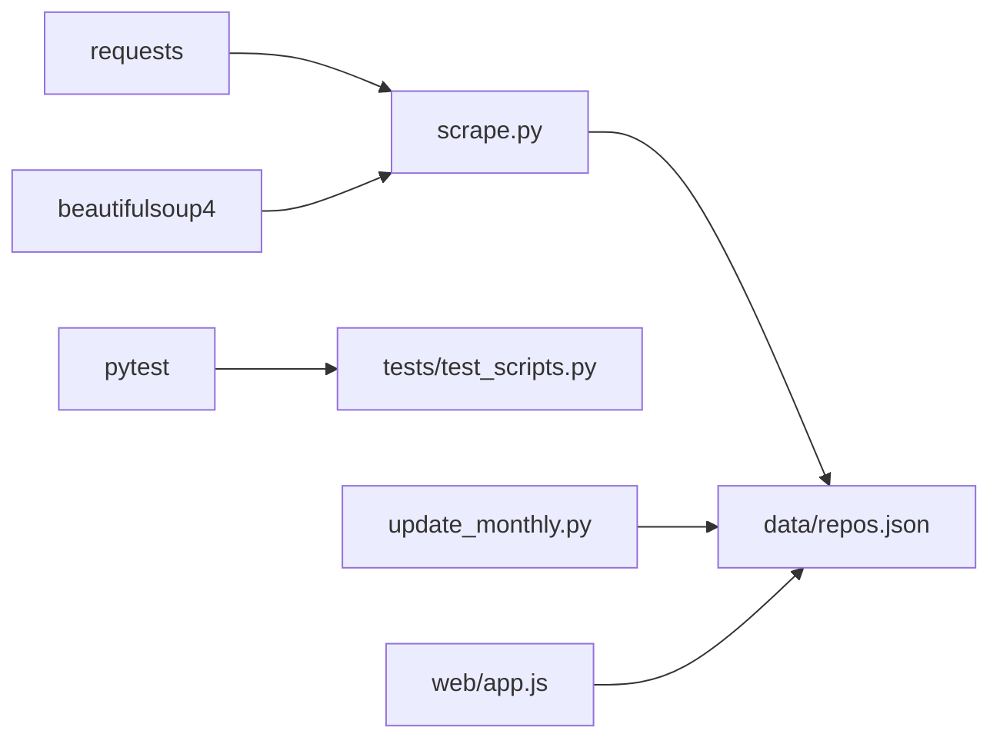

# 部署与运维

<cite>
**本文引用的文件**   
- [README.md](file://README.md)
- [requirements.txt](file://requirements.txt)
- [.github/workflows/ci.yml](file://.github/workflows/ci.yml)
- [.github/workflows/deploy-pages.yml](file://.github/workflows/deploy-pages.yml)
- [.github/workflows/monthly-scrape.yml](file://.github/workflows/monthly-scrape.yml)
- [.github/workflows/monthly-update.yml](file://.github/workflows/monthly-update.yml)
- [scripts/scrape.py](file://scripts/scrape.py)
- [scripts/update_monthly.py](file://scripts/update_monthly.py)
- [tests/test_scripts.py](file://tests/test_scripts.py)
- [web/index.html](file://web/index.html)
- [web/app.js](file://web/app.js)
- [web/manifest.json](file://web/manifest.json)
- [web/sw.js](file://web/sw.js)
</cite>

## 目录
1. [简介](#简介)
2. [项目结构](#项目结构)
3. [核心组件](#核心组件)
4. [架构总览](#架构总览)
5. [详细组件分析](#详细组件分析)
6. [依赖关系分析](#依赖关系分析)
7. [性能考量](#性能考量)
8. [故障排除指南](#故障排除指南)
9. [监控与日志最佳实践](#监控与日志最佳实践)
10. [结论](#结论)

## 简介
本指南面向本地开发与生产运维，覆盖以下目标：
- 本地开发环境搭建与配置（含环境变量 GITHUB_TOKEN、依赖管理、调试技巧）
- GitHub Actions CI/CD 流水线说明（持续集成测试、自动化部署到 GitHub Pages、月度数据抓取与增量更新）
- 常见故障排查（API 限流、网络请求失败、数据同步问题）
- 监控与日志收集的最佳实践

## 项目结构
仓库采用“脚本 + 前端静态站点 + CI/CD”的轻量架构。Python 脚本负责从多源抓取并生成 JSON 数据集；前端通过静态服务器读取该数据集进行展示；GitHub Actions 负责测试、构建与部署。

图表来源
- [scripts/scrape.py:650-696](file://scripts/scrape.py#L650-L696)
- [scripts/update_monthly.py:300-344](file://scripts/update_monthly.py#L300-L344)
- [web/app.js:404-443](file://web/app.js#L404-L443)
- [.github/workflows/ci.yml:1-34](file://.github/workflows/ci.yml#L1-L34)
- [.github/workflows/deploy-pages.yml:1-43](file://.github/workflows/deploy-pages.yml#L1-L43)
- [.github/workflows/monthly-scrape.yml:1-50](file://.github/workflows/monthly-scrape.yml#L1-L50)
- [.github/workflows/monthly-update.yml:1-91](file://.github/workflows/monthly-update.yml#L1-L91)

章节来源
- [README.md:123-148](file://README.md#L123-L148)

## 核心组件
- 数据抓取与聚合脚本
  - scrape.py：多源抓取（Awesome Lists、GitHub Search API、Hacker News、DEV.to），合并去重、评分排序，输出 data/repos.json
  - update_monthly.py：按月份增量抓取新仓库，合并入现有数据，可选生成月度报告
- 前端应用
  - index.html + app.js：加载 data/repos.json，提供搜索、筛选、收藏、对比、灵感模式等交互
  - sw.js + manifest.json：PWA 缓存策略与应用清单
- CI/CD 工作流
  - ci.yml：PR/push 触发测试与语法检查
  - deploy-pages.yml：将 web 目录打包为 artifact 并部署到 GitHub Pages
  - monthly-scrape.yml：每月定时运行全量抓取，提交 data/repos.json
  - monthly-update.yml：每月定时运行增量抓取，提交 data/ 下的新增报告与数据

章节来源
- [scripts/scrape.py:1-696](file://scripts/scrape.py#L1-L696)
- [scripts/update_monthly.py:1-344](file://scripts/update_monthly.py#L1-L344)
- [web/index.html:1-284](file://web/index.html#L1-L284)
- [web/app.js:1-800](file://web/app.js#L1-L800)
- [web/sw.js:1-50](file://web/sw.js#L1-L50)
- [web/manifest.json:1-16](file://web/manifest.json#L1-L16)
- [.github/workflows/ci.yml:1-34](file://.github/workflows/ci.yml#L1-L34)
- [.github/workflows/deploy-pages.yml:1-43](file://.github/workflows/deploy-pages.yml#L1-L43)
- [.github/workflows/monthly-scrape.yml:1-50](file://.github/workflows/monthly-scrape.yml#L1-L50)
- [.github/workflows/monthly-update.yml:1-91](file://.github/workflows/monthly-update.yml#L1-L91)

## 架构总览
系统由“数据采集 → 数据持久化 → 前端消费 → 自动化部署”构成。CI/CD 贯穿测试、构建与发布，确保数据与页面的一致性。

图表来源
- [.github/workflows/ci.yml:1-34](file://.github/workflows/ci.yml#L1-L34)
- [.github/workflows/deploy-pages.yml:1-43](file://.github/workflows/deploy-pages.yml#L1-L43)
- [.github/workflows/monthly-scrape.yml:1-50](file://.github/workflows/monthly-scrape.yml#L1-L50)
- [.github/workflows/monthly-update.yml:1-91](file://.github/workflows/monthly-update.yml#L1-L91)
- [web/app.js:404-443](file://web/app.js#L404-L443)

## 详细组件分析

### 本地开发环境搭建与配置
- 克隆仓库并进入目录
- 安装 Python 依赖（requests、beautifulsoup4）
- 设置环境变量 GITHUB_TOKEN（可选但强烈建议）
- 运行抓取脚本生成 data/repos.json
- 启动本地 HTTP 服务访问前端

关键要点
- 环境变量
  - GITHUB_TOKEN：提升 GitHub API 限流额度（未设置时默认较低）
- 依赖管理
  - requirements.txt 包含 requests 与 beautifulsoup4
- 本地运行
  - 使用 Python 内置 http.server 在 web 目录下启动服务
  - 直接以 file:// 打开会因跨域限制无法 fetch 数据

章节来源
- [README.md:49-75](file://README.md#L49-L75)
- [requirements.txt:1-2](file://requirements.txt#L1-L2)
- [scripts/scrape.py:23-26](file://scripts/scrape.py#L23-L26)
- [web/app.js:404-443](file://web/app.js#L404-L443)

### 环境变量与调试技巧
- 环境变量
  - GITHUB_TOKEN：用于提高 GitHub API 调用限额
- 调试技巧
  - 在脚本中打印速率限制提示与错误信息，便于定位问题
  - 使用 pytest 运行 tests/ 验证核心逻辑（如评分算法、解析函数）
  - 前端在 file:// 协议下会显示友好提示，建议使用本地 HTTP 服务

章节来源
- [scripts/scrape.py:103-111](file://scripts/scrape.py#L103-L111)
- [scripts/scrape.py:153-172](file://scripts/scrape.py#L153-L172)
- [scripts/scrape.py:224-246](file://scripts/scrape.py#L224-L246)
- [tests/test_scripts.py:1-250](file://tests/test_scripts.py#L1-L250)
- [web/app.js:404-443](file://web/app.js#L404-L443)

### GitHub Actions CI/CD 流水线

#### 持续集成测试（ci.yml）
- 触发条件：push 到 main、pull_request 到 main、手动触发
- 步骤：
  - 检出代码
  - 设置 Python 3.11 并缓存 pip
  - 安装依赖与 pytest
  - 运行测试套件
  - 对脚本进行 AST 语法检查

章节来源
- [.github/workflows/ci.yml:1-34](file://.github/workflows/ci.yml#L1-L34)

#### 自动化部署到 GitHub Pages（deploy-pages.yml）
- 触发条件：push 到 main、手动触发
- 权限：contents read、pages write、id-token write
- 步骤：
  - 检出代码
  - 配置 Pages
  - 复制 data/repos.json 到 web/data 目录
  - 上传 web 目录作为 artifact
  - 部署到 GitHub Pages

章节来源
- [.github/workflows/deploy-pages.yml:1-43](file://.github/workflows/deploy-pages.yml#L1-L43)

#### 月度数据抓取（monthly-scrape.yml）
- 触发条件：每月 1 日 0:00 UTC 定时任务、手动触发
- 步骤：
  - 设置 Python 3.11
  - 安装依赖
  - 运行测试
  - 执行 scrape.py（注入 GITHUB_TOKEN）
  - 提交并推送 data/repos.json（若无变更则跳过）
  - 失败时在工作流摘要中通知

章节来源
- [.github/workflows/monthly-scrape.yml:1-50](file://.github/workflows/monthly-scrape.yml#L1-L50)

#### 月度增量更新（monthly-update.yml）
- 触发条件：每月 1 日 02:00 UTC 定时任务、手动触发（可传入 year/month）
- 步骤：
  - 设置 Python 3.11
  - 安装依赖
  - 运行测试
  - 计算目标月份（默认上月）
  - 执行 update_monthly.py（注入 GITHUB_TOKEN）
  - 生成并附加月度报告到工作流摘要
  - 提交并推送 data/ 下的变更（若无变更则跳过）
  - 失败时在工作流摘要中通知

章节来源
- [.github/workflows/monthly-update.yml:1-91](file://.github/workflows/monthly-update.yml#L1-L91)

### 数据处理流程与算法

#### 全量抓取与合并（scrape.py）
- 数据来源
  - Awesome Lists：解析 README 中的 GitHub 链接
  - GitHub Search API：多维度查询（近期活跃、新建、飙升等）
  - Hacker News：热门帖子中的 GitHub 链接
  - DEV.to：热门文章中提取 GitHub 链接
- 处理逻辑
  - 统一格式化为标准字段
  - 去重合并（数值字段取最大值，source 合并）
  - 计算综合评分（stars、forks、today_stars、commit_activity）
  - 保存为 data/repos.json

图表来源
- [scripts/scrape.py:174-222](file://scripts/scrape.py#L174-L222)
- [scripts/scrape.py:248-279](file://scripts/scrape.py#L248-L279)
- [scripts/scrape.py:316-383](file://scripts/scrape.py#L316-L383)
- [scripts/scrape.py:385-442](file://scripts/scrape.py#L385-L442)
- [scripts/scrape.py:444-509](file://scripts/scrape.py#L444-L509)
- [scripts/scrape.py:555-603](file://scripts/scrape.py#L555-L603)
- [scripts/scrape.py:605-629](file://scripts/scrape.py#L605-L629)

章节来源
- [scripts/scrape.py:1-696](file://scripts/scrape.py#L1-L696)

#### 月度增量更新（update_monthly.py）
- 功能
  - 按指定月份范围抓取新仓库（支持多语言、热点主题、低星但近期活跃）
  - 合并到 data/repos.json，保持评分排序
  - 可选生成 Markdown 月度报告
- 处理逻辑
  - 构造日期范围与查询条件
  - 分页抓取并按 stars 排序
  - 合并去重与评分计算
  - 输出报告与统计数据

图表来源
- [scripts/update_monthly.py:79-136](file://scripts/update_monthly.py#L79-L136)
- [scripts/update_monthly.py:162-204](file://scripts/update_monthly.py#L162-L204)
- [scripts/update_monthly.py:226-298](file://scripts/update_monthly.py#L226-L298)
- [scripts/update_monthly.py:300-344](file://scripts/update_monthly.py#L300-L344)

章节来源
- [scripts/update_monthly.py:1-344](file://scripts/update_monthly.py#L1-L344)

### 前端数据加载与 PWA
- 数据加载
  - 优先尝试相对路径，若失败则回退其他路径
  - 若加载失败且处于 file:// 协议，显示本地服务器启动提示
- PWA 缓存
  - Service Worker 缓存静态资源与数据文件，提升离线体验
- 应用清单
  - manifest.json 定义应用名称、图标与启动页

章节来源
- [web/app.js:404-443](file://web/app.js#L404-L443)
- [web/sw.js:1-50](file://web/sw.js#L1-L50)
- [web/manifest.json:1-16](file://web/manifest.json#L1-L16)
- [web/index.html:276-282](file://web/index.html#L276-L282)

## 依赖关系分析
- 运行时依赖
  - Python：requests、beautifulsoup4
  - Node：无（纯静态前端）
- 外部服务
  - GitHub API（Search、Repo、Commit Activity）
  - Hacker News API
  - DEV.to API
- 测试依赖
  - pytest（在 CI 与本地均可运行）

图表来源
- [requirements.txt:1-2](file://requirements.txt#L1-L2)
- [tests/test_scripts.py:1-20](file://tests/test_scripts.py#L1-L20)
- [scripts/scrape.py:1-25](file://scripts/scrape.py#L1-L25)
- [scripts/update_monthly.py:1-25](file://scripts/update_monthly.py#L1-L25)
- [web/app.js:1-10](file://web/app.js#L1-L10)

章节来源
- [requirements.txt:1-2](file://requirements.txt#L1-L2)
- [tests/test_scripts.py:1-250](file://tests/test_scripts.py#L1-L250)

## 性能考量
- API 限流优化
  - 设置 GITHUB_TOKEN 提升配额
  - 合理 sleep 与分页控制，避免瞬时高并发
- 数据合并与评分
  - 去重时仅保留必要字段，减少内存占用
  - 评分计算尽量向量化（当前实现已较简洁）
- 前端渲染
  - 按需加载与懒渲染（app.js 中可见分页与虚拟滚动相关变量）
  - PWA 缓存静态资源与数据，降低重复请求

[本节为通用指导，不直接分析具体文件]

## 故障排除指南

### 常见问题与解决方案
- “Failed to load data”
  - 原因：通过 file:// 协议直接打开页面导致 fetch 被阻止
  - 解决：使用本地 HTTP 服务（python3 -m http.server 8000）
- 遇到 GitHub API 限流
  - 原因：未设置 GITHUB_TOKEN 或达到免费配额
  - 解决：设置 GITHUB_TOKEN 环境变量；等待配额重置或降低请求频率
- 网络请求失败
  - 原因：第三方 API 不可用或超时
  - 解决：检查网络连通性；重试机制已在脚本中部分实现；查看工作流日志定位失败点
- 数据不同步
  - 原因：CI 未成功提交 data/ 变更或分支保护规则阻止推送
  - 解决：检查工作流运行记录；确认权限与分支策略；必要时手动触发工作流

章节来源
- [README.md:166-176](file://README.md#L166-L176)
- [scripts/scrape.py:153-172](file://scripts/scrape.py#L153-L172)
- [scripts/scrape.py:224-246](file://scripts/scrape.py#L224-L246)
- [.github/workflows/monthly-scrape.yml:30-50](file://.github/workflows/monthly-scrape.yml#L30-L50)
- [.github/workflows/monthly-update.yml:69-91](file://.github/workflows/monthly-update.yml#L69-L91)
- [web/app.js:404-443](file://web/app.js#L404-L443)

## 监控与日志最佳实践
- 工作流摘要与通知
  - 在失败时自动追加工作流摘要，包含运行链接与触发者信息，便于快速定位
- 日志输出
  - 脚本中打印关键步骤与错误信息，便于审查与排障
- 数据新鲜度
  - 前端根据 fetched_at 显示数据更新时间，帮助判断数据是否及时刷新
- 版本与缓存
  - Service Worker 使用固定缓存名，部署新版本时需考虑缓存失效策略

章节来源
- [.github/workflows/monthly-scrape.yml:42-50](file://.github/workflows/monthly-scrape.yml#L42-L50)
- [.github/workflows/monthly-update.yml:81-91](file://.github/workflows/monthly-update.yml#L81-L91)
- [scripts/scrape.py:650-696](file://scripts/scrape.py#L650-L696)
- [web/app.js:467-494](file://web/app.js#L467-L494)
- [web/sw.js:1-50](file://web/sw.js#L1-L50)

## 结论
本项目通过轻量脚本与静态前端实现了高质量 GitHub 项目的聚合与展示，配合 GitHub Actions 完成测试、部署与定期数据更新。遵循本指南进行本地开发与运维，可有效提升稳定性与可维护性。建议在团队内统一环境变量管理、完善错误告警与数据校验，并持续优化 API 调用策略与前端渲染性能。