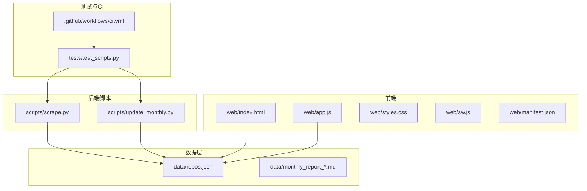
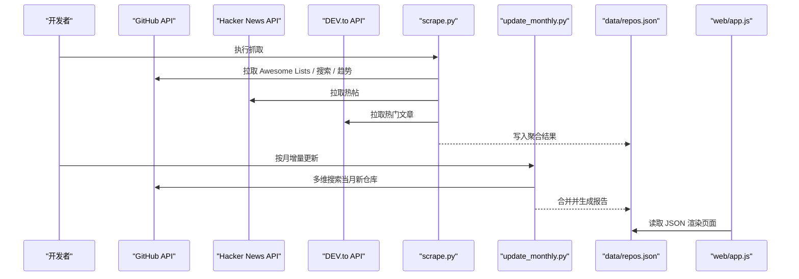
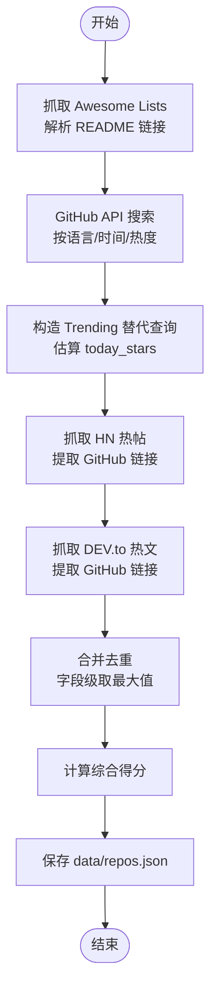
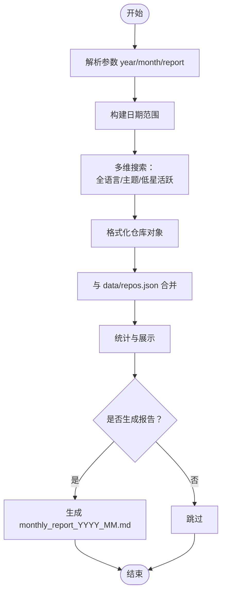
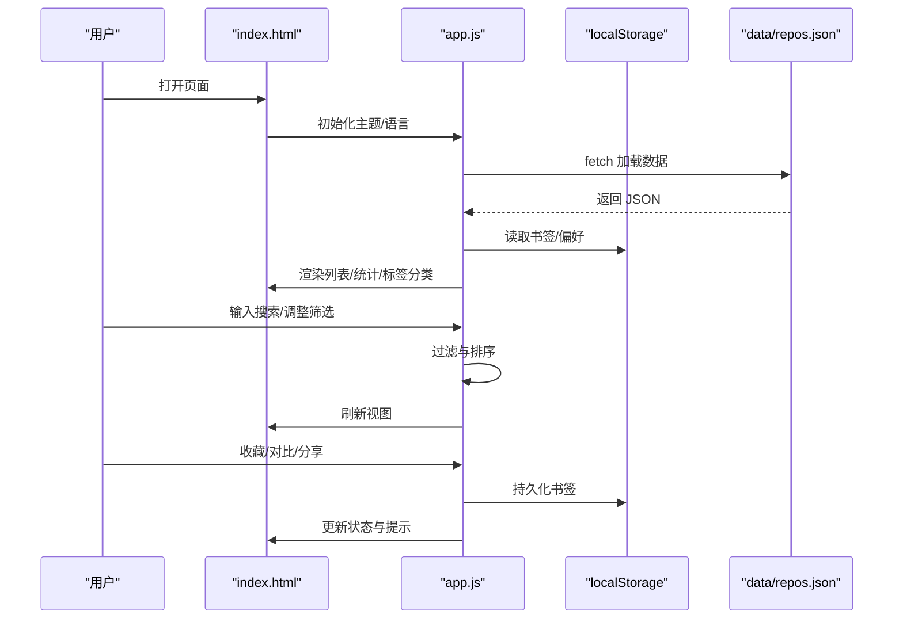
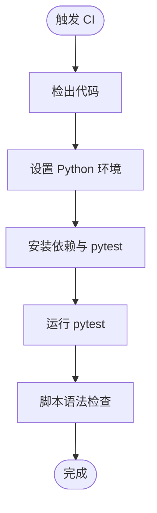
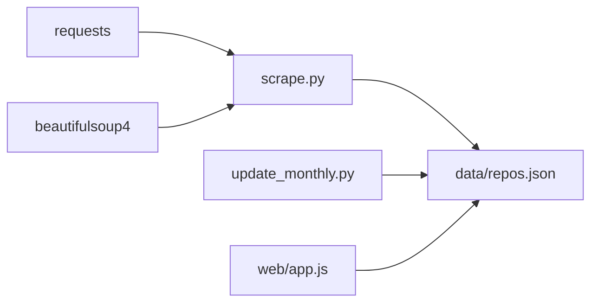

# 项目概述

<cite>
**本文引用的文件**   
- [README.md](file://README.md)
- [README.zh-CN.md](file://README.zh-CN.md)
- [requirements.txt](file://requirements.txt)
- [scripts/scrape.py](file://scripts/scrape.py)
- [scripts/update_monthly.py](file://scripts/update_monthly.py)
- [web/app.js](file://web/app.js)
- [web/index.html](file://web/index.html)
- [tests/test_scripts.py](file://tests/test_scripts.py)
- [.github/workflows/ci.yml](file://.github/workflows/ci.yml)
</cite>

## 目录
1. [简介](#简介)
2. [项目结构](#项目结构)
3. [核心组件](#核心组件)
4. [架构总览](#架构总览)
5. [详细组件分析](#详细组件分析)
6. [依赖关系分析](#依赖关系分析)
7. [性能与可扩展性](#性能与可扩展性)
8. [故障排查指南](#故障排查指南)
9. [结论](#结论)
10. [附录：快速开始与在线演示](#附录快速开始与在线演示)

## 简介
GitHub Treasure Repo 是一个开源、全自动的高质量 GitHub 项目聚合器。它整合多个数据源（Awesome Lists、GitHub Search API、Hacker News、DEV.to），形成单一策划目录，并提供智能筛选、灵感模式与书签管理等功能。其目标是帮助开发者高效发现优质仓库，降低信息过载带来的筛选成本。

核心价值与目标
- 多源聚合：从 curated 列表、API 搜索、社区热点等多渠道汇聚高质量项目
- 智能评分与排序：基于 Stars、Forks、活跃度与增长信号计算综合得分
- 前端体验：支持多维度筛选、实时搜索、分享链接、书签与对比、PWA 离线访问
- 自动化流水线：通过 GitHub Actions 定期抓取与更新数据，保证时效性

在线演示
- 在线访问：https://allengaller.github.io/repo-hoarder/

## 项目结构
仓库采用“爬虫脚本 + 静态前端 + CI/CD”的轻量架构：
- scripts：Python 爬虫与月度增量更新脚本
- web：纯前端（HTML/CSS/JS）+ PWA 清单与服务工作线程
- data：抓取结果 JSON 与月度报告
- tests：pytest 单元测试
- .github/workflows：CI、部署与定时任务

图表来源
- [scripts/scrape.py:650-696](file://scripts/scrape.py#L650-L696)
- [scripts/update_monthly.py:300-344](file://scripts/update_monthly.py#L300-L344)
- [web/app.js:404-443](file://web/app.js#L404-L443)
- [web/index.html:1-200](file://web/index.html#L1-L200)
- [tests/test_scripts.py:1-250](file://tests/test_scripts.py#L1-L250)
- [.github/workflows/ci.yml:1-34](file://.github/workflows/ci.yml#L1-L34)

章节来源
- [README.md:123-148](file://README.md#L123-L148)
- [README.zh-CN.md:140-170](file://README.zh-CN.md#L140-L170)

## 核心组件
- 多源爬虫（scrape.py）
  - Awesome Lists 解析：从 README 中抽取 GitHub 仓库链接并去重
  - GitHub API 搜索：按语言、时间、热度等维度检索
  - Trending 替代策略：使用近期推送/创建与星标上升查询组合，估算今日增长
  - Hacker News 与 DEV.to：从热帖/文章中提取 GitHub 链接并补充元数据
  - 合并与评分：字段级取最大值合并重复项，计算综合得分并持久化到 JSON
- 月度增量更新（update_monthly.py）
  - 指定月份的多维抓取（全语言、热门主题、低星但活跃）
  - 与现有 repos.json 合并，生成月度 Markdown 报告
- 前端应用（web/app.js + index.html）
  - 加载 data/repos.json，提供搜索、筛选、排序、书签、对比、分享、灵感模式
  - 本地持久化书签与主题/语言偏好，支持 PWA 离线缓存
- 测试与 CI（tests/.github/workflows）
  - pytest 覆盖核心算法与接口契约
  - CI 安装依赖、运行测试与语法检查

章节来源
- [scripts/scrape.py:174-221](file://scripts/scrape.py#L174-L221)
- [scripts/scrape.py:248-278](file://scripts/scrape.py#L248-L278)
- [scripts/scrape.py:316-382](file://scripts/scrape.py#L316-L382)
- [scripts/scrape.py:385-441](file://scripts/scrape.py#L385-L441)
- [scripts/scrape.py:444-508](file://scripts/scrape.py#L444-L508)
- [scripts/scrape.py:555-602](file://scripts/scrape.py#L555-L602)
- [scripts/update_monthly.py:79-135](file://scripts/update_monthly.py#L79-L135)
- [scripts/update_monthly.py:162-203](file://scripts/update_monthly.py#L162-L203)
- [web/app.js:404-443](file://web/app.js#L404-L443)
- [web/index.html:50-200](file://web/index.html#L50-L200)
- [tests/test_scripts.py:18-106](file://tests/test_scripts.py#L18-L106)
- [.github/workflows/ci.yml:10-34](file://.github/workflows/ci.yml#L10-L34)

## 架构总览
系统由“数据采集 → 数据处理 → 数据持久化 → 前端消费”构成，配合 CI/CD 实现自动化更新与部署。

图表来源
- [scripts/scrape.py:650-696](file://scripts/scrape.py#L650-L696)
- [scripts/update_monthly.py:300-344](file://scripts/update_monthly.py#L300-L344)
- [web/app.js:404-443](file://web/app.js#L404-L443)

## 详细组件分析

### 多源爬虫（scrape.py）
职责
- 从 Awesome Lists 解析仓库链接，过滤非仓库路径与自引用
- 调用 GitHub API 进行多维度搜索（语言、时间、热度）
- 模拟 Trending：用近期推送/创建与星标上升查询组合，估算每日增长
- 从 Hacker News 与 DEV.to 提取 GitHub 链接并补全元数据
- 合并去重、计算分数、输出 JSON

关键流程

图表来源
- [scripts/scrape.py:174-221](file://scripts/scrape.py#L174-L221)
- [scripts/scrape.py:248-278](file://scripts/scrape.py#L248-L278)
- [scripts/scrape.py:316-382](file://scripts/scrape.py#L316-L382)
- [scripts/scrape.py:385-441](file://scripts/scrape.py#L385-L441)
- [scripts/scrape.py:444-508](file://scripts/scrape.py#L444-L508)
- [scripts/scrape.py:555-602](file://scripts/scrape.py#L555-L602)

评分算法
- 公式：score = stars + forks + (forks/stars)*1000 + today_stars*10 + commit_activity*2
- 今日增长估算：根据最近推送时间与仓库年龄加权，结合高星新星额外加分
- 提交活跃度：对 Top-N 候选调用免费 stats/commit_activity 接口获取近四周提交量

章节来源
- [scripts/scrape.py:542-552](file://scripts/scrape.py#L542-L552)
- [scripts/scrape.py:281-313](file://scripts/scrape.py#L281-L313)
- [scripts/scrape.py:114-127](file://scripts/scrape.py#L114-L127)

### 月度增量更新（update_monthly.py）
职责
- 针对指定年份与月份，按全语言、热门主题、低星但活跃等维度抓取
- 与现有 repos.json 合并，保留更高分数或新增项
- 可选生成 Markdown 月度报告

图表来源
- [scripts/update_monthly.py:79-135](file://scripts/update_monthly.py#L79-L135)
- [scripts/update_monthly.py:162-203](file://scripts/update_monthly.py#L162-L203)
- [scripts/update_monthly.py:226-297](file://scripts/update_monthly.py#L226-L297)

章节来源
- [scripts/update_monthly.py:300-344](file://scripts/update_monthly.py#L300-L344)

### 前端应用（web/app.js + index.html）
职责
- 加载 data/repos.json，渲染卡片网格与详情弹窗
- 提供搜索、筛选、排序、书签、对比、分享、灵感模式
- 本地持久化书签、主题与语言设置；支持 PWA 离线访问

关键交互序列

图表来源
- [web/app.js:404-443](file://web/app.js#L404-L443)
- [web/app.js:296-332](file://web/app.js#L296-L332)
- [web/index.html:50-200](file://web/index.html#L50-L200)

章节来源
- [web/app.js:1-200](file://web/app.js#L1-L200)
- [web/index.html:1-200](file://web/index.html#L1-L200)

### 测试与 CI（tests/test_scripts.py + .github/workflows/ci.yml）
职责
- 验证核心函数行为：parse_num、calculate_score、estimate_today_stars、merge_and_sort、format_api_repo 等
- CI 在 push/PR 时安装依赖、运行测试与语法检查

图表来源
- [.github/workflows/ci.yml:10-34](file://.github/workflows/ci.yml#L10-L34)
- [tests/test_scripts.py:18-106](file://tests/test_scripts.py#L18-L106)

章节来源
- [tests/test_scripts.py:1-250](file://tests/test_scripts.py#L1-L250)
- [.github/workflows/ci.yml:1-34](file://.github/workflows/ci.yml#L1-L34)

## 依赖关系分析
- 外部依赖
  - requests：HTTP 请求库
  - beautifulsoup4：HTML 解析（当前爬虫主要使用正则与 API，未强依赖）
- 内部模块耦合
  - scrape.py 与 update_monthly.py 共享评分与格式化工具逻辑，但各自独立运行
  - web/app.js 仅消费 data/repos.json，不直接依赖后端脚本
- 可能的循环依赖
  - 无循环依赖；前后端通过 JSON 解耦

图表来源
- [requirements.txt:1-2](file://requirements.txt#L1-L2)
- [scripts/scrape.py:650-696](file://scripts/scrape.py#L650-L696)
- [scripts/update_monthly.py:300-344](file://scripts/update_monthly.py#L300-L344)
- [web/app.js:404-443](file://web/app.js#L404-L443)

章节来源
- [requirements.txt:1-2](file://requirements.txt#L1-L2)

## 性能与可扩展性
- 速率限制与重试
  - GitHub API 默认 60 次/小时，可通过环境变量 GITHUB_TOKEN 提升至 5000 次/小时
  - 遇到 403 限流时进行等待与重试
- 并发与节流
  - 当前为串行请求，通过 time.sleep 控制频率，避免触发限流
  - 可考虑异步并发与指数退避提升吞吐
- 数据规模
  - 前端按需渲染与分页/虚拟滚动可优化大列表性能
  - 建议在前端增加索引与缓存策略（如 IndexedDB）
- 扩展点
  - 新增数据源：复用 fetch_github_repo_details 与 format_api_repo 统一入库
  - 评分模型：可按业务需求调整权重与因子

[本节为通用指导，无需特定文件来源]

## 故障排查指南
常见问题
- 页面显示“无法加载数据”
  - 原因：浏览器安全策略禁止 file:// 协议下的 fetch 请求
  - 解决：通过本地 HTTP 服务器访问（例如 python3 -m http.server 8000）
- GitHub API 请求受限
  - 原因：未配置 GITHUB_TOKEN
  - 解决：设置环境变量 GITHUB_TOKEN，提高限额至 5000 次/小时
- 本地运行失败
  - 确保已安装依赖（pip install -r requirements.txt）
  - 先运行抓取脚本生成 data/repos.json，再启动前端服务

章节来源
- [README.md:164-176](file://README.md#L164-L176)
- [README.zh-CN.md:213-225](file://README.zh-CN.md#L213-L225)
- [web/app.js:428-443](file://web/app.js#L428-L443)

## 结论
GitHub Treasure Repo 以极简技术栈实现了“多源采集 + 智能评分 + 前端消费”的完整闭环，并通过 CI/CD 保障数据新鲜度与质量。对于初学者，它提供了清晰的数据流向与易用的前端体验；对于有经验的开发者，它在扩展数据源、优化并发与评分模型方面具备良好的延展空间。

[本节为总结性内容，无需特定文件来源]

## 附录：快速开始与在线演示
在线演示
- https://allengaller.github.io/repo-hoarder/

本地快速开始
- 克隆仓库并进入目录
- 安装依赖：pip install -r requirements.txt
- 抓取数据：python3 scripts/scrape.py
- 启动前端服务：cd web && python3 -m http.server 8000
- 访问：http://localhost:8000

数据更新
- 全量抓取：python3 scripts/scrape.py
- 月度增量：python3 scripts/update_monthly.py --year 2026 --month 6 --report

章节来源
- [README.md:43-76](file://README.md#L43-L76)
- [README.zh-CN.md:51-77](file://README.zh-CN.md#L51-L77)