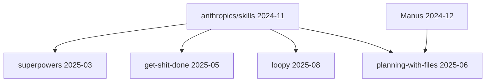

# 范式谱系档案：Agent harness 配置

## 范式源头

- **anthropics/skills** (2024-11) — 首创「agent harness 配置」范式
  - 证据线：README 自述 / 代码依赖 / 作者谱系
  - 关键创新：把 agent 的能力封装成可组合的 skill，通过配置文件定义 agent 行为

## 同期表亲

- 无明显同期表亲（范式较为独特）

## 衍生品（catalog 内）

- [superpowers](../ai-engineering/superpowers.md) — 扩展 skills 范式，增加更多预定义 skill
- [get-shit-done](../ai-engineering/get-shit-done.md) — 基于 skills 范式的任务导向 agent
- [loopy](../ai-agents/loopy.md) — 把 skills 范式包装成 loop

## 混血儿

- planning-with-files — 融合了 skills 范式的配置化 + Manus 的文件驱动规划

## 谱系图

## 参考文献

- [anthropics/skills README](https://github.com/anthropics/skills)
- [Claude Code 文档：Skills](https://docs.anthropic.com/claude/docs/skills)
