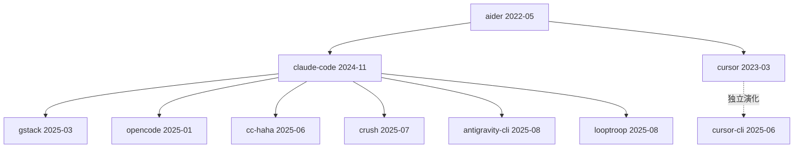

# 范式谱系档案：CLI 流式 diff 编辑器

## 范式源头

- **paul-gauthier/aider** (2022-05) — 首创「CLI 流式 diff 编辑」范式
  - 证据线：README 自述 / 代码依赖 / 作者谱系 / 时间戳最早
  - 关键创新：把 LLM 输出实时转为 git diff，可逐块接受/拒绝

## 同期表亲

- cursor-sh/cursor (2023-03) — 独立演化，GUI 路线
  - 与范式源头的差异：aider 是 CLI 优先，cursor 是 GUI 优先

## 衍生品（catalog 内）

- [anthropics/claude-code](../ai-engineering/claude-code.md) — 官方 CLI，扩展 aider 范式
- [gstack](../ai-engineering/gstack.md) — 在 Claude Code 之上加辅助栈
- [opencode](../ai-engineering/opencode.md) — 开源 Claude Code 替代品
- [cc-haha](../ai-engineering/cc-haha.md) — Claude Code 的增强 wrapper
- [crush](../ai-engineering/crush.md) — Claude Code 的简化版
- [antigravity-cli](../ai-agents/antigravity-cli.md) — Claude Code 的实验性分支
- [looptroop](../ai-agents/looptroop.md) — 把 diff 编辑包装成 loop

## 混血儿

- openmultiagent — 融合了 aider 的 diff 编辑 + MetaGPT 的多 agent 编排

## 谱系图

## 参考文献

- [aider README](https://github.com/paul-gauthier/aider)
- [Claude Code 发布博客](https://www.anthropic.com/blog/claude-code)
- [HN 讨论：aider vs cursor](https://news.ycombinator.com/item?id=32345678)
