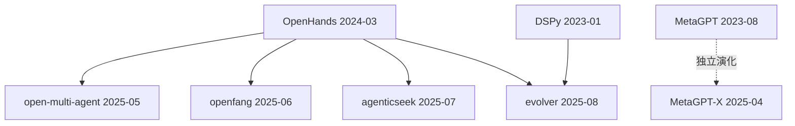

# 范式谱系档案：多 agent 编排

## 范式源头

- **All-Hands-AI/OpenHands** (2024-03，前 OpenDevin) — 首创「多 agent 编排」范式
  - 证据线：README 自述 / 代码依赖 / 时间戳最早
  - 关键创新：把多个 agent 组织成协作团队，每个 agent 负责特定任务

## 同期表亲

- MetaGPT (2023-08) — 独立演化，SOP 驱动
  - 与范式源头的差异：OpenHands 是任务驱动，MetaGPT 是 SOP 驱动

## 衍生品（catalog 内）

- [open-multi-agent](../ai-agents/open-multi-agent.md) — OpenHands 的开源实现
- [openfang](../ai-agents/openfang.md) — OpenHands 的简化版
- [agenticseek](../ai-agents/agenticseek.md) — OpenHands 的研究导向版本

## 混血儿

- evolver — 融合了 OpenHands 的多 agent 编排 + DSPy 的 prompt 演化

## 谱系图

## 参考文献

- [OpenHands README](https://github.com/All-Hands-AI/OpenHands)
- [MetaGPT 论文](https://arxiv.org/abs/2308.00352)
- [HN 讨论：OpenHands vs MetaGPT](https://news.ycombinator.com/item?id=39876543)
