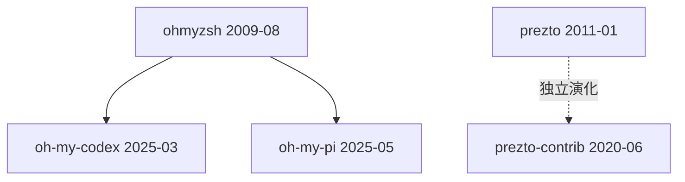

# 范式谱系档案：Oh-my-zsh 家族范式

## 范式源头

- **ohmyzsh/ohmyzsh** (2009-08) — 首创「oh-my-zsh 家族」范式
  - 证据线：README 自述 / 社区共识 / 时间戳最早
  - 关键创新：把 shell 配置封装成可组合的插件，通过主题和插件系统定义 shell 行为

## 同期表亲

- prezto (2011-01) — 独立演化，性能优先
  - 与范式源头的差异：oh-my-zsh 是功能优先，prezto 是性能优先

## 衍生品（catalog 内）

- [oh-my-codex](../ai-engineering/oh-my-codex.md) — 把 oh-my-zsh 范式应用到 Codex CLI
- [oh-my-pi](../ai-engineering/oh-my-pi.md) — 把 oh-my-zsh 范式应用到 Raspberry Pi

## 混血儿

- 无明显混血儿（范式较为纯粹）

## 谱系图

## 参考文献

- [oh-my-zsh README](https://github.com/ohmyzsh/ohmyzsh)
- [prezto README](https://github.com/sorin-ionescu/prezto)
