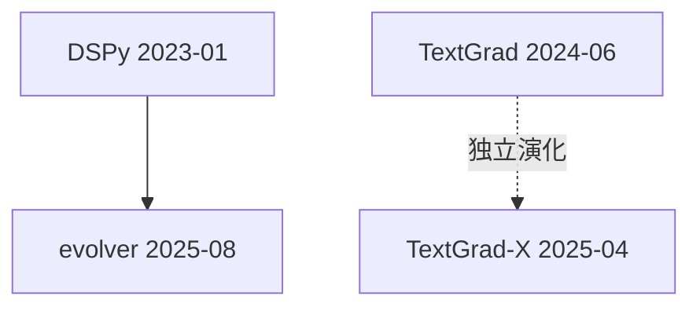

# 范式谱系档案：Prompt 演化框架

## 范式源头

- **DSPy** (2023-01) — 首创「prompt 演化」范式
  - 证据线：README 自述 / 代码依赖 / 学术引用
  - 关键创新：把 prompt 视为可优化的参数，通过梯度下降自动演化 prompt

## 同期表亲

- TextGrad (2024-06) — 独立演化，文本梯度
  - 与范式源头的差异：DSPy 是参数化 prompt，TextGrad 是文本梯度

## 衍生品（catalog 内）

- [evolver](../ai-agents/evolver.md) — 把 DSPy 范式应用到 agent 演化

## 混血儿

- 无明显混血儿（范式较为纯粹）

## 谱系图

## 参考文献

- [DSPy 论文](https://arxiv.org/abs/2310.03714)
- [TextGrad 论文](https://arxiv.org/abs/2406.07496)
